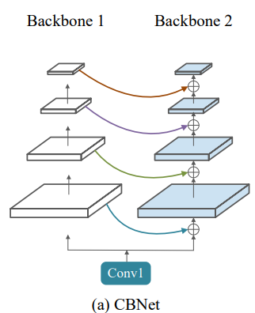
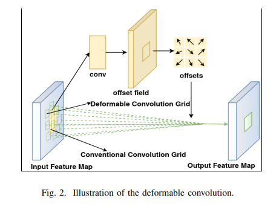
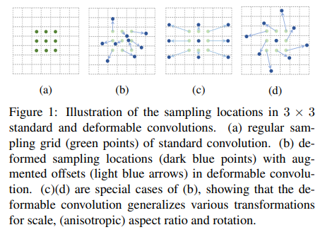
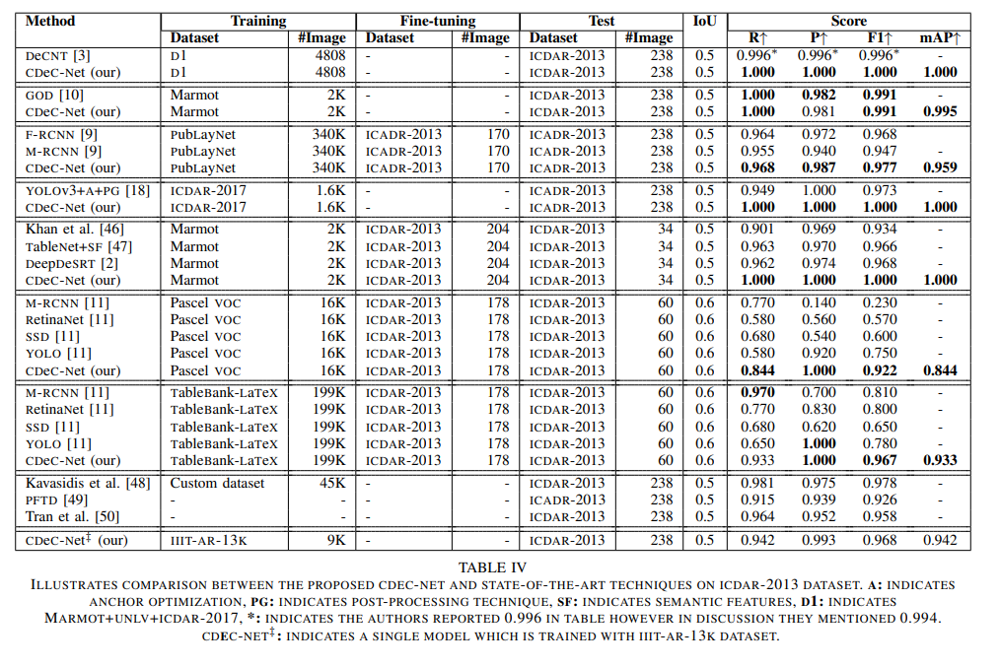
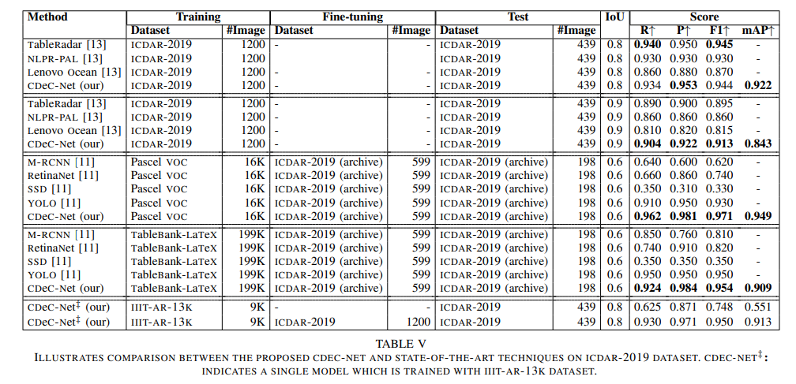
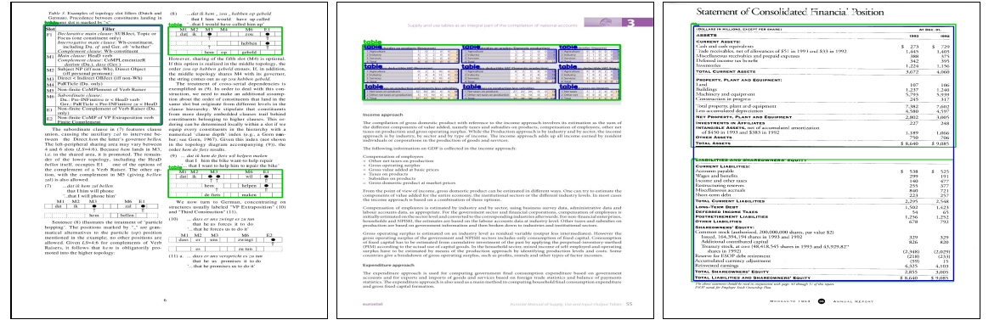

# CDeC-Net: Composite Deformable Cascade Network for Table Detection in Document Images

> Illustration of complex table detection results. **Blue** and **Green** colored rectangles correspond to **ground truth** and predicted bounding boxes using CDeC-Net. 

## Abstract 
The proposed network consists of a **multistage** extension of **Mask R-CNN** with a **dual backbone** having **deformable convolution** for detecting tables varying in scale with high detection accuracy at higher IoU threshold.

Our solution has three important properties: 
- a **single** trained model **CDeC-Net‡** performs well across all the popular benchmark datasets; 
- we report excellent performances across **multiple**, including higher, thresholds of IoU; 
- by following the same protocol of the recent papers for each of the benchmarks, we consistently demonstrate the **superior quantitative performance**.

## CDEC-NET: COMPOSITE DEFORMABLE CASCADE NETWORK

#### Cascade Mask R-CNN
- **Cascade** Mask R-CNN has a similar architecture as Cascade R-CNN, but along with an additional **segmentation** branch, denoted by ’S’, for creating masks of the detected objects.
- The network head takes ROI features as input and makes two predictions — **classification score** (C) and **bounding box regression** (B).
- CDeC-Net comprises of a sequence of three detectors trained with **increasing IoU thresholds** of 0.5, 0.6, and 0.7, respectively.
> Cascade R-CNN

#### Composite Backbone
We use a **dual backbone** based architecture which creates a composite connection between the parallel stages of two adjacent ResNeXt-101 backbones (one is called **assistant backbone** and other is called **lead backbone**).
> CBNetV2: A Composite Backbone Network Architecture for Object Detection

#### Deformable Convolution
We replace the fixed receptive field CNN with deformable CNN [22] in each of our dual backbone architectures. The gird is deformable as each grid point can be moved by a **learnable offset**.

> Deformable Convolution

## EXPERIMENTS
- We observe from the table that CDeC-Net outperforms state-of-the-art techniques on **ICADR2013, UNLV, Marmot, TableBank,** and **PubLayNet datasets**.

- ILLUSTRATES COMPARISON BETWEEN THE PROPOSED CDEC-NET AND STATE-OF-THE-ART TECHNIQUES ON **ICDAR-2013** DATASET

- ILLUSTRATES COMPARISON BETWEEN THE PROPOSED CDEC-NET AND STATE-OF-THE-ART TECHNIQUES ON **ICDAR-2019** DATASET.

- Shows examples where CDeC-Net **fails** to accurately detect the tables.

    While our single model CDeC-Net‡ fails to predict bounding boxes corresponding to tables present in the documents.