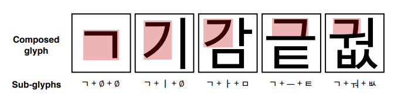
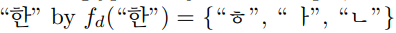
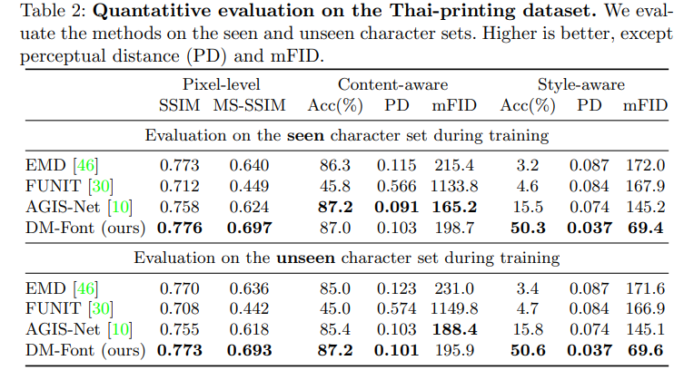
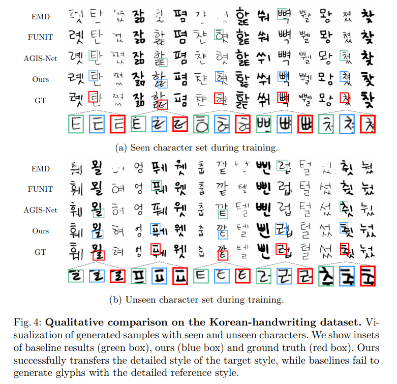

# Few-shot Compositional Font Generation with Dual Memory

> Fig. 1: Few-shot font generation results. While previous few-shot font generation methods (AGIS, FUNIT, and EMD) are **failed to generate unseen font**, our model successfully transfer the font style and details.

## Abstract
- In this paper, we focus on **compositional scripts**, a widely used letter system in the world, where each glyph can be decomposed by several components.

- we propose a novel font generation framework, named **Dual Memory-augmented Font Generation Network (DM-Font)**, which enables us to generate a highquality font library with only a few samples.

- We employ **memory components** and **global-context** awareness in the generator to take advantage of the compositionality.

## Preliminary: Complete Compositional Scripts

> Fig. 2: Examples of compositionality of Korean script. Even if we choose the same sub-glyph, e.g., “ㄱ”, the shape and position of each sub-glyph are varying depending on the combination, as shown in red boxes.

## Dual Memory-augmented Font Generation Network

- DM-Font disentangles global **local styles** and **composition information**, and writes them into **dynamic** and **persistent** memory, respectively.

#### Architecture overview

- **encoding** stage, the reference style glyphs are encoded to the component features and stored into the dynamic memory.
- After the encoding, the **decoder** fetches the component features and generates the target glyph according to the target character label.

###### Encoder

> The encoder extracts the component-wise features and stores them into the dynamic memory using the component label $\hat{u^{i}_{c}}$ and the style label $\hat{y_{s}}$.
- Enc disassembles a source glyph into the several component features using the pre-defined decomposition function.
- We adopt multi-head structure (Thai: four & Korean: three ), one head per one component type.
- The encoded component-wise features are written into the dynamic memory

###### dynamic memory
- dynamic memory (DM) stores **encoded component features** of the given reference glyphs.
-  encoded features in DM learn unique **local styles** depending on each font.

###### persistent memory
- persistent memory (PM) is a component-wise learned embedding that represents the **intrinsic shape** of each component and the **global information** of the script such as the compositionality.
- PM captures the **global information** of sub-glyphs independent to each font style.

Note that **DM simply stores and retrieves** the encoded features, but **PM is learned embedding** trained from the data. Therefore, DM is adaptive to the reference input style samples, while PM is fixed after training.

##### Memory addressor
- Memory addressor provides the access address of both dynamic and persistent memory based on the given character label $y_{c}$. We use pre-defined decomposition function .

e.g. 

<!-- - The component-wise encoded features for the reference $\hat{x}$, whose character label is $\hat{y_{c}}$ and style label is $\hat{y_{s}}$, are stored into DM during the encoding stage.

- the encoder Enc is a multi-head encoder, and $\hat{y_{c}}$ can be decomposed by $f_{d}(\hat{y_{c}})$ to sub-glyph labels $\hat{u^{i}_{c}}$. Hence, the features in DM at address $(\hat{u_{c}^{i}}, y^{s})$. -->

###### Decoder

> The memory addressor loads the component features by the character label $y_{c}$ and feeds them to the decoder.
In the decoding stage, decoder Dec generates a target glyph with the target character $y_{c}$ and the reference style $y_{s}$ using the component-wise features stored into the dynamic memory DM and the persistent memory PM.

######  discriminator 
- For discriminator D, we use a multitask discriminator with the **font condition** and the **character condition**.
- The multitask discriminator has independent branches for each target class and each branch performs binary classification.
- Considering two types of conditions, we use two multitask discriminator, one for character classes and the other for font classes, with a shared backbone.

######  component classifie
We further use component classifier Cls to ensure the model to fully utilize the compositionality

######  compositional generator
Moreover, we introduce the global-context awareness and local-style preservation to the generator, called compositional generator

DM-Font learns the compositionality in the weakly-supervised manner; it does not require any exact component location, e.g., component-wise bounding boxes, but only component labels are required. Hence, DM-Font is not restricted to the font generation only, but can be applied to any generation task with compositionality, e.g., attribute conditioned generation tasks

######  Experiments
Pixel-level evaluation metrics assess the pixel structural similarity between the ground truth image and the generated image. We employ the **structural similarity index (SSIM)** and **multi-scale structural similarity index (MS-SSIM)**.

We report the **top-1 accuracy**, **perceptual distance** (PD), and **mean FID** (mFID) using the classifiers. PD is computed by L2 distance of the features between generated glyph and GT glyph, and mFID is a conditional FID [16] by averaging FID for each target class.

