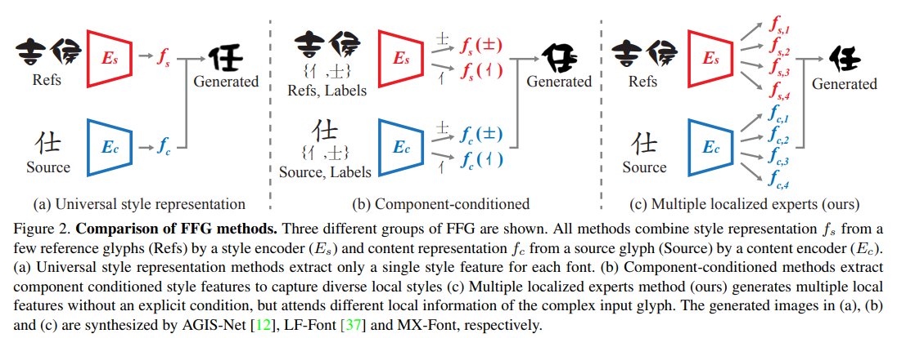
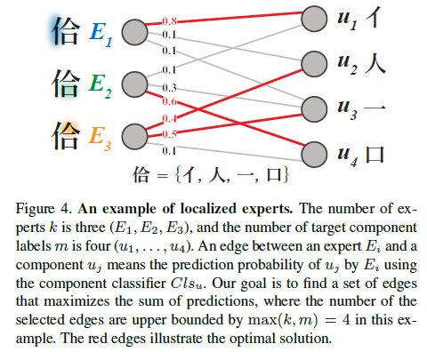
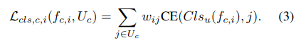
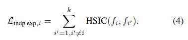
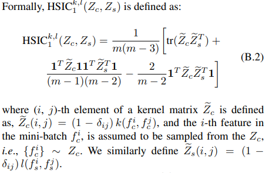
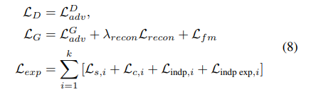
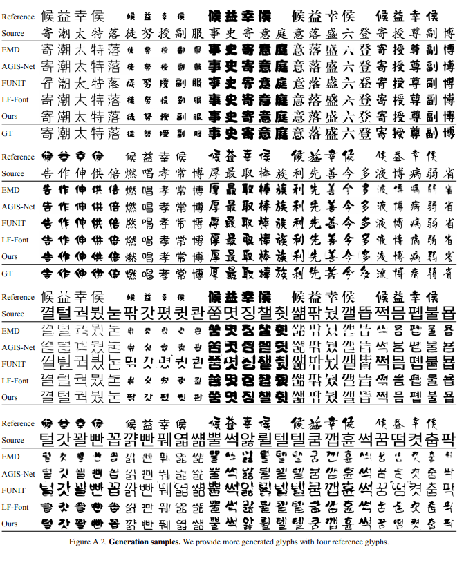

# Multiple Heads are Better than One: Few-shot Font Generation with Multiple Localized Experts
###### tags: Yonsei University, NAVER AI Lab, NAVER CLOVA
arxive: https://arxiv.org/pdf/2104.00887.pdf
The unified few-shot font generation repository: https://github.com/clovaai/fewshot-font-generation
> clovaai/fewshot-font-generation included:
**FUNIT** (Liu, Ming-Yu, et al. ICCV 2019) : not originally proposed for FFG tasks, but we modify the unpaired i2i framework to the paired i2i framework for FFG tasks.
**DM-Font** (Cha, Junbum, et al. ECCV 2020) : proposed for complete compositional scripts (e.g., Korean). If you want to test DM-Font in Chinese generation tasks, you have to modify the code (or use other models).
**LF-Font** (Park, Song, et al. AAAI 2021) : originally proposed to solve the drawback of DM-Font, but it still require component labels for generation. Our implementation allows to generate characters with unseen component.
**MX-Font** (Park, Song, et al. ICCV 2021) : generating fonts by employing **multiple experts** where each expert focuses on different local concepts.

# Abstract
Existing FFG methods aim to disentangle content and style either by extracting **a universal representation style** or extracting **multiple component-wise style** representations.

However, previous methods either fail to capture **diverse local styles** or cannot be **generalized to a character with unseen components**, e.g., unseen language systems.

To mitigate the issues, we propose a novel FFG method, named **Multiple Localized Experts Few-shot Font Generation Network (MXFont)**. MX-Font extracts multiple style features not **~~explicitly conditioned~~** on component labels, but automatically by **multiple experts** to represent different local concepts, e.g., left-side sub-glyph.

During training, we utilize component labels as **weak supervision** to guide each expert to be specialized for different local concepts.

We also employ the **independence loss** and the **content-style adversarial** loss to impose the contentstyle disentanglement.

# Related Works
The universal style representation shows limited performances in capturing localized styles and content structures. To address the issue, **component-conditioned methods** such as DM-Font [6], LFFont [37], remarkably improve the stylization performance by employing localized style representation, where the font style is described multiple localized styles instead of a single universal style. 

However, these methods require explicit component labels (observed during training) for the target character even at the test time. This property limits practical usages such as cross-lingual font generation. Our method inherits the advantages from component-guided multiple style representations, but **does not require the explicit labels** at the test time.

# Method

#### Model architecture
- Our method consists of three modules:
    1) k-headed encoder, or localized experts $E_{i}$ 
    2) a generator $G$
    3) style and component feature classifiers $Cls_{s}$ and $Cls_{u}$. 

- The localized expert $E_{i}$ encodes a glyph image $x$ into a local feature $f_{i}$.
    
    Here, our localized experts are not supervised by component labels to obtain k local features $f_{1}, ..., f_{k}$; our local features are not component-specific features. We set the number of the **localized experts, $k$, to 6** in our experiments if not specified.

- We employ two feature classifiers, $Cls_{s}$ and $Cls_{u}$ to supervise $f_{s,i}$ and $f_{c,i}$, which serve as **weak supervision** for $f_{i}$.
    

- These classifiers are only used during training but independent to the model inference itself. Following the previous methods [6, 37], we use font library labels for style labels $y_{s}$, and the component labels $U_{c}$ for content labels $y_{c}$. 
     

> The same **decomposition rule** used by **LF-Font** is adopted. While previous methods only use the style (or content) classifier to train style (or content), we additionally utilize them for the content and style disentanglement by introducing the content-style adversarial loss.

#### Learning multiple localized experts with weak local component supervision

- Because we do not want that an expert is explicitly assigned to a component label, e.g., strictly mapping “人” component to E1, we solve an automatic allocation algorithm, finding the optimal expert-component matching as shown in Figure 4.

- Specifically, we formulate the component allocation problem as the Weighted Bipartite B-Matching problem, which can be optimally solved by the **Hungarian algorithm**.
    

<!-- - We optimize auxiliary component classification loss $L_{cls,c}$ with the cross entropy loss (CE) as follows:
     -->

- We additionally formulate the independence between each expert by the **Hilbert-Schmidt Independence Criterion (HSIC)** [16] which has been used in practice for statistical testing [16, 17], feature similarity measurement [28], and model regularization [38, 51, 3].
    
> Hilbert-Schmidt Independence Criterion (HSIC):

#### Content and style disentanglement
- To achieve perfect content and style disentanglement, the style (or content) features should **include the style** (or content) domain information but **exclude the content** (or style) domain information. We employ two objective functions for this: **content-style adversarial loss** and **independent loss**.

- The content-style adversarial loss, motivated by the domain adversarial network [11], enforces the extracted features for style (or content) is useless to classify content.
    
    

> disentanglement framework:

> auxiliary component classification loss is defined as follow:
 
, where variables $w_{ij}$ is getting from Hungarian algorithm.

- We also employ the independence loss between content and style local features, $f_{c,i}$ and $f_{s,i}$ for the disentanglement of content and style representations.
    

#### Training
We use the **hinge generative adversarial loss** $L_{adv}$ [52], **feature matching loss** $L_{fm}$, and **pixel-level reconstruction loss** $L_{recon}$ by following the previous high fidelity GANs, e.g., BigGAN [4], and state-of-the-art font generation methods, e.g., DM-Font [6] or LF-Font [37].

Now we describe our full objective function. The entire model is trained in an end-to-end manner with the weighted sum of all losses, including (4), (5), (6), and (7).

As conventional GAN training, we alternatively update $L_{D}$, $L_{G}$, and $L_{exp}$.
## Experiments
#### Quantitative evaluation.
Following previous works [6, 37], we train evaluation classifiers that **classifies character labels** (content-aware) and **font labels** (style-aware). Note that these classifiers are only used for evaluation, and trained separately to the FFG models.

We conduct a **user study** for quantifying the subjective quality. The participants are asked to pick the three best results, considering the style, the content, and the most preferred considering both the style and the content.

We also report **Learned Perceptual Image Patch Similarity (LPIPS)** [53] scores to measure the dissimilarity between the generated images and their corresponding ground truth images, thus it is only reported for Chinese FFG task.

#### Qualitative evaluation

#### Analyses

## Appendix
In the **cross-lingual** FFG, MX-Font can produce promising results in that they are all readable. Meanwhile, all other competitors provide inconsistent results, which are often impossible to understand. These results show a similar conclusion as our main paper.
