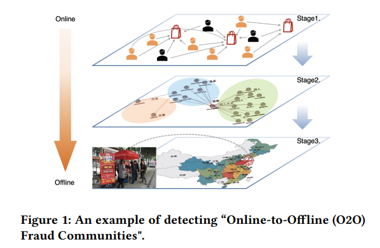

# 阿里巴巴集團-螞蟻金服

## Graph Neural Network

#### What Happens Behind the Scene? Towards Fraud Community Detection in E-Commerce from Online to Offline (Companion Proceedings of the Web Conference 2021, WWW '21)

- 面對電子商務平台的詐欺行為，反詐欺系統逐漸成為這些平台不可或缺的基礎設施。而在最近，越來越多惡意賣家將他們的虛假購買行為從線上轉移到線下，故意繞過線上平台的詐欺偵測，使得在線交易建構的詐欺偵測系統受到威脅。為了解決這個問題，本文中研究了一個新的檢測方向，稱為線下欺詐社區檢測，它可以大大加強現有的欺詐檢測系統。

- 本文提出 FRODO ( FRaud COmmunity Detection from Online to Offline )，該框架結合了在線及離線的數據觀點優勢，更是利於線下的詐欺偵測。此外，在框架內提出了一個新的多視圖異構圖神經網絡(Multi-view Heterogeneous Graph Neural Network)模型，該模型可以通過少量的黑色種子，即少量的標記欺詐來發現異常圖樣本。

- 種子由三個組件組成的流線型管道處理，包括用於高覆蓋率的標籤傳播(step 1)、用於高風險欺詐用戶識別的多視圖異構圖神經網絡(step 2)以及用於離線欺詐社區檢測的時空網絡重建和挖掘(step 3)。最後在大型網路平台的資料進行測試，並在大量實驗結果證明了所提出方法的良好有效性。

- 本文更引入了基於位置的服務（Location Based Services, LBS）、興趣點（Point Of Interest, POI）等時空信息來挖掘線下詐欺產業社區，實現線下造假用戶的物理溯源。追溯結果發現，一些詐騙團伙通過贈送娃娃等物品的形式，吸引了大量淘寶刷單客。 

#### Collaboration Based Multi-Label Propagation for Fraud Detection (Joint Conference on Artificial Intelligence 2020, IJCAI-20)

- 詐欺偵測對電子商務平檯而言，一直是個具有挑戰性的問題，像是偵測欺詐用戶透過垃圾信推廣的某些商品。通常詐欺用戶會同時具有不同的垃圾郵件行為，例如:垃圾郵件交易、點擊、評論等。本文認為，現有的解決方案有兩個主要限制：1）忽略了多個垃圾郵件行為之間的相關性； 2) 在處理龐大的用戶集時，大規模計算是棘手的。為了解決這些問題，本文提出了一種基於協作的多標籤傳播（Collaboration based Multi-Label Propagation, CMLP）算法。具體來說，它把最終的預測分為兩部分：1）自己的預測部分； 2）他人的預測，即協作部分。

- 然後，為了在大規模電子商務數據上加速它，本文提出了一種基於異構圖( heterogeneous graph )的變體。一般來說，惡意商家會僱傭很多欺詐用戶來購買相同的商品。 一個直觀的選擇是從U-I 二項圖（user-item bipartite graph）合成一個U-U 映射（user-user mapping graph），即如果兩個用戶對同一個項目感興趣，他們就會相互連接。雖然這種策略明確地避免了重新建構圖，這通常很耗時，但本文觀察到這在實踐時產生了一個非常密集的圖，並加以利用這個特性。

- 在電商平台中，一件熱門商品可能連接數百萬用戶。 因此，U-U 圖可能包含許多完整的子圖，並且邊的數量急劇增加，使得運算成本提高。為了緩解這個問題，本文提出了一種異構圖傳播（H-CMLP）方法，它直接檢測 U-I 圖上的社群。而且，有數億的用戶以至於難以標註，只有少數標記數據可用，因此它被形式化為半監督多標籤學習 (supervised multi-label learning, SSML) 問題。本文的實驗證明，此方法可以有效地處理普通的 SSML 問題和欺詐檢測任務。

## Computer Vision

#### Spatial-Phase Shallow Learning: Rethinking Face Forgery Detection in Frequency Domain (Computer Vision and Pattern Recognition 2021, CVPR 2021)

- 由於資訊安全問題，面部偽造技術的顯著成功在計算機視覺領域受到了相當大的關注。本文觀察到上採樣(up-sampling)是大多數人臉偽造技術的必要步驟，其中上採樣為使用卷積網路模型放大特徵圖的長寬以利辨識，但累積上採樣會導致頻域的明顯變化。根據真實圖像的特性，相位譜保留了豐富的頻率分量(frequency components)，這些分量提供了額外的信息並補充了幅度譜的損失。

- 本文發現隨著上採樣操作次數的增加，相位譜(Phase)的平均像素差變得遠大於幅度譜(Amplitude)的平均像素差。下圖為原圖和上採樣的頻域分析，將其相位譜及幅度譜經過離散傅立葉轉換(Discrete Fourier Transform, DFT)並相減後，發現原點和上採樣的相位譜差異大於上採樣的幅度譜。（顏色越深表示像素值越小）

- 本文提出了空間相位淺層學習（Spatial-Phase Shallow Learning, SPSL）方法，該方法結合空間圖像和相位譜來捕獲面部偽造的上採樣偽影，以提高可轉移性，用於臉部偽造檢測。此外，本文通過使網絡變淺來抑制高級特徵並專注於局部區域來減少感受野(receptive field)。本文的大量實驗表明，SPSL 可以在跨數據集評估和多類分類方面達到最先進的性能，並在單個數據集評估上獲得不錯的結果。如下圖所示，典型的人臉操作方法包括三個階段: 1. 編碼源人臉； 2. 在潛在空間中交換人臉； 3. 解碼目標人臉。另外，之前大部分的方法只關注偽造人臉，而本文同時關注上採樣和偽造人臉。

- 本文也針對FF++資料集（FaceForensics++又叫做FF++，由 1000 個影片中的照片序列所組成。這些照片使用四種自動人臉轉換方法進行操作：Deepfakes、Face2Face、FaceSwap 和 NeuralTextures。）在空間域中的平均相位譜進行測試，其中相位譜的空間圖像顯示了每種方法的不同結果。 特別是，基於 NeuralTextures 的圖像，只是稍微篡改了嘴唇，與原始圖像非常相似，導致在 RGB 域中幾乎無法區分，但相位譜的空間圖像仍然是可分離的。

# 360金融

## Reinforcement Learning

#### Effective Automated Feature Derivation via Reinforcement Learning for Microcredit Default Prediction (International Joint Conference on Neural Networks 2020, IJCNN 2020)

- 小額信貸是一種新的金融服務，提供非常小的貸款給缺乏抵押品且極有可能被傳統金融機構拒絕的族群。對於此類的消費金融平台而言，關鍵在於風險管理和預測借款人是否違約的信用分數是否在該服務發揮重要作用。其中從原始數據獲取重要的特徵非常具有挑戰性，因為搜索的特徵範圍可以非常大，也可能具有不含資訊量的特徵。

- 如下圖所示，常見的信用建模過程如下：a) 數據處理；b) 特徵工程；c) 模型訓練。我們還可以看出，關於 AutoML 的大部分研究都集中在圖像處理、語音識別和語言翻譯方面，而360金融則以其獨特的特色致力於金融領域的實踐。

- 整個FDRL(Feature Derivation via Reinforcement Learning)框架如下圖所示，有兩個核心部分，即元學習器(meta learner，作為中繼的學習模型)和搜索策略(search strategy)。 元學習器是傳統訓練的模型，它扮演預處理的角色，以加速計算並減少下游搜索策略的搜索空間。

- 本文提出了一種新的模型框架，通過強化學習從原始數據中自動生成區分特徵以幫助分類器的預測，該分類器可能是邏輯回歸（logistic regression）或提升樹（boosting tree），將其特徵生成問題重新表述為強化學習。最後，本文以 360 金融用戶行為日誌的數據進行實驗，此方法在團隊資深的該領域專家(expert)和遺傳基因演算法(genetic programing)皆有明顯的提升。

## Survival analysis

#### Gradient Boosting Survival Tree with Applications in Credit Scoring (Journal of the Operational Research Society 2019, JORS 2019)

- 信用評分(credit scoring)在消費金融領域發揮著至關重要的作用。生存分析通過量化生存時間的概率，為信用評分問題提供了一種進階的解決方案。為了處理在中國消費金融市場收集的高度異構的行業數據，本文提出了一種稱為梯度提升生存樹（Gradient Boosting Survival Tree，GBST）的非參數集成樹模型，該模型使用梯度提升算法擴展生存樹模型。

- 本文應用 GBST 模型來量化具有大規模真實市場數據集的信用風險。實驗結果表明，GBST 模型優於現有的生存模型，這些模型以一致性指數 (C-index)、Kolmogorov-Smirnov (KS) 指數以及每個時間段的ROC曲線(Receiver Operating Characteristic curve， ROC curve)下的面積 (此面積又叫做Area Under Curve，AUC) 衡量.

- 生存分析是指在量化某個隨機事件發生之前的時間分佈。那麼對於任何時間 t，生存函數 S(t) 定義如下，

與傳統的信用評分方法相比，生存分析不僅可以預測借款人是否違約的概率，還可以預測他違約的時間概率。在消費金融領域，此方法量化了每個借款人的特徵，如年齡、性別、教育程度等。 生存分析的基本任務是研究每個人的最佳生存函數$S(t;x) $.

- 測試數據集（2013年5月-2013年12月）第24還款月不同生存組的違約率曲線(default rate)。 對於每個模型，測試數據集中的貸款按照預測的生存概率按升序排序，然後分成 10 個大小相等的組。 群體指數越大，群體的預測生存概率越高。實驗結果如下圖，GBST 顯示出比其他模型更好的判別力，因為 GBST 預測的後 4 個生存組（1-4）的違約率高於其他模型，而前 4 個生存組（7-10 ) GBST 預測的違約率低於其他模型的。

- 本文實驗還計算每個模型和每個還款月的 AUC 和 KS 指數，表明 GBST 的 AUC 和 KS 指數均高於其他模型的相應分數，並且差異具有統計學意義（p 值 < 0.05），很少有例外。 因此，GBST 顯著優於其他模型。 此外，與其他模型的分數相比，GBST 的兩個分數隨時間衰減的速度要慢得多，這表明 GBST 模型在該數據集上的時間一致性往往更高。

# JP Margan

## Federated Learning

#### Federated Learning using Peer-to-peer Network for Decentralized Orchestration of Model Weights (2021)

- 聯邦式學習（Federated Learning，也稱為協作學習）是一種機器學習技術，它在多個分散設備或本地數據上訓練算法，而無需交換它們。 這種方法與傳統的集中式機器學習技術形成對比，傳統的集中式機器學習技術將所有本地數據集上傳到一個伺服器，另外也有一些經典的分散式方法，後者通常假設本地數據樣本的分布是相同的。

- 機器學習，尤其是深度學習需要大量數據。在某些情況下，這些數據是許多企業的專有和機密數據。為了在聯邦式學習中尊重個體組織的隱私，聯邦學習可以發揮至關重要的作用。這種保護隱私的聯邦學習的實現在金融、醫療、法律、研究和其他需要保護隱私的領域等各種生態系統中都有適用性。

- 然而，許多這樣的實現是由網絡中的中心化架構(centralized architecture)驅動的，其中聚合器節點成為單點故障，並且預計還有大量計算資源可供其使用。本文提出了一種實現去中心化(decentralized)、對等(P2P)聯合學習框架的方法，該框架利用了基於RAFT演算法的選擇方式。

- Raft 算法通過當選的領導者達成共識。本文集群中的服務器可能是領導者、追隨者，並且在選舉的精確情況下（領導者不可用）可以成為候選人。 領導者負責將日誌複製到追隨者。該方法是基於 - 沒有一個永久的聚合器，是基於時間地當選領導者，它將聚合來自網絡中所有對等方的模型。領導者將聚合後的模型發佈到網絡上，供大家消費。

- 論文中的實驗驗證了使用點對點網絡可以創建彈性聯邦學習網絡。 儘管所提出的解決方案在其參考實現中使用了人工神經網絡，但該框架的通用設計可以適應網絡中的任何聯邦式學習模型。

## Graph Neural Network

#### Classifying and Understand Financial Data Using Graph Neural Network (Association for the Advancement of Artificial Intelligence 2020, AAAI 2020)

- 對於在金融機構收集的數據，通常具有額外的拓撲結構(topological structure)，並且可以用圖形結構(graph structure)表示。例如，社交網絡、通信網絡、金融系統和支付網絡。圖結構可以由每個實體的連接構建，例如金融機構、客戶或計算中心。鑑於結構化數據，圖神經網絡 (Graph Neural Network，GNN) 是一種強大的工具，可以模仿專家對節點標記的決定。

- GNNs 通過圖結構結合節點特徵，使用神經網絡嵌入節點信息並通過圖中的邊傳遞。本文希望識別 GNN 模型使用的輸入數據中的信息交互，以對圖中的節點進行分類，並檢查模型是否按任務要求執行。然而，由於復雜的數據表示和非線性變換，解釋 GNN 做出的決策非常具有挑戰性。在這項工作中，本文提出了金融交易數據的圖表示方法和新的圖特徵解釋方法來識別信息圖拓撲(informative graph topology)。

- 本文設計了度量一致性(consistency)、對比度(contrastivity)和稀疏性(sparsity)來衡量信息組件檢測結果。一致性為同一類中的節點檢測到的信息組件是否一致；對比度作為跨同一類中節點的信息子圖相似性，以及為不同類中的節點檢測到的信息組件是否具有對比性； 稀疏性被定義為組件重要性權重的密度。

- 以下是一些是意圖以及範例，圖形的顏色代碼都遵循每個節點屬於“0”類，每個“房子”形狀節點根據其主題被標記為“1-3”。節點順序被表示。紅色節點是我們嘗試分類和解釋的節點。本文呈現了為每個帳戶類型檢​​測到的信息組件的可視化，像是客戶帳戶或銀行帳戶。

## Reinforcement Learning

#### Model-based Reinforcement Learning for Predictions and Control for Limit Order Books (NeurIPS 2019 Workshop on Robust AI in Financial Services)

- 本文通過強化學習構建了一個可以獲利的電子交易代理人(agent)，可以在股票市場下達買賣訂單。環境模型僅使用歷史觀察數據構建，RL(Reinforcement Learning)代理人通過與環境模型而不是與真實市場交互來學習交易策略，以最大限度地減少風險和潛在的貨幣損失。 本文以自我監督(self-training)的方式進行訓練，通過深度神經網絡學習了潛在空間中市場的時間和因果表示。本文實驗證明了完全在環境模型內訓練的交易策略可以轉移回真實市場並保持其盈利能力。 以這個環境模型可以作為一個強大的模擬器來預測市場變動以及貿易影響以供進一步研究。

- 限價訂單簿 (Limit Order Books，LOB) 被全球超過一半的交易市場使用，示意圖如下圖。本文使用觀察到的狀態轉換軌跡，並使用擅長處理時間序列的RNN(recurrent neural network)來訓練環境模型。這項工作有兩個部分：一個由 LOB 的潛在表示學習(latent representation learning)、狀態-動作轉換(state-action transitio)和獎勵模型(reward models)組成的世界模擬模型。 基於世界模擬模型使用三種廣泛使用的 RL 方法訓練的交易代理(分別為A2C、PG、DQN)。

- 本文與基於動量(momentum-based)、基於分類器(classifier-based)以及貪婪最佳解(greedy optimal)進行比較，其中貪婪最佳解策略假設代理知道下一個狀態的未來 LOB，用來衡量 RL 策略與最優策略的接近程度。如下圖所示，RL 代理的性能通常非常接近於貪婪最佳解，並且比其他兩個基準的平均性能高出約 10% 到 30%。本文還展示了 RL 從世界模擬模型到真實環境的可轉移性。

