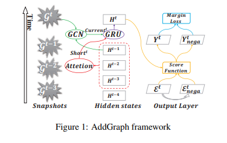
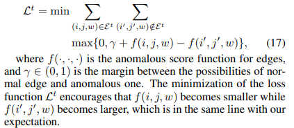
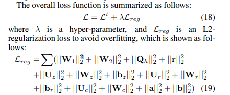
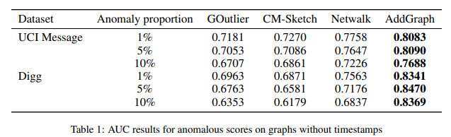
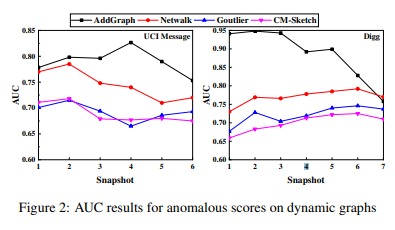

# AddGraph: Anomaly Detection in Dynamic Graph Using Attention-based Temporal GCN

## Abstract
Anomaly detection in dynamic graphs becomes very critical in many different application scenarios, e.g., recommender systems.

It also raises huge challenges due to the high flexible nature of anomaly and lack of sufficient labelled data.

It is better to learn the anomaly patterns by considering all possible hints including the structural, content and temporal features, rather than utilizing heuristic rules over the partial features.

In this paper, we propose **AddGraph**, a general end-to-end anomalous edge detection framework using an extended temporal GCN (Graph Convolutional Network) with an attention model, which can capture both long-term patterns and the short-term patterns in dynamic graphs.

In order to cope with insufficient explicit labelled data, we employ a selective negative sampling and margin loss in training of AddGraph in a semi-supervised fashion.

We conduct extensive experiments on real-world datasets, and illustrate that AddGraph can outperform the state-of-the-art competitors in anomaly detection significantly.

## Anomaly Detection over Graph Embedding
The anomaly detection is realized by the dynamic clustering model of node representation. Our work roughly follows a similar idea.

However, we extend GCN to the temporal GCN so that we can capture the temporal features in a more reasonable way, and we build an end-to-end semi-supervised learning model to detect anomalous edges rather than two-phases clustering, which has the potential to achieve better results.

## AddGraph Framework
The overview of our AddGraph framework is illustrated in Figure 1. The core idea behind AddGraph is to build a framework to describe the normal edges by using all possible features in the snapshots in the training phase, including structural, content and temporal features.

## Selective Negative Sampling and Loss
As the generated sampled edges may be still normal, we cannot use a strict loss function such as cross entropy to distinguish the existing edges and the generated ones. We then take the same idea in [Bordes et al., 2013] and use marginbased pairwise loss in training of AddGraph:

We cannot assume that all edges are still completely normal in the snapshots after training phase, while we need to compute the hidden states for each snapshot.

In the process of sampling on the graph mixed with normal and anomalous edges, we actually select partial edges which are more credible for the training. Specifically, for each edge $(i, j, w)$, we produce a negative sampled edge $(i' , j' , w)$. The sampled edge pair is discarded if $f(i, j, w) > f(i' , j' , w)$.

## Experiment

#### Results on Graphs without Timestamps
The results are shown in Table 1, in which the data of baselines are reported by [Yu et al., 2018]. 

#### Results on Dynamic Graphs
In the tests over dynamic graphs, we use the first 50% as the training data and the latter 50% as the test data. After anomaly injection with proportion of 5%, we split the training data and test data into snapshots. According to the size of dataset, the snapshot size is set to 1,000 and 6,000 for UCI Message and Digg respectively.

Figure 2 illustrates the results on dynamic graph, in which
the data of baselines are reported by [Yu et al., 2018].
