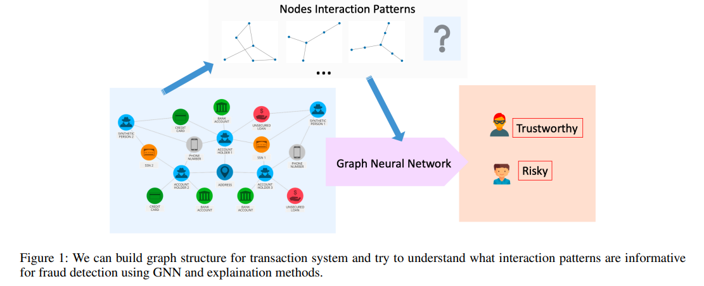
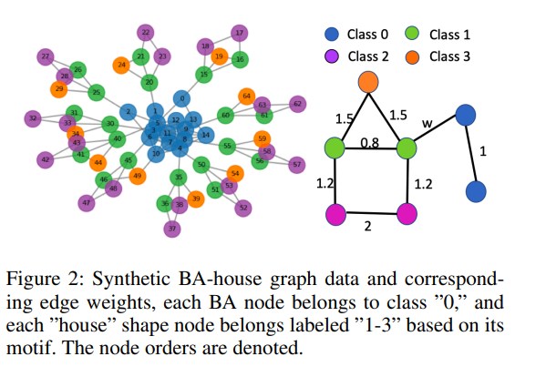
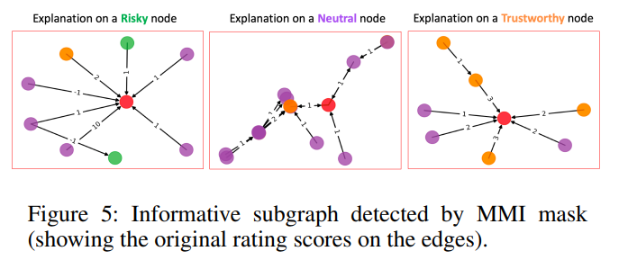
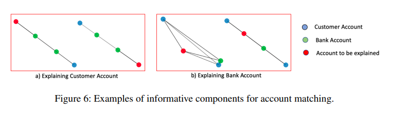
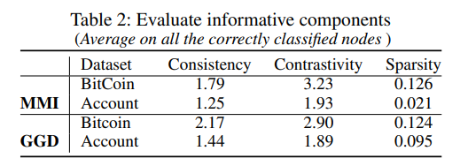

# Classifying and Understanding Financial Data Using Graph Neural Network

## Abstract
For the data collected in financial institutions, usually, it has additional topological structures and is amenable to be represented as a graph. For example, social networks, communication networks, financial systems, and payments networks.

The graph structure can be built from the connection of each entity, such as financial institutions, customers, or computing centers.

Given the structured data, Graph Neural Networks (GNNs) is a powerful tool that can mimic experts’ decision on node labeling.

GNNs combine node features through graph structure by using a neural network to embed node information and pass it through edges in the graph.

We want to identify the informative interaction in the input data used by the GNN model to classify the node in the graph and examine if the model works as we desire. 

However, due to the complex data representation and non-linear transformations, explaining decisions made by GNNs is challenging. 

In this work, we propose graph representation methods for finical transaction data and new graph features’ explanation methods to identify the informative graph topology. 

We use four datasets (one synthetic and three reals) to validate our methods. Our results demonstrate that graph-structured representation help to analyze financial transaction data, and our explanation approach can mimic patterns in human interpretation and disentangle different features in the graphs.

Our contribution is summarized as follows: 
1. We propose to transfer financial transaction data to weighted graph representation for further analysis and data information understanding. 
2. We propose to use GNN to analyze financial transaction data, including fraud detection and account matching.
3. We provide the tools to interpret informative interactions between entities for entity labeling in the structured-graph format.

## Explaining Informative Component of Graph Structures Data
- Maximal Mutual Information (MMI) Mask
- Guided Gradient (GGD) Salience
- Edge Weighted Graph Attention (E-GAT)
- Culturing Node Class Sensitivity

## Evaluation Metrics and Methods
We define metrics consistency, contrastivity and sparsity (Here, definition of contrastivity andsparsity are different from the ones in(Pope et al. 2019)) to measure informative component detection results.

## Experiments
- Note that, the color codes for all the figures below follow the on denoted in Figure 2. The red node is the node we try to classify and explain.

- Bitcoin OTC (Over-the-counter) Data

- Bank Transaction Data - Account Matching
We present a visualization of the informative components detected for each account type - costumer account or bank account in Figure 6.

- For the above two real datasets, we measured consistency, contrastivity, and sparsity by selecting the top 4 edges.

