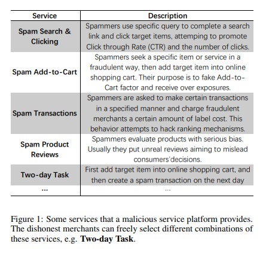
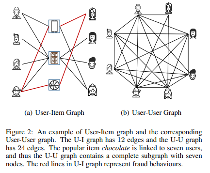
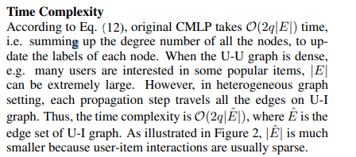
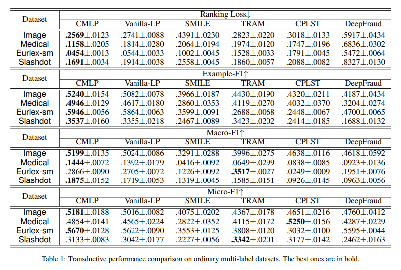
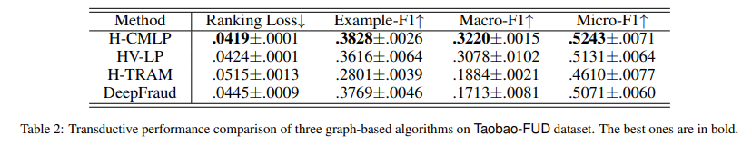

# Collaboration Based Multi-Label Propagation for Fraud Detection

## Abstract
Detecting fraud users, who fraudulently promote certain target items, is a challenging issue faced by e-commerce platforms.

Generally, many fraud users have different spam behaviors simultaneously, e.g. spam transactions, clicks, reviews and so on.

Existing solutions have two main limitations: 
1) the correlations among multiple spam behaviors are neglected; 
2) large-scale computations are intractable when dealing with an enormous user set.

To remedy these problems, this work proposes a **collaboration based multi-label propagation (CMLP) algorithm**.

We first introduce a generic version that involves collaboration technique to exploit label correlations.

Specifically, it breaks the final prediction into two parts: 
1) its own prediction part; 
2) the prediction of others, i.e. collaborative part. 

Then, to accelerate it on large-scale ecommerce data, we propose a **heterogeneous graph based variant** that detects communities on the useritem graph directly

## Introduction
In reality, a fraud user may perform multiple species of fraud operations simultaneously, such as spam transactions, clicks, reviews and so on. As illustrated in Figure 1, the third-party fraud platforms will provide some combinational fraudulent strategies.

Hence, a simple binary classification model is less powerful to deal with such rich labeling information.

To bridge this gap, we propose to assign each user multiple fraud labels. Moreover, since there are hundreds of millions of users, fully-annotation is impossible and only a few labeled data is available. Hence, it is formalized to a semisupervised multi-label learning (SSML) problem.

However, most of them are either incompatible for e-commerce tasks or incapable of handling instancelevel large-scale datasets.

This paper proposes a novel collaboration based multi-label propagation method (CMLP) for largescale SSML fraud detection task.

####  Collaboration Based Multi-Label Propagation 
In the e-commerce fraud detection scenario, our goal is to determine whether a user has some fraud behaviors. In general, malicious merchants will hire many fraud users to buy the same items. Therefore, a natural choice is to synthesize a user-user mapping (U-U graph) from the user-item bipartite graph (U-I graph), i.e. two users are connected to each other if they are interested in the same item.

Though this strategy avoids building a graph explicitly, which is usually time-consuming, we observe that it gives a really dense graph in practice (Figure 2).

#### Heterogeneous Graph Propagation
To alleviate this problem, we present a heterogeneous graph propagation (H-CMLP) approach, which detects communities on U-I graph directly.

## Experiments

#### Ordinary Multi-Label Data
We choose four real-world multi-label datasets from different task domains: 1) Medical [Pestian et al., 2007]: a text dataset contains clinical free texts, each of which is with 45 ICD9-CM labels, from CCHMC Department of Radiology. 2) Image [Wang et al., 2019]: a collection of 2, 000 images that are annotated by 5 labels. 3) Slashdot [Read et al., 2009]: a web text dataset collects 3, 782 technology-related news from 22 categories. 4) Eurlex-sm [Loza Menc’ia and Furnkranz, ¨ 2008]: a large text dataset contains 19, 348 legal documents about European Union law, having 201 subject matters tags. All the datasets are randomly partitioned to 5% labeled data and 95% unlabeled data.

Table 1 lists the transductive results on all the datasets.

#### E-commerce Fraud Data
The other experiment is conducted on a large-scale ecommerce dataset Taobao-FUD. Taobao-FUD collects an interaction matrix from more than 72 million users and 80 million items. Each user is equipped with four binary labels {Transaction, Cart, Click, Review}, indicating whether the users have corresponding fraud behaviors on some items.

Table 2 reports the transductive performance of all the methods on Taobao-FUD. 
