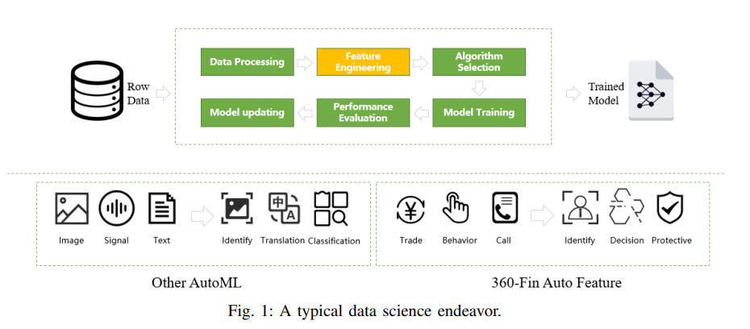
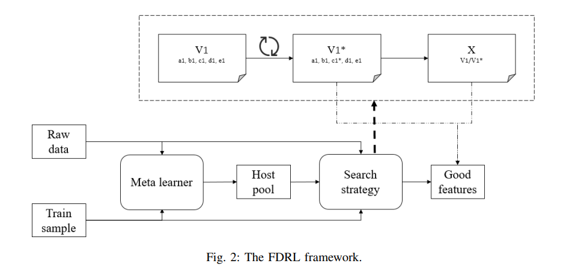
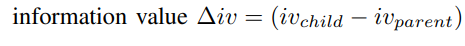
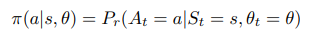
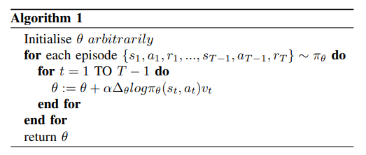
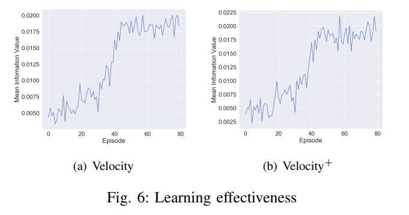
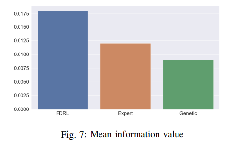
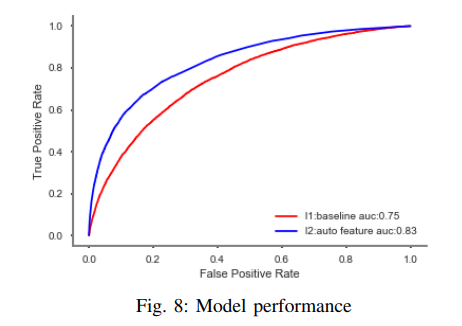

# Effective Automated Feature Derivation via Reinforcement Learning for Microcredit Default Prediction

## Abstract
#### Problem
Microcredit is a new financial instrument serving the segment of population that typically lack collateral and are highly likely to be rejected by traditional financial institutions, by lending very small loans.

It is very challenging to derive effective features from raw data as the searching space can be very large with noninformative features.

#### Proposition
In this paper, we propose a new performance-driven framework automated generating discriminating features from raw data via reinforcement learning to help improve the default prediction of the downstream classifier which may be a logistic regression or boosting tree.

Then we reformulate the feature generation problem as reinforcement learning by constructing a transformation link and regarding it as a sequential decision process.

Finally, experimental results on the data of user behavior log from 360 Financial show the significant improvement of the proposed method over our years of domain expert knowledge and the Genetic Programming.

#  INTRODUCTION

As shown in Fig. 1, the common credit modeling process can be described as follows: 

a) **Data Processing**: The data scientist collects mass of data including user information which can be seen directly as model feature and log data that are used to create new features 

b) **Feature Engineering**: We divide the concept of feature engineering into two categories. One is to create new feature by a algebraic equation with existing features. A common method is symbolic regression. The other is deriving new features from a source raw data through some complex strategy under a given budget. Unlike most existing researches mainly tackling the first type of problem, here in this paper, we are focusing on the second category which makes the most contribution of the default prediction and takes more than 80% of the time cost in financial credit modeling 

c) **Model Training**: With a good job of feature engineering, it is relatively easy to get a reliable model both in accuracy and generalization. Logistic regression used to be the most popular method with a few number of features as input depending on the carefully designing and selecting features by data scientist. More recently, boosting tree gradually takes its place due to the fact that credit data in Chinese market now are usually high dimensional and extremely heterogeneous

>From Fig. 1, we can also see that most researches about AutoML are focusing on image process, speech recognition and language translation. While, 360 Financial is dedicated to the practice in financial sector with its unique characteristic.

Our contributions through this paper are as follows:
- A formal paradigm for the automated feature derivation framework is defined to unify the feature structure, its interpretation and the calculation logic together 
- The feature generation problem is reformulated as reinforcement learning by constructing a transformation link and regarding it as a sequential decision process 
- We carry out an effective practice on default prediction in consumer finance and achieve a efficient and automated system exceed our expert experience

## FDRL FRAMEWORK

The whole framework is illustrated in Fig. 2 with 2 core parts that are meta learner and search strategy. The meta learner is a traditionally trained model taking a preprocessing role to accelerate the calculation and reduce the search space for the downstream search strategy.

#### Paradigm Definition
We expect to elaborate the paradigm through answering the above 3 questions.
- What kind of feature to derive - velocity+
- How to introduce the guidance signal- 1 as normal borrower and 0 as cheating user
- How to calculate the feature value - traditional tree based model to train a meta-learner with meta features like the rate of null value, the number of unique value, the relevance to labels from supervisor train samples and variance to assign the selectable columns to the component of host and initialize a potential host candidates pool.
#### Methodology
The components of reinforcement learning are defined as follows.
- **State**: 
We use a tuple like $(a, b, c, d, e)$ to represent a velocity feature.
While for the velocity+ feature, we use $(a1, b1, c1, d1, e1)$ standing for molecule and $(a2, b2, c2, d2, e2)$ standing for denominator
- **Action**:
For example if the agent chooses to change value $c$ to $c^{*}$ with parent feature state $(a, b, c, d, e)$, the child feature will be $(a, b, c^{∗} , d, e)$
- **Reward**:

The policy of choosing an action given a current state can be parameterized as:

As the training process goes on, the agent learns to choose proper action to transform a ordinary feature to a good feature through a plenty of trying. We summarize the learning method in Algorithm 1.

By exploring the transformation link, ”best” features are generated at the final state.

## EXPERIMENTS
The proposed method is evaluated with a real default prediction task and compared with our expert experience and the traditional Genetic Programming.

#### Train data
- We sample 100000 users from 360 Financial online lending system with the registration time distributed in 3 months. 
- All of these users have one or multiple loan records which depends on the number of successful loans. Each record can be further composed of loan time, loan amount and repayment time.
- More specifically, we define a user who has 30 days overdue repayment as default borrower, while leave others as normal users.

#### Learning effectiveness

We use the information value of the last state of each transformation link to evaluate the learning effectiveness. For the velocity feature, the final average information value rises up to 0.018 and the information value for velocity+ is near 0.02.

#### Performance comparison

Fig. 7 shows the mean information value of velocity features for different methods. We can see that the mean information value of artificially designed features is 0.011 while our proposed method can reach 0.018.

As shown in Fig. 8, the default prediction model with auto features gets 8% gain than the model with artificially designed features in terms of AUC score which is widely used to evaluate model performance.

## FUTURE WORK
In the future, we will try to set each component of a feature an agent to arrange its corresponding options and modify the learning policy a multi agent reinforcement learning.