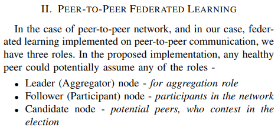
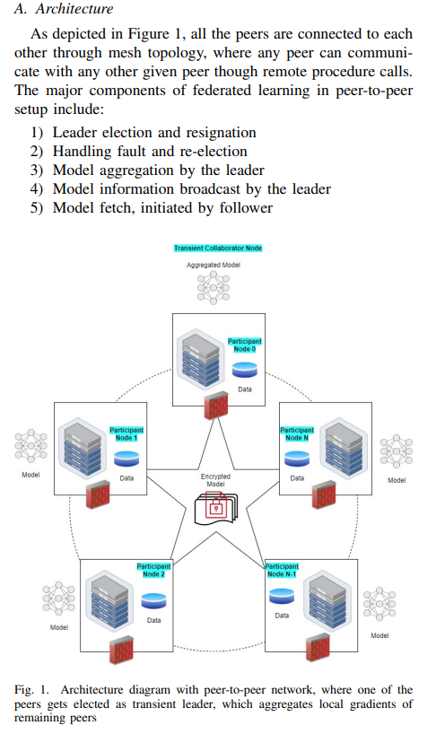

# Federated Learning using Peer-to-peer Network for Decentralized Orchestration of Model Weights

>**Federated learning**
Federated learning (also known as collaborative learning) is a machine learning technique that trains an algorithm across multiple decentralized edge devices or servers holding local data samples, without exchanging them. This approach stands in contrast to traditional centralized machine learning techniques where all the local datasets are uploaded to one server, as well as to more classical decentralized approaches which often assume that local data samples are identically distributed.
Federated learning enables multiple actors to build a common, robust machine learning model without sharing data, thus allowing to address critical issues such as data privacy, data security, data access rights and access to heterogeneous data. Its applications are spread over a number of industries including defense, telecommunications, IoT, and pharmaceutics. (From Wikipedia, the free encyclopedia)

## Abstract

Machine learning, and particularly Deep Learning requires large amounts of data, that in several instances are proprietary and confidential to many businesses.

In order to respect **individual organization’s privacy** in collaborative machine learning, federated learning could play a crucial role. Such implementations of privacy preserving federated learning find applicability in various ecosystems like finance, health care, legal, research and other fields that require preservation of privacy.

However, many such implementations are driven by a **centralized architecture** in the network, where the aggregator node becomes the single point of failure, and is also expected with lots of **computing resources** at its disposal.

In this paper, we propose an approach of implementing a **decentralized**, peer-topeer federated learning framework, that leverages **RAFT based** aggregator selection.

>**Raft** (algorithm) achieves consensus via an elected leader. A server in a raft cluster is either a leader or a follower, and can be a candidate in the precise case of an election (leader unavailable). The leader is responsible for log replication to the followers. It regularly informs the followers of its existence by sending a heartbeat message. Each follower has a timeout (typically between 150 and 300 ms) in which it expects the heartbeat from the leader. The timeout is reset on receiving the heartbeat. If no heartbeat is received the follower changes its status to candidate and starts a leader election. (from Wiki)

The proposal hinges on that fact that there is **no one permanent aggregator**, but instead a transient, time based elected leader, which will aggregate the models from all the peers in the network.

The leader ( aggregator) publishes the aggregated model on the network, for everyone to consume. Along with **peer-to-peer network** and **RAFT based aggregator selection**, the framework uses dynamic generation of cryptographic keys, to create a more secure mechanism for delivery of models within the network. The key rotation also ensures anonymity of the sender on the network too. 

Experiments conducted in the paper, verifies the usage of peer-to-peer network for creating a resilient federated learning network. Although the proposed solution uses an artificial neural network in it’s reference implementation, the generic design of the framework can accommodate any federated learning model within the network.

Index Terms—federated learning, machine learning, privacy, distributed, decentralized, blockchain, peer-to-peer, p2p