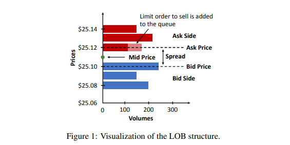
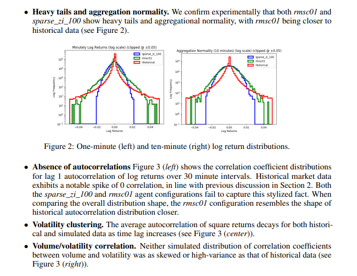
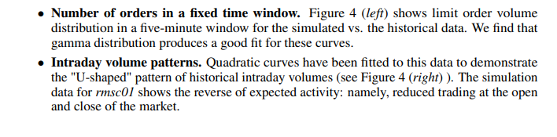
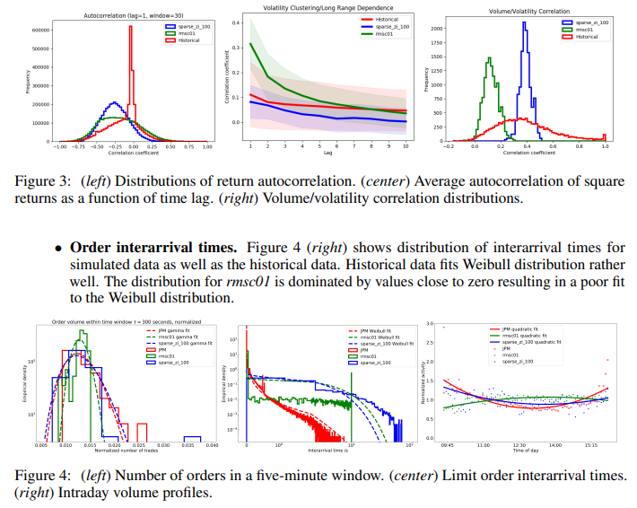

# Get Real: Realism Metrics for Robust Limit Order Book Market Simulations

## Abstract

Machine learning (especially reinforcement learning) methods for trading are increasingly reliant on simulation for agent training and testing. Furthermore, simulation is important for validation of hand-coded trading strategies and for testing hypotheses about market structure

In fact, researchers have shown that many market simulation approaches fail to reproduce statistics and stylized facts seen in real markets.

Our paper provides a comprehensive catalog of these metrics including mathematical formulations where appropriate. Our results show that there are still significant discrepancies between simulated markets and real ones.

A diagram illustrating LOB structure is provided in Figure 1.

##  Realism metrics
One way to establish IABS (Interactive agent-based simulation) realism is to ensure that simulated LOB (Limit Order Book) time series mimic the stylized facts derived from real market histories.

#### Stylized facts about asset return distributions
- Absence of autocorrelations
- Heavy tails and aggregational normality
- Intermittency
- Volatility clustering
- Long range dependence 
- Gain/loss asymmetry
- Volume/volatility positive correlation
- Returns/volatility negative correlation
- Asymmetric causal information flow 

#### Stylized facts about volumes and order flow
- Order book volumes
- Order sizes
- Number of orders in a fixed time window
- Order inter-arrival times I
- New order prices 
- Cancellation time, time-to-first-fill and time-to-execution
- Time correlation of order flow

#### Stylized facts about non-stationary patterns
- Intraday volume patterns
- Seasonal volume patterns
- Intraday sensitivity to macro economic events/holiday
- Intraday volume/spread negative correlation

#### Stylized facts about order market impact

#### Stylized facts about cross asset correlations

## Experimental results
####  Stylized facts about asset return distributions
To derive historical asset return distributions, we analyze minutely intraday log returns of 50 randomly sampled U.S. exchange-traded equities for each trading day of 2011. The set of equities is resampled each trading day and is drawn uniformly across all stocks from all exchanges.

#### Stylized facts about volumes and order flow
To derive historical distributions, we consider order book historical data for JPM stock traded on the NASDAQ exchange for each trading day of June 2019 from 9:30 am to 4:30 pm.

