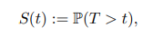

# Gradient Boosting Survival Tree with Applications in Credit Scoring

## ABSTRACT

Credit scoring plays a vital role in the field of consumer finance. Survival analysis provides an advanced solution to the credit-scoring problem by quantifying the probability of survival time.

In order to deal with highly heterogeneous industrial data collected in Chinese market of consumer finance, we propose a nonparametric ensemble tree model called gradient boosting survival tree (GBST) that extends the survival tree models with a gradient boosting algorithm.

we apply the GBST model to quantify the credit risk with large-scale real market datasets. The results show that the GBST model outperforms the existing survival models measured by the concordance index (C-index), Kolmogorov-Smirnov (KS) index, as well as by the area under the receiver operating characteristic curve (AUC) of each time period.

##  Gradient boosting survival tree
github: https://github.com/360jinrong/GBST

### Survival analysis
The survival analysis aims, in general, for quantifying the distribution of time until some random event happens.

Then for any time t, the survival function S(t) is defined as follows,

Comparing with the traditional credit scoring methods, the survival analysis is able to predict not only the probability whether a borrower defaults, but also the probability of time when he defaults.

### Learning objective
In the field of consumer finance, it quantifies the characteristics of each borrower, such as age, sex, education level, etc. The fundamental task of survival analysis is then to investigate the optimal survival function for each individual $S(t;x)$.

### Gradient boosting
Inspired by the gradient boosting method (Friedman, 2001), the optimization problem stated in Eq. (10) is solved in an additive manner.