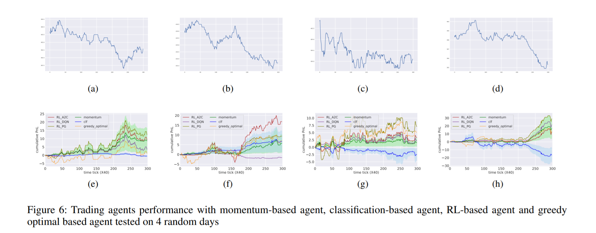

# Model-based Reinforcement Learning for Predictions and Control for Limit Order Books

## Abstract 
We build a profitable electronic trading agent with Reinforcement Learning that places buy and sell orders in the stock market. An environment model is built only with historical observational data, and the RL agent learns the trading policy by interacting with the environment model instead of with the real-market to minimize the risk and potential monetary loss. Trained in unsupervised and self-supervised fashion, our environment model learned a temporal and causal representation of the market in latent space through deep neural networks. We demonstrate that the trading policy trained entirely within the environment model can be transferred back into the real market and maintain its profitability. We believe that this environment model can serve as a robust simulator that predicts market movement as well as trade impact for further studies.

## Problem Formulation and Dataset
Limit Order Books (LOBs) are used by more than half of the exchange markets in the world (Rosu and others 2010).

We use observed trajectories of state transitions to train the environment model, and one transition is demonstrated in Fig 2.

## Model
This work has two parts: a world model that consists of latent representation learning of the LOB, state-action transition, and reward models. A trading agent trained based on the world model with three widely used RL methods.

## Explanation and Analysis
As shown in Fig 6, the RL agent’s performance is very close to the greedy-optimal solution in general and outperforms the other two benchmarks’ average performance by ∼ 10% to 30%.

We also show the transferability of RL policy from the world model to the real environment.
