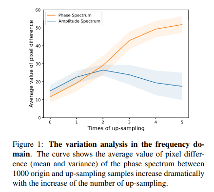
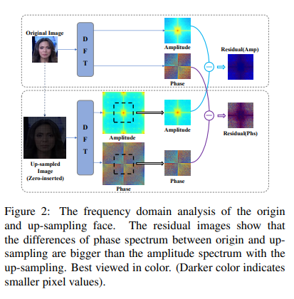
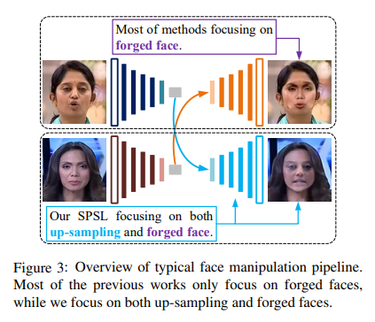
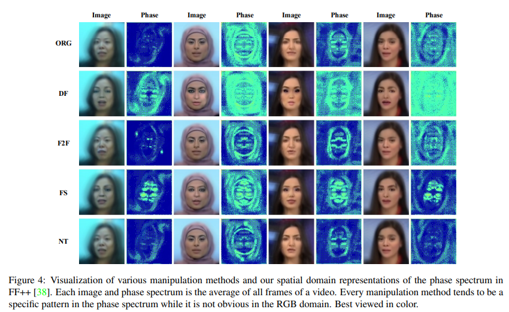
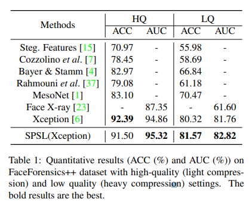
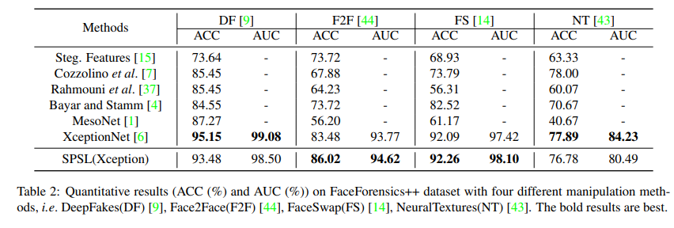
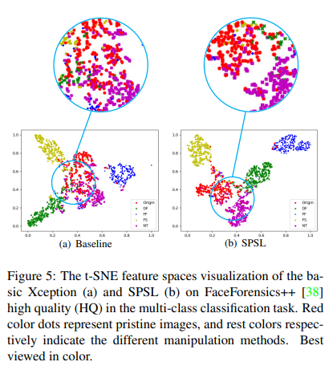

# Spatial-Phase Shallow Learning: Rethinking Face Forgery Detection in Frequency Domain
## Abstract

The remarkable success in face forgery techniques has received considerable attention in computer vision due to security concerns.

We observe that up-sampling is a necessary step of most face forgery techniques, and cumulative up-sampling will result in obvious changes in the frequency domain, especially in the phase spectrum.

According to the property of natural images, the phase spectrum preserves abundant frequency components that provide extra information and complement the loss of the amplitude spectrum.

- To this end, we present a novel Spatial-Phase Shallow Learning (SPSL) method, which combines spatial image and phase spectrum to capture the up-sampling artifacts of face forgery to improve the transferability, for face forgery detection.

Moreover, we notice that local texture information is more crucial than high-level semantic information for the face forgery detection task.

- So we reduce the receptive fields by shallowing the network to suppress high-level features and focus on the local region.

Extensive experiments show that SPSL can achieve the state-of-the-art performance on cross-datasets evaluation as well as multi-class classification and obtain comparable results on single dataset evaluation.

## Introduction
As shown in Figure 1, with more times of up-sampling operations are performed, the average pixel differences of the phase spectrum get much greater than that of the amplitude spectrum.

A visualization comparison can also be found in Figure 2.

The major contributions in this paper are summarized as follows:
- We firstly leverage the phase spectrum to detect forged face images and demonstrate that CNNs can capture extra implicit features of the phase spectrum which are beneficial to face forgery detection with precise mathematical derivation. 
- Aiming at the specific problem of forged face detection, we assume that high-level semantic information should be appropriately suppressed. And we experimentally validate the hypothesis by decreasing the receptive field of CNNs with shallow network learning. 
- We verify that our approach achieves the state-of-theart performance of forged face detection over crossdataset evaluation.

## SPSL for Face Forgery Detection

#### Motivation
As shown in Figure 3, a typical facial manipulation method consists of three stages [9]: 1) encoding source face; 2) swapping face in latent space; 3) decoding target face.

Up-sampling is a vital step for decoding the target face, based on either AutoEncoders [35] or GANs. 

Thus, we leverage the phase information to detect up-sampling artifacts. For applying phase information to CNNs, we reconstruct the spatial domain representation of the phase spectrum from the frequency domain (i.e. IDFT with the frequency spectrum without amplitude). 

Finally, we concatenate the spatial domain representation of the phase spectrum with the RGB image in the channel, which results in an RGBP 4-channel image.

- Capturing up-sampling artifacts via phase spectrum in face forgery
To detect the observed common artifacts, namely upsampling, we analyze it in the frequency domain. Up-sampling will lead to the emergence of new frequency components. And we make a claim as follows
Claim 1. Phase spectrum is more sensitive to up-sampling artifacts and therefore helps face forgery detection.

- Suppressing the semantic information and focusing on local region
We consider that the pivotal distinction between pristine face and forged face is local low-level features(e.g. textures, colors) instead of global high-level semantic features(e.g.face, human). Because most of these semantic features are shared in both pristine and forged faces, extensive highlevel semantic information more or less has a negative effect on forged face detection as it contains many common characteristics of pristine and forged face images.For the purpose of suppressing high-level semantic features and extracting more texture features, we straightforwardly shallow the neural network by throwing away many convolutional layers or blocks. Then we demonstrate that shallow networks are more transferable and efficient simultaneously

#### Experiments

