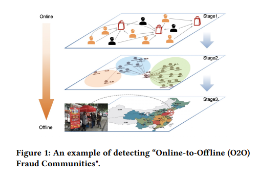
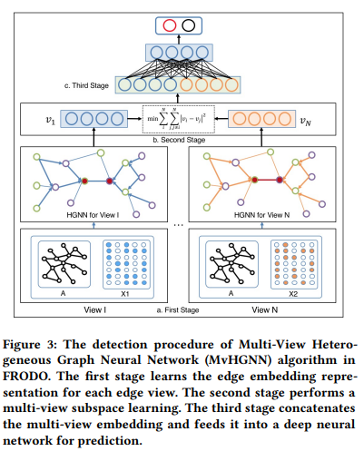
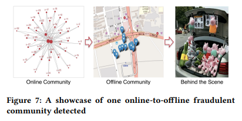
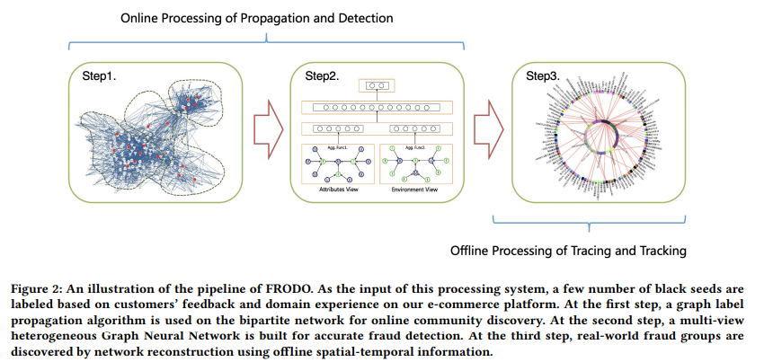

# What Happens Behind the Scene? Towards Fraud Community Detection in E-Commerce from Online to Offline

## Abstract
Fraud behavior poses a severe threat to e-commerce platforms and anti-fraud systems have become indispensable infrastructure of these platforms. 

Recently, there have been a large number of fraud detection models proposed to monitor online purchasing transactions and extract hidden fraud patterns. 

However, there have been an increasing number of malicious sellers on e-commerce platforms, according to our recent statistics, who purposely circumvent these online fraud detection systems by transferring their fake purchasing behaviors from online to offline. This way, the effectiveness of our existing fraud detection system built based upon online transactions is compromised. 

To solve this problem, we study in this paper a new problem, called offline fraud community detection, which can greatly strengthen our existing fraud detection systems. 

We propose a new **FRaud COmmunity Detection from Online to Offline (FRODO)** framework which combines the strength of both online and offline data views, especially the offline spatial-temporal data, for fraud community discovery. 

Moreover, a new **Multi-view Heterogeneous Graph Neural Network** model is proposed within our new FRODO framework which can find anomalous graph patterns such as biclique communities through only a small number of black seeds, i.e., a small number of labeled fraud users. 

The seeds are processed by a streamlined pipeline of three components comprised of label propagation for a high coverage, multi-view heterogeneous graph neural networks for high-risky fraud user recognition, and spatial-temporal network reconstruction and mining for offline fraud community detection. 

The extensive experimental results on a large real-life Taobao network, with 20 millions of users, 5 millions of product items and 30 millions of transactions, demonstrate the good effectiveness of the proposed methods.

## Reference
#### 源自於[量子位](https://inf.news/tech/944fbc4d3bcf459f1a4fc2b7f17570b8.html):
拔得頭籌的是一個名為FRODO的反作弊算法系統：基於大規模圖神經網絡，線上能實時識別電商虛假交易，線下能主動聚類挖掘風險社群，並形成聯動公檢法系統的自動化情報網絡，實時高效地傳遞電商風險信號的那一種。簡單說，就是能域內+域外、線上+線下、離散行為+聚集團伙、提前預警+主動防控，全方位打擊網絡虛假交易。

該論文在評審環節獲得了評委們的一致好評，並以六票全票通過，獲得了WWW2021物聯網研討會的最佳論文獎。

> WWW會議（全球資訊網國際會議）每年召開一次，是探討網際網路當前發展和未來趨勢的國際頂尖交流平台，並被中國計算機學會評定為頂級會議。

#### 為什麼治理網絡虛假交易變得尤為重要？
移動互聯時代，注意力成為稀缺資源。電商刷單風險的背後，隱藏著規模龐大的網絡黑灰產業鏈，其危害不容小視。

縱觀阿里電商行為風控，尤其是刷單行為反作弊的歷史演進，可以說與風險主體、作弊團伙、以及外部黑灰產平台的不斷攻擊疊代和技術對抗密不可分。尤其是近年來隨著阿里業務不斷發展，各種新興導購場景創新發展，更多的電商業務也面臨著越來越多的風險模式和變化，這為電商行為風控帶來了前所未有的挑戰。

正如淘系產品技術&平台生態業務負責人湯興（花名：平疇）所說：
>淘寶作為中國網際網路電子商務第一平台，既聯繫著數億消費者的日常所需，又是千萬商家的運營陣地，如何用最前沿的算法技術，維護平台交易安全和電商生態純淨是淘寶技術的重要使命

#### 反作弊系統FRODO如何煉成
面對無孔不入的網際網路黑產，淘系技術對抗智能團隊面臨的核心挑戰主要集中在3個維度：

- 業務維度，對於一系列線上-線下聯動的新型行為風險，如何通過升級傳統電商風控系統，實現online-to-offline一體化線上風險感知和實時線下風控立體布防；
- 技術維度，對於刷手社區、作弊賣家店群、黑灰產平台等風險網絡，如何結合多種圖算法優勢，實現針對高度複雜的風險圖譜認知技術應用；
- 電商風控體系維度，各種作弊模式層出不窮，如何以不變應萬變，通過構建體系化通用型的風控流程框架，實現對於各種刷單風險的統一認知和診斷治理。

另外，FRODO同時還輔以阿里自研的MvHGNN多視圖異構圖神經網絡算法，用來解決典型」地推刷單」等一系列電商交易O2O風險。

「地推刷單」是指黑產人員將刷手招募環節從線上遷移到線下，以地推的形式獲取真實用戶，採取面對面指導完成一系列刷單操作，並通常以小禮物贈送的方式即時獎勵兼職刷手，作為刷單酬勞。

面對這樣高成本的黑產強對抗，淘系技術展示了真正的技術實力：FRODO風控系統通過作弊種子傳播擴展召回、複雜異構GNN網絡風險提純、LBS時空信息引入進行GIS風險社群挖掘等全流程操作，實現了對於該類別風險的有效識別防範。

在2021財年，FRODO風控系統在阿里電商業務中全面上線應用。對抗智能團隊通過該技術創新，實現了對於虛假交易風險的秒級精準識別，準確率和召回率均有顯著提升。

同時，針對前述「地推刷單」風險，實現了線上風險行為識別與線下黑產社群打擊的深度聯動。線下黑產社群一經形成，FRODO風控系統即可快速感知行為風險，並通過引入刷手社群LBS信息和線下POI作弊網點信息，快速定位作弊時空社群。

據悉，以上一系列的識別流程可以實現小時級線上預警監測，並聯動阿里安全CRO、阿里客戶體驗CCO等部門實現天級別屬地現場確認取證。如上圖所示，FRODO已實現了從線上社群檢測到線下LBS定位，再到實地勘驗取證的全鏈路風控流程打通。

具體而言，FRODO反作弊系統構建了從線上到線下的一體化檢測框架。該框架結合了線上多視圖數據和線下時空數據，針對性解決作弊交易識別和欺詐社區檢測的多任務目標。 如上圖所示，FRODO框架由三個部分組成： 側重風險寬召回的標籤傳播LPA算法 用於高風險欺詐用戶識別的多視圖異構圖神經網絡Multi-view HGNN算法 用於離線欺詐社區檢測的時空網絡重構k-core和biclique社區挖掘等算法 FRODO框架一大特點是通過少量黑種子（即少量標記的欺詐用戶），就能找到異常的圖譜模式和線下風險社群，並達到了接近100%的準確度。對比於業界眾多領先baseline算法，FRODO均取得了最好結果。

#### 用好先進技術持續打造綠色平台
這樣的反作弊系統，能在人們的日常生活中發揮怎樣的價值？2月3日，人民日報時評文章《依法治理網絡虛假流量》，重點指出：
>從網上無孔不入的「刷單兼職」小廣告，到直播間營造虛假熱鬧場面，再到炮製網絡「爆文」，網絡黑灰產業鏈深入許多領域。
而FRODO等智能反作弊系統，正站在打擊黑灰產的第一線，旨在不斷治理電商生態，為平台商家提供公平、公正的線上營商環境。近年來，阿里依託於以FRODO為代表的領先人工智慧技術和先進的AutoRisk風控系統，協同配合網安行政、地方公檢法等各職能部門聯合治理電商生態，已成功打擊數個中大型作弊公司和刷單網絡平台，涉及虛假交易金額達數億元。