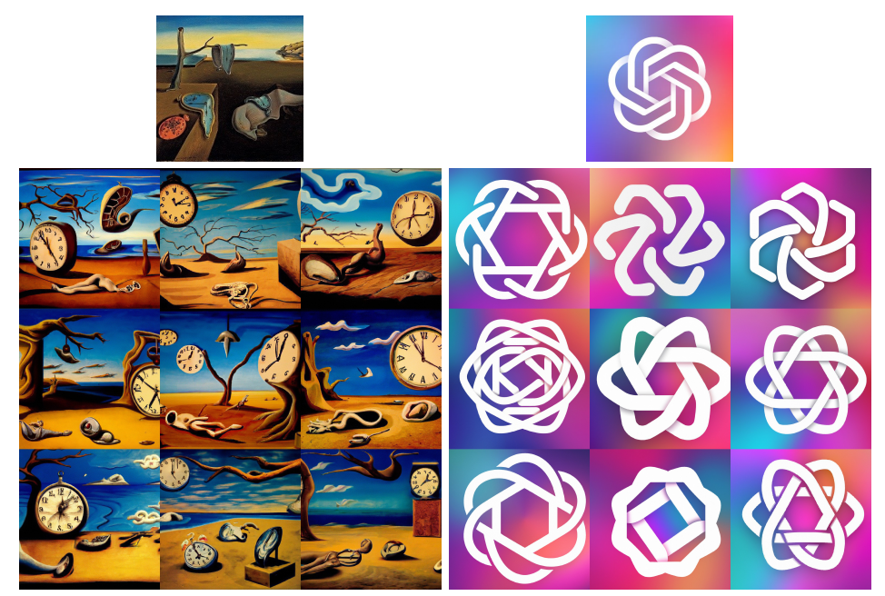
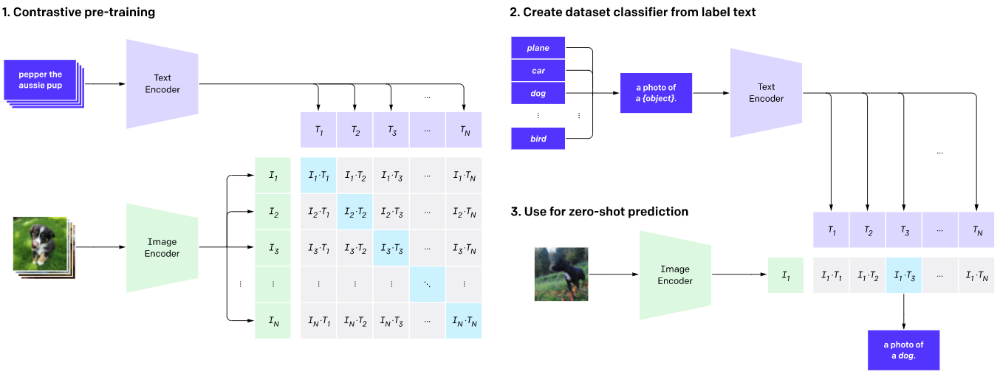
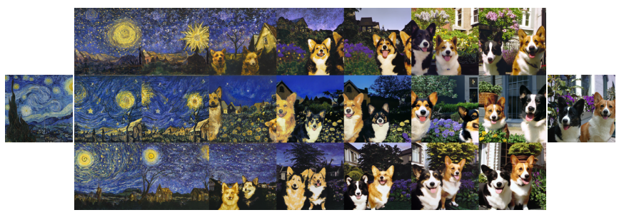
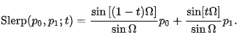
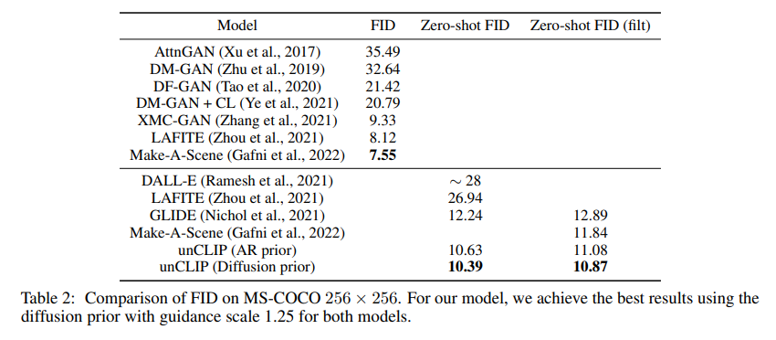
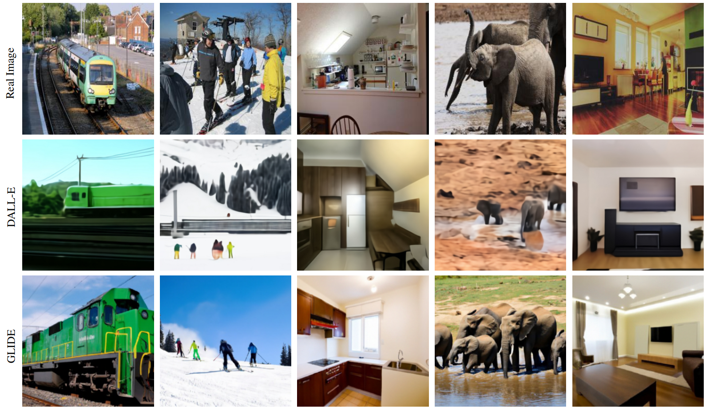

# Hierarchical Text-Conditional Image Generation with CLIP Latents
> A preliminary analysis of these issues in the context of the DALL·E 2 Preview platform (the first deployment of an unCLIP model), can be found in Mishkin et al.
reference: [DALL·E 2](https://openai.com/dall-e-2/)

> 

>
 Figure 2: Variations of an input image by encoding with CLIP and then decoding with a diffusion model.
## Abstract

- We propose a two-stage model: 
    - a prior that generates a **CLIP** image embedding given a text caption
    - a decoder that generates an image **conditioned** on the image embedding.

- We show that explicitly generating image representations improves image diversity with minimal loss in **photorealism** and **caption** similarity. 
    > **Photorealism** is a genre of art that encompasses painting, drawing and other graphic media, in which an artist studies a photograph and then attempts to reproduce the image as realistically as possible in another medium.

- Our decoders conditioned on image representations can also produce variations of an image that preserve both its **semantics** and **style**, while varying the non-essential details absent from the image representation. 

- We use **diffusion models** for the decoder and experiment with both **autoregressive** and **diffusion models** for the prior, finding that the latter are computationally more efficient and produce higher-quality samples.

## Method
> 
Figure 3: A high-level overview of unCLIP:
    1. Above the dotted line, we depict the **CLIP training process**, through which we learn a joint representation space for text and images. 
    2. Below the dotted line, we depict our **text-to-image generation process**: a CLIP text embedding is first fed to an autoregressive or diffusion prior to produce an image embedding, and then this embedding is used to **condition** a diffusion decoder which produces a final image. 
    3. Note that the CLIP model is **frozen** during training of the prior and decoder.

> **CLIP** 
CLIP pre-trains an **image encoder** and a **text encoder** to predict which images were paired with which texts in our dataset. We then use this behavior to turn CLIP into a zero-shot classifier. 

We convert all of a dataset’s classes into captions such as “a photo of a dog” and predict the class of the caption CLIP estimates best pairs with a given image.

#### Decoder
- We use **diffusion models** to produce images conditioned on CLIP image embeddings.
- Specifically, we modify the architecture described in Nichol et al. (2021) by:
    - projecting and adding **CLIP embeddings** to the existing timestep embedding, 
    - projecting CLIP embeddings into **four extra tokens** of context that are concatenated to the sequence of outputs from the **GLIDE** text encoder.
- To generate high resolution images, we train two **diffusion upsampler models**: one to upsample images from 64 × 64 to 256 × 256, and another to further upsample those to 1024 × 1024.

#### Prior
- While a decoder can invert CLIP image embeddings $z_{i}$ to produce images $x$, we need a prior model that produces $z_{i}$ from **captions $y$** to enable image generations from text captions.
- We explore two different model classes for the prior model:
    - **Autoregressive (AR) prior**: the CLIP image embedding $z_{i}$ is converted into a sequence of discrete codes and predicted autoregressively conditioned on the caption $y$.
    - **Diffusion prior**: The continuous vector $z_{i}$ is directly modelled using a Gaussian diffusion model conditioned on the caption $y$.

- We additionally allow for sampling using classifier-free guidance for both the AR and diffusion prior by **randomly dropping** this text conditioning information during training.

#### Variations
- Given an image $x$, we can obtain its CLIP **image embedding** $z_{i}$ and then use our decoder to **“invert”** $z_{i}$ , producing new images that we call **variations** of our input. 
<!-- - To make the variations more similar to the original image $x$, we first perform DDIM inversion of $x$ with the decoder conditioned on $z_{i}$ to obtain its DDIM inverted latent $z_{T}$ .
- We can then use $z_{T}$ as the initial noise when generating the images through the decoder. -->
- It is also possible to combine two images for variations. To do so, we perform **spherical interpolation** of their CLIP embeddings $z_{i}$ and $z_{j}$ to obtain intermediate $z_{θ} = slerp(z_{i} , z_{j} , θ)$, and produce variations of $z_{θ}$ by passing it through the decoder.
> 
Figure 4: Variations between two images by **interpolating their CLIP image embedding** and then decoding with a diffusion model. We fix the decoder seed across each row. The intermediate variations naturally blend the content and style from both input images.

> **spherical interpolation**:
Slerp(Spherical linear interpolation) has a geometric formula independent of quaternions, and independent of the dimension of the space in which the Let p0 and p1 be the first and last points of the arc, and let t be the parameter, 0 ≤ t ≤ 1. Compute Ω as the angle subtended by the arc, so that cos Ω = p0 ∙ p1, the n-dimensional dot product of the unit vectors from the origin to the ends. The geometric formula is then
 

## Exploring the CLIP Latent Space Using the unCLIP Decoder
- As an example use case, we can revisit cases where CLIP makes incorrect predictions, such as **typographic attacks**.<!-- In these adversarial images, a piece of text is overlayed on top of an object, which causes CLIP to predict the object described by the text rather than the object depicted in the image. This piece of text essentially hides the original object in terms of output probabilities. -->

> Figure 5: Variations of images featuring typographic attacks paired with the CLIP model’s predicted probabilities across three labels. 
    - Surprisingly, the decoder still recovers Granny Smith apples even when the predicted probability for this label is **near 0%**. 
    - We also find that our CLIP model is slightly less susceptible to the **“pizza”** attack than the models investigated in CLIP.

## Text-to-Image Generation
#### Importance of the Prior
- Although we train a **prior** to generate CLIP image embeddings from captions, the prior is not strictly necessary for caption-to-image generation. 

- For instance, our decoder can condition on both CLIP image embeddings and captions, but the CLIP image embedding is **dropped 5%** of the time during training in order to enable classifier-free guidance.
<!-- - Therefore, at sampling time, we can condition on only the caption, although this underperforms a model trained fully in this way (this model is GLIDE, and we do a thorough comparison with GLIDE in Sections 4.2 and 4.3). 
+ Another possibility is to feed the decoder the CLIP text embedding as if it were an image embedding, as previously observed. -->
> 
Figure 7: Samples using different conditioning signals for the same decoder. 
    - In the first row, we pass the **text caption** to the decoder, and pass a zero vector for the CLIP embedding. 
    - In the second row, we pass both the **text caption** and the **CLIP text embedding** of the caption. 
    - In the third row, we pass the **text** and a **CLIP image embedding** generated by an autoregressive prior for the given caption. 
    - Note that this decoder is only trained to do the text-to-image generation task (without the CLIP image representation) 5% of the time.

- Conditioning the decoder on just the caption is clearly worst, but conditioning on text embeddings zero-shot does produce reasonable results.

####  Human Evaluations
We observe in Figure 1 that unCLIP is capable of synthesizing complex, realistic images. While we can compare sample quality to past models using FID, its not always aligned with human judgment.
To better gauge the generation capabilities of our system, we conduct systematic human evaluations comparing unCLIP to GLIDE for photorealism, caption similarity, and sample diversity.

#### Improved Diversity-Fidelity Trade-off with Guidance
Compared to GLIDE, we qualitatively observe that unCLIP is able to generate more diverse images while leveraging the guidance technique to improve sample quality.
- For GLIDE, the semantics (camera angle, color, size) converge as we increase guidance scale,
- whereas for unCLIP the semantic information of the scene is frozen in the CLIP image embedding and therefore does not collapse when guiding the decoder.

> Figure 8: Samples when increasing guidance scale for both unCLIP and GLIDE, using the prompt, “**A green vase filled with red roses sitting on top of table.**” 
    - Samples from unCLIP improve in quality (more realistic lighting and shadows) but do not change in content as we increase guidance scale, preserving semantic diversity even at high decoder guidance scales.

#### The best minimum FID.
In the text-conditional image generation literature, it has become standard practice to evaluate FID on the MS-

## Related Work

