## Improving model adaptation for semantic segmentation by learning model-invariant features with multiple source-domain models
> institution: Hokkaido University, Japan

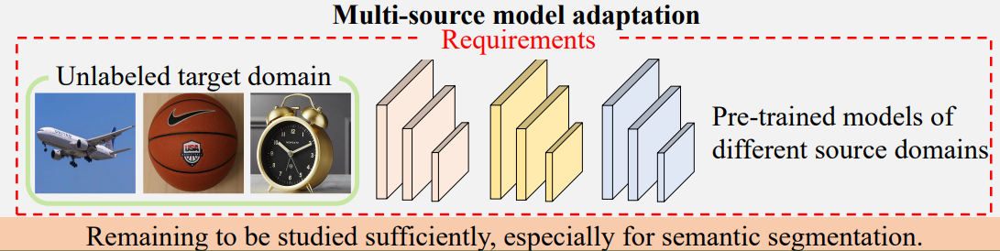

#### Motivation:
Domain shift problem: a well-trained model cannot perform well on a different data distribution from the training data.

#### Methodology:
- We propose a two-stage method with model-invariant feature learning for multi-source model adaptation of semantic segmentation.

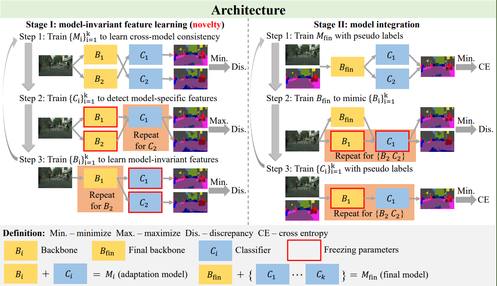

#### Experimental results
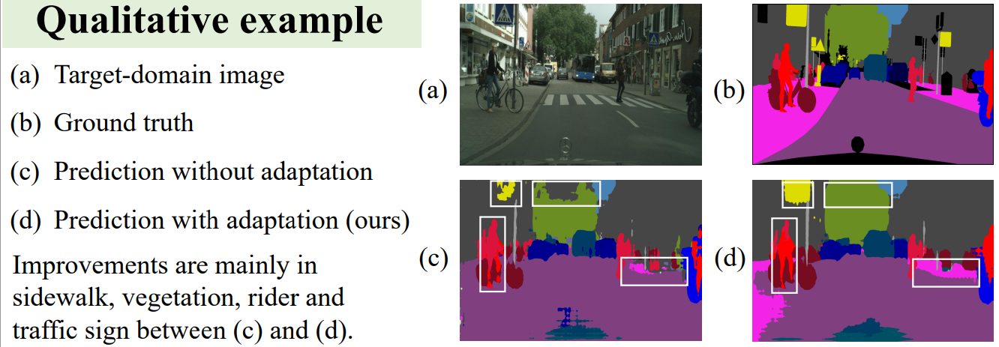

## STRONG-WEAK INTEGRATED SEMI-SUPERVISION FOR UNSUPERVISED DOMAIN ADAPTATION
> institution: Michigan State University

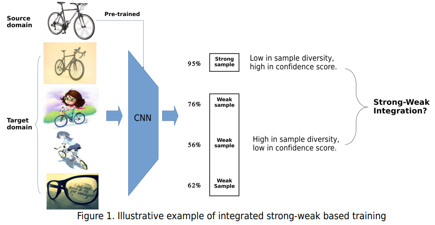

#### Motivation:
- Unsupervised domain adaptation (UDA) focuses on transferring knowledge learned in the labeled source domain to the unlabeled target domain. 
- Strong samples can help weak and misclassified samples in pseudo-label based training. 
- Strong samples are low in diversity but high in prediction confidence, conversely.
- Strong-weak integration can achieve good balance between diversity and prediction confidence.

#### Methodology:
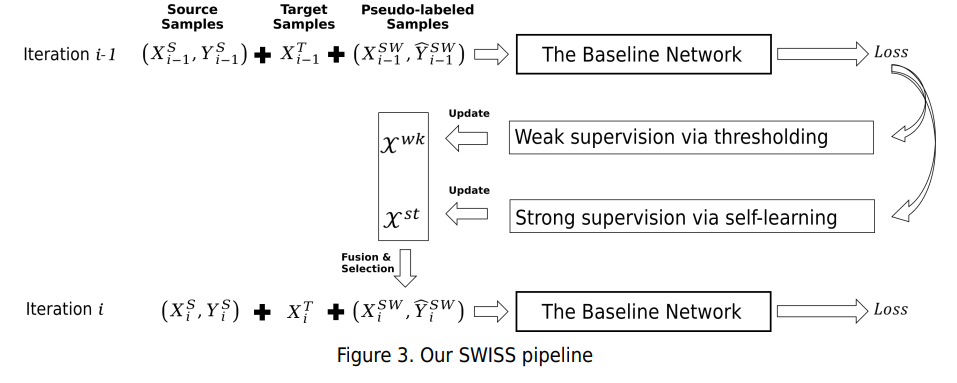
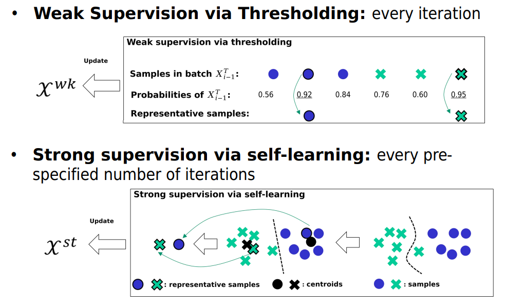

#### Experimental results
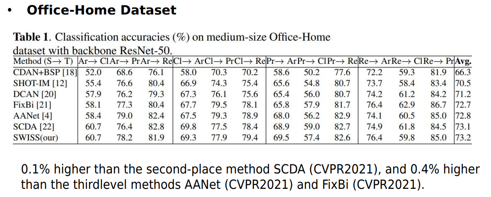

## FULLY SHAREABLE SCENE TEXT RECOGNITION MODELING FOR HORIZONTAL AND VERTICAL WRITING
> institution: NTT Corporation

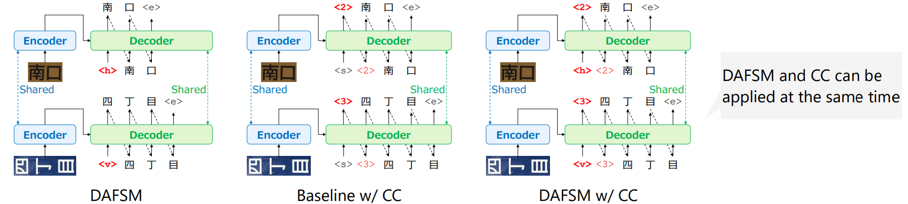

#### Motivation
- Require a large amount of both horizontal and vertical writing data
- Suffer from inadequate training on vertical writing because there is less vertical writing training data than horizontal writing data

#### Abstract
- Propose a simple and efficient method of joint scene text recognition for both horizontal and vertical writing 
    - Give the writing direction as an initial token to the autoregressive decoder while sharing all components for each writing direction 
    - Predict character count before predicting the character string 

- Not to decisively control the model according to the writing direction, but to flexibly consider the writing direction in the continuous space obtained by the fully shareable model for horizontal and vertical writing

#### Experimental results
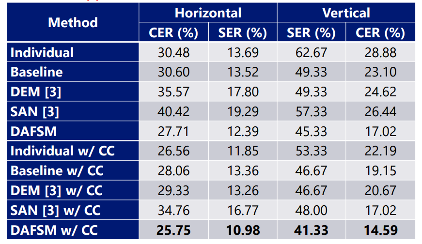
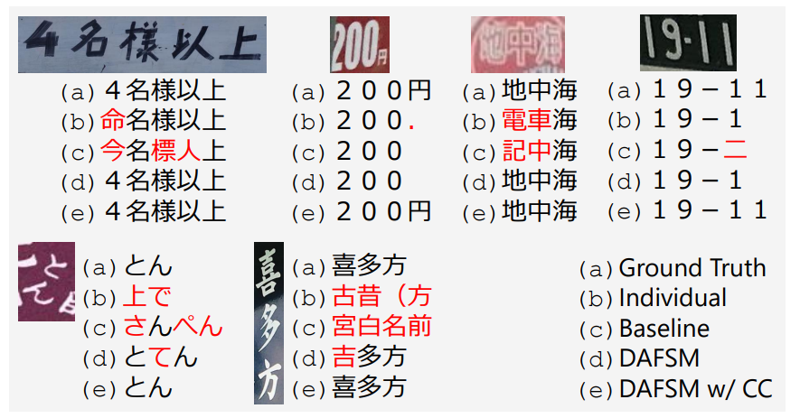

### Learning Contextually Fused Audio-visual Representations for Audio-visual Speech Recognition
> Chinese Academy of Sciences

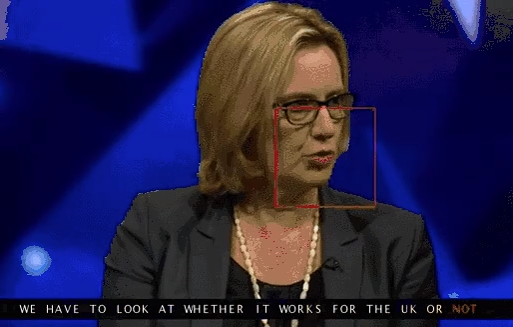

#### INTRODUCTION
- We propose a self-supervised audio-visual representation learning approach for AVSR. 
- It extends the audio-visual correspondence and masked prediction into a unifed learning objective: audiovisual recovery, where the model is trained to recover the masked information of one modality with the help of 
    - the complementarity from the other modality and 
    - the contexts in a sequence.

#### Methodology:
Masking-Fusion-Recovery The model is pretrained by frstly fusing the partially masked lowlevel audio visual representations, then recovering the masked information through contrastive loss. 
• Cross-modal negative sampling In the contrastive loss, in addition to using the low-level representations within the same modality as the negative samples, we propose to use the representations from the other modality as additional negative samples. 
• Single-modality fne-tuning When applying the pre-trained model to single-modality tasks like ASR/VSR, we can simply replace the missing modality with the learned mask embedding.
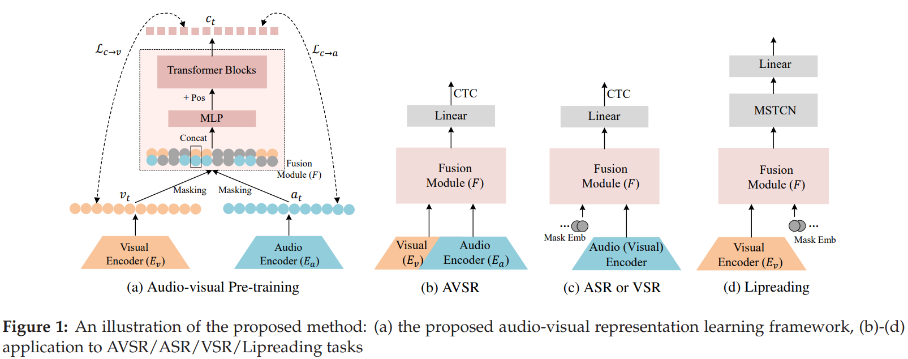

#### Result:
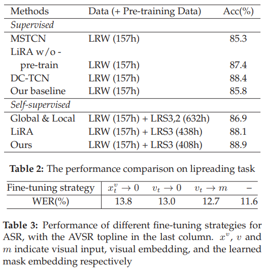

## SEQDNET: IMPROVING MISSING VALUE BY SEQUENTIAL DEPTH NETWORK
> institution: National Taiwan University, Taiwan

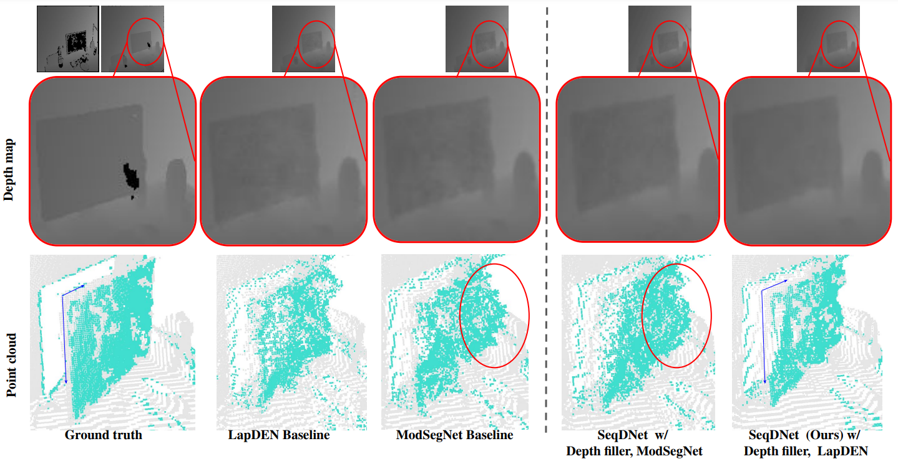

#### Motivation:
- Depth estimation is essential for many applications, such as 3D reconstruction and object recognition.
- In practice, the captured depth images naturally suffer from the noise and invalid depth value, i.e, depth noise and depth hole.

#### Methodology:
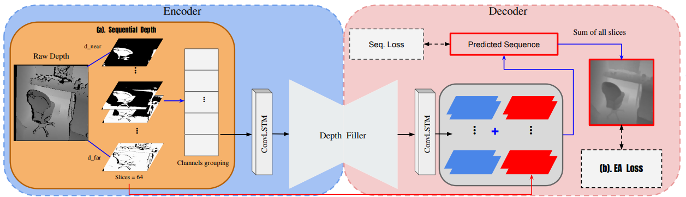
- **Sequential Depth**:
The thresholds are defined by the distance from near to far. The formula is:
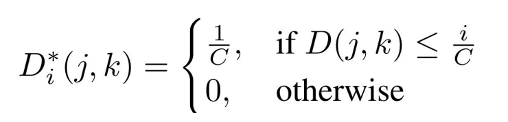
<!-- - Edge Awareness Loss (EA Loss):
EA Loss leverages the gradient of normal map as weights to represent the importance of current positions.
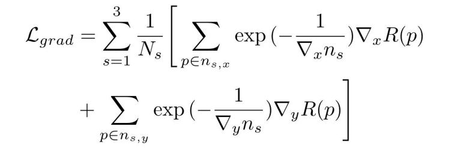 -->
- **Seq. Loss**:
    - SeqDNet learns the depth prediction by considering the costs of each slice.
    - To slice true depth, we must ensure that the depth value should be quantized without losing the original accuracy.
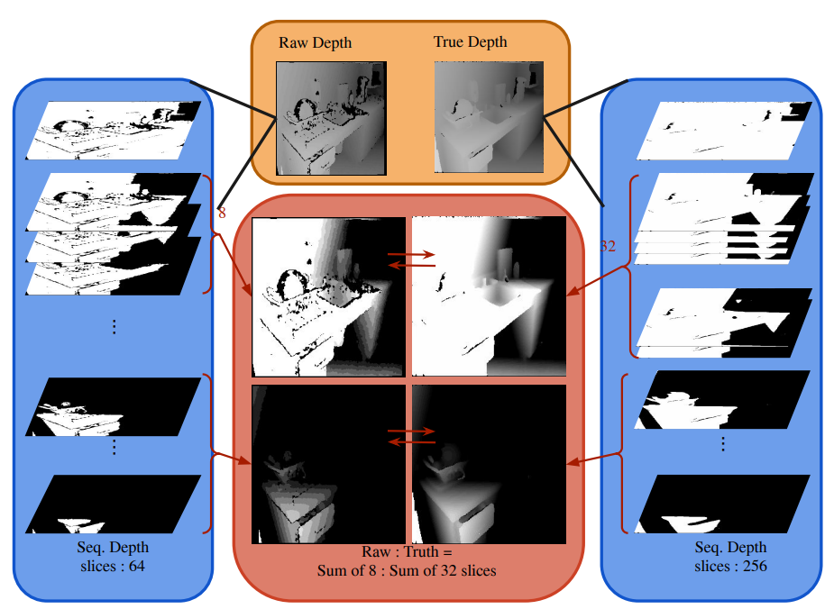

#### Result:
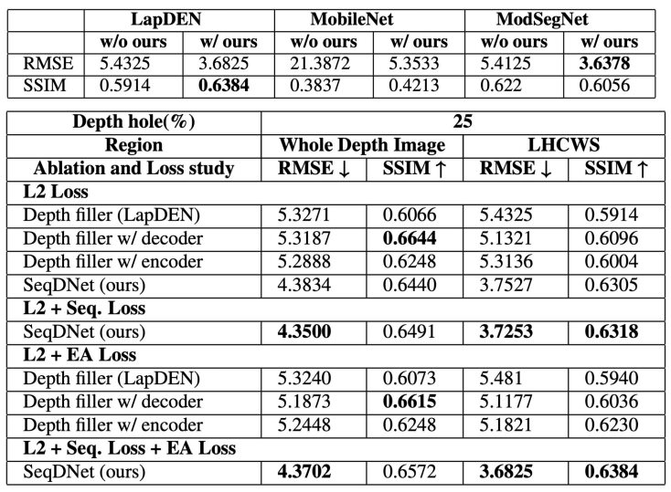
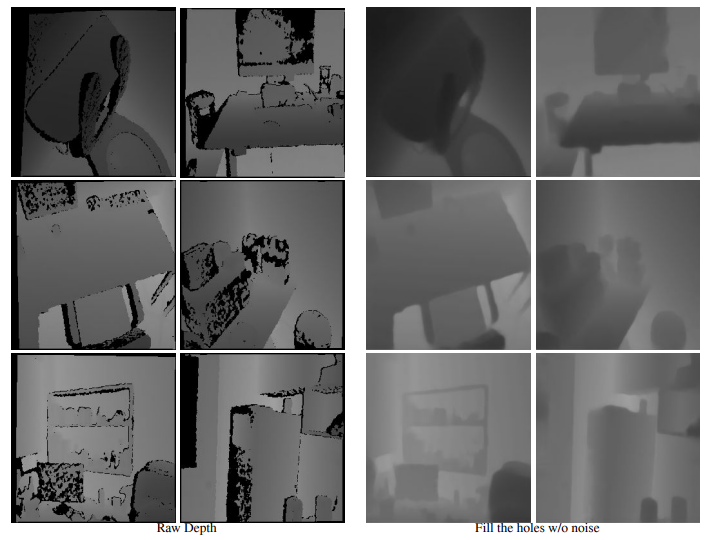
