# CharFormer: A Glyph Fusion based Attentive Framework for High-precision Character Image Denoising

> author: Hao Xu, Jilin University
conference: ACM International Conference on Multimedia 2022 (ACM MM, 2022)

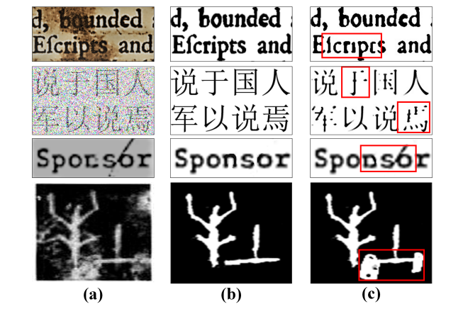
> Figure 1: Character image denoising examples. (a) Character images with different degradation. (b) Correct denoising results. (c) Denoising results with incorrect glyphs, where the incorrect parts of glyphs are highlighted in red boxes.

## ABSTRACT

- Current methods only focus on **pixel-level information** and **ignore critical features of a character**, such as its glyph, resulting in character-glyph damage during the denoising process.
- we introduce a novel generic framework based on **glyph** fusion and attention mechanisms, for precisely recovering character images without changing their inherent glyphs.
- CharFormer introduces a parallel target task for capturing **additional information** and injecting it into the image denoising backbone, which will maintain the consistency of character glyphs during character image denoising.
- Moreover, we utilize attention-based networks for **global-local feature** interaction, which will help to deal with blind denoising and enhance denoising performance.

## PROPOSED CHARFORMER
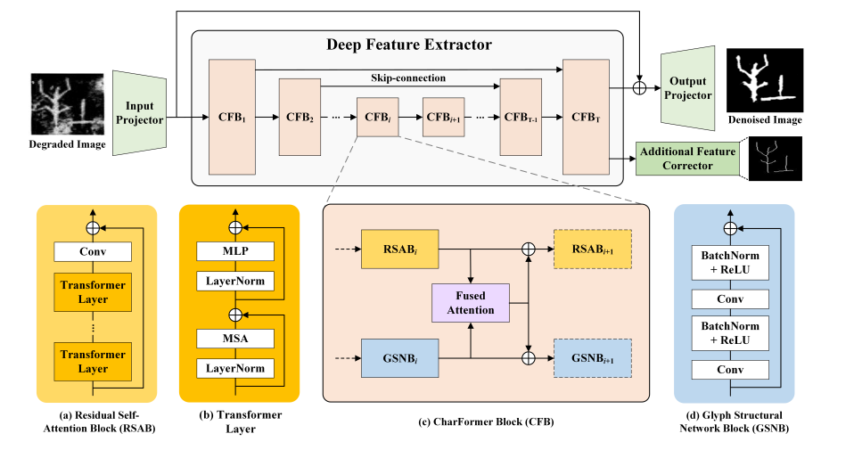
> Figure 2: The overall architecture of the proposed CharFormer, where different blocks and layers are distinguished by colours.

### Framework Architecture
#### 1. Input Projector.
- The input projector applies a 3 × 3 convolution layer with LeakyReLU, which aims to extract the shallow features of the input character image.

#### 2. Deep Feature Extractor.
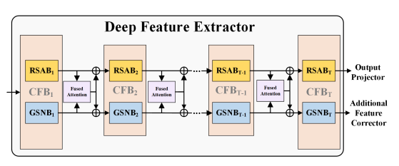
> Figure 3: Details of CFB connections for demonstrating how each component of CFB works and the feature transformation procedure.
- The deep feature extractor is developed into a U-shaped encoder-decoder structure, which is composed of 𝑇 CharFormer blocks (CFB).
- Note that each CFB parallelly organizes two components, RSAB and GSNB, to learn denoising information and glyph features, respectively, as Figure 3 shows.

#### 3. Output Projector.
- The output feature map of the deep feature extractor consists of two parts due to the specific structure of CFBs, where $𝐹_{𝑅𝐸𝐶}$ will be fed into the output projector for clean character reconstruction
- For pixel level image reconstruction, we introduce the pixel loss for the reconstructed character image $𝐼_{𝑅}$ as:
    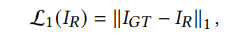
- The perceptual loss $L_{𝑃} (·)$ is proposed by considering the feature level information comparison and the global discrepancy.
- Based on a VGG16 model 𝑉𝐺𝐺(·) pretrained on the ImageNet dataset, we define perceptual loss for 𝐼𝑅 as:
    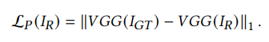
> Perceptual Losses for Real-Time Style Transfer and Super-Resolution
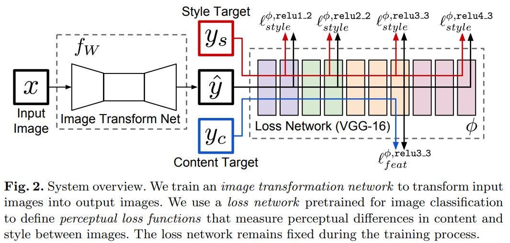
<!-- 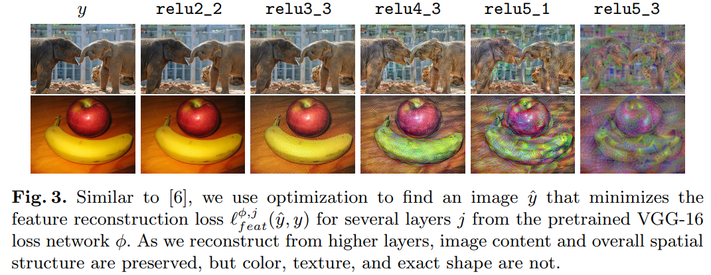 -->

#### 4. Additional Feature Corrector.
- By inputting the ground truth of the noisy character image $𝐼_{𝐺𝑇}$ , we obtain the skeletonized binary image $𝐼_{𝐺𝑇_{𝑆}} ∈ R^{H×W}$.
- We utilize the same loss functions in this module with the output projector, thus, we have:
    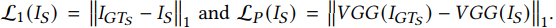

### CharFormer Block
#### 1. Residual Self-Attention Block.
- We aim to take advantage of the self-attention mechanism for capturing long-range spatial dependencies and apply a regular convolution layer for improving the translational equivariance of the network.
#### 2. Glyph Structural Network Block.
- GSNB is designed to extract the glyph information that will be injected into the backbone network RSABs, it stacks 3 × 3 convolution layers in a residual block.
#### 3. Fused Attention.
- Inspired by CBAM (Convolutional Block Attention Module), Given an input feature $𝐹_{𝑘}$ , the output $𝐹𝐴(𝐹_{𝑘})$ of the fused attention layer is:
    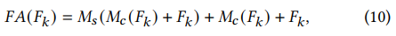
    where $𝑀_{𝑐}$, $𝑀_{𝑠}$ are the channel and spatial attention, respectively.

> 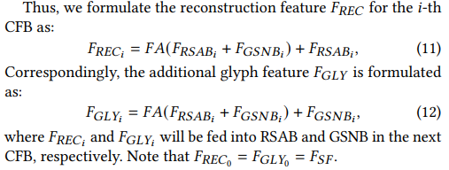

#### 4. Overall Loss Function
Finally, we define the overall loss function for CharFormer as:
    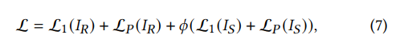

### EXPERIMENTS
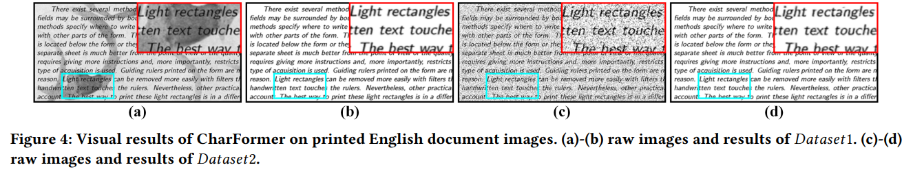
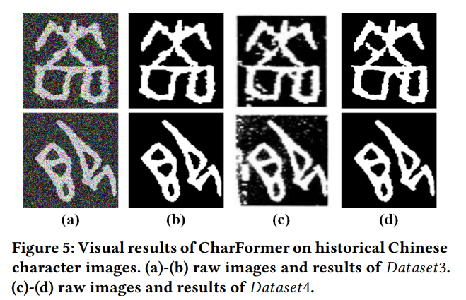
- Thus, we obtain 𝐷𝑎𝑡𝑎𝑠𝑒𝑡1 which involves noisy raw images with uneven backgrounds. 
- We also generate 𝐷𝑎𝑡𝑎𝑠𝑒𝑡2 by adding mixed Gaussian and speckle noise (noise variance 𝜎 = 5) on the ground truth of document-level images.
- 𝐷𝑎𝑡𝑎𝑠𝑒𝑡3 simulates a blind denoising scenario by randomly adding mixed Gaussian and speckle noise (noise variance 𝜎 = [10, 50]) to the ground truth of these character-level images, where the ground truth images are manually annotated by five philologists.
- we define the noisy raw character images as 𝐷𝑎𝑡𝑎𝑠𝑒𝑡4 to provide cases with complex noise.

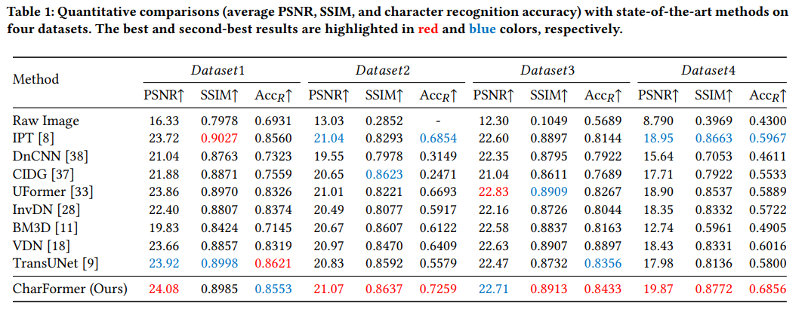
### Qualitative comparisons
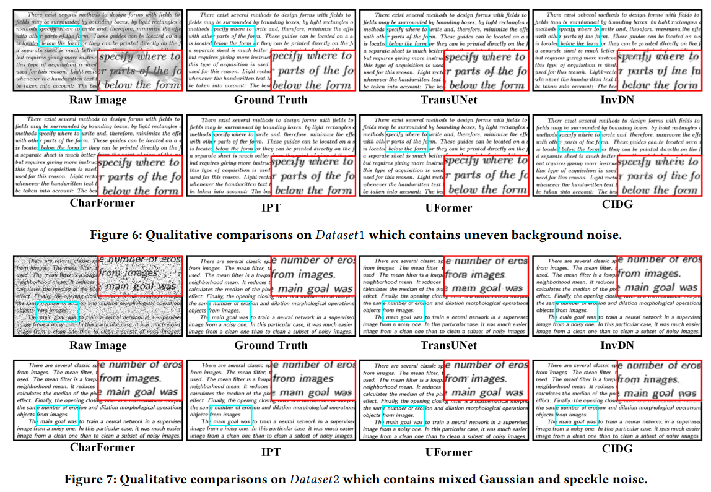
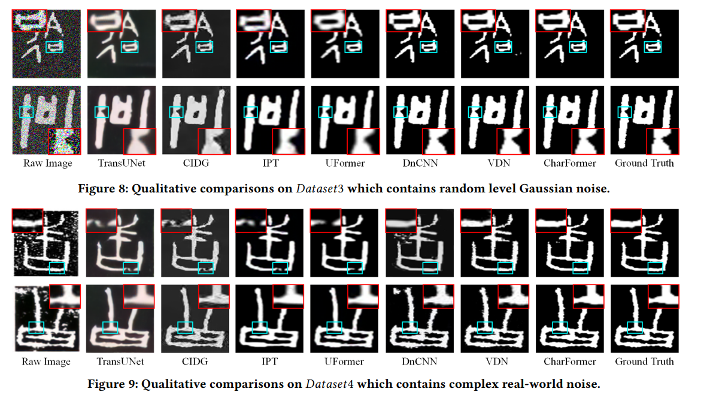

### Validation of Glyph Information Extraction.
The former two images refer to the noisy character image and its ground truth and the last image is the character skeleton, where we can find that the glyphs are extracted properly.
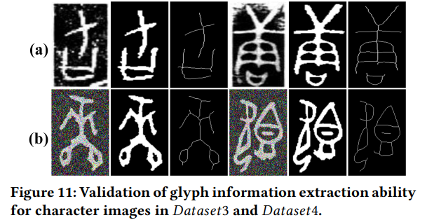