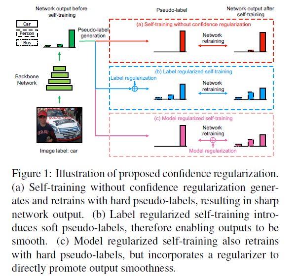
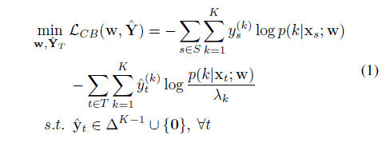
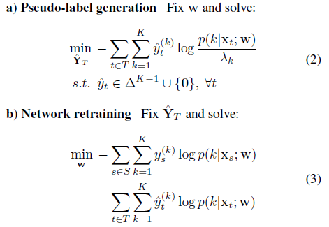
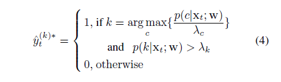
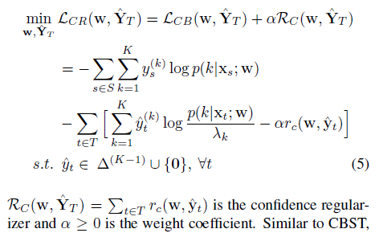
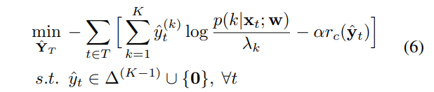
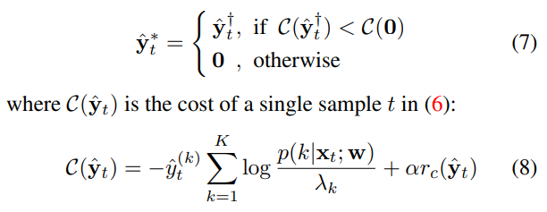
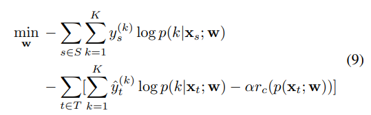
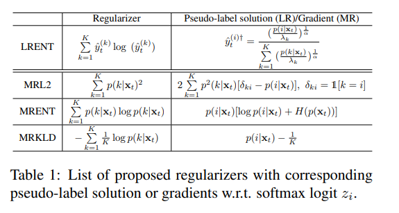

# Confidence Regularized Self-Training(CBST)

## Abstract
Since pseudo-labels can be noisy, self-training can put overconfident label belief on wrong classes, leading to deviated solutions with propagated errors.

To address the problem, we propose a confidence regularized self-training (CRST) framework, formulated as regularized self-training.

We propose two types of confidence regularization: label regularization (LR) and model regularization (MR). CRST-LR generates soft pseudo-labels while CRST-MR encourages the smoothness on network output.

The code and models of this work are available at https://github.com/yzou2/CRST.

## Continuous class-balanced self-training
CBST is a self-training framework that performs joint network learning and pseudo-label estimation under a unified loss minimization problem.
Here, we first relax the pseudo-label variables to continuous domain, as shown in

The feasible set is the union of f0g and a probability simplex $\Delta^{K-1}$.

The continuous CBST is solved by alternating optimization based on the following a), b) steps:

For solving step a), there is a global optimizer for arbitrary $^yt = (^y(1) t ; :::; ^y(K) t ) $ as follows.

For solving step b), one can use typical gradient-based methods such as mini-batch gradient descent.

## Confidence regularized self-training
we leverage confidence regularization to prevent the over-minimization of entropy that could lead to degraded performance in self-training.

>**Remark:** The only difference between CBST and continuous CBST lies in the feasible set where continuous CBST has a probability simplex while CBST has a set of onehot vectors. Although the feasible set relaxization does not change the solutions of CBST and the pseudo-labels are still one-hot vectors, continuous CBST allows generating soft pseudo-labels if specific regularizers are introduced into pseudo-label generation. Thus it serves as the basis for our proposed label regularized self-training.

In this paper, we introduce two types of CRST frameworks: label regularized self-training and model regularized self-training.

#### Label regularization
With fixed $w$, the pseudo-label generation in step a) of CRST-LR is defined as follows:

The global minimizer of (6) can be found via a twostage optimization given the special structure of the feasible space. The first stage involves minimizing (6) within $∆^{(K−1)}$ only, which gives $\hat{y}^{†}_{t}$ . The second stage is to select between $\hat{y}^{†}_{ t}$ or $0$ by checking which leads to a lower cost:

#### Model regularization
Compared to CBST, CRST-MR has the same hard pseudo-label generation process. But in network retraining of step b), CRST-MR uses a cross-entropy loss regularized by an output smoothness encouraging term. We define the optimization problem in step b) as follows:

Specifically, we introduce three model regularizers in Table 1 based on $L2$, negative entropy and KLD between uniform distribution u and softmax output.

