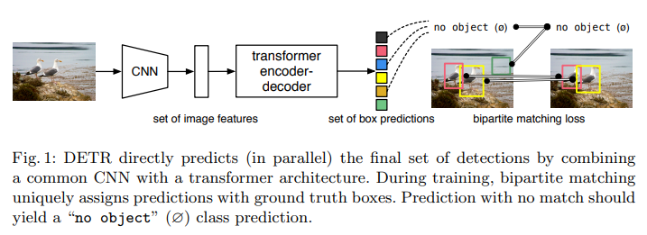
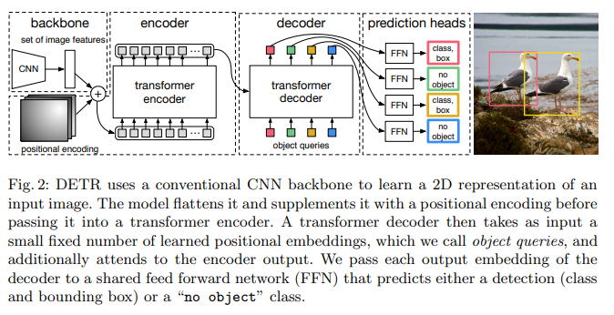
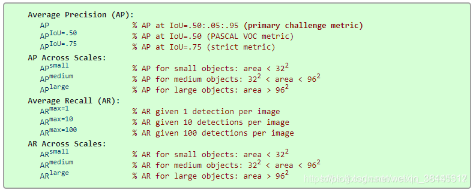

## End-to-End Object Detection with Transformers

#### Abstract

Our approach streamlines the detection pipeline, effectively removing the need for many hand-designed components like a ~~non-maximum suppression procedure~~ or ~~anchor generation that explicitly encode our prior knowledge about the task~~.

The main ingredients of the new framework, called DEtection TRansformer or DETR, are a **set-based global loss that forces unique predictions via bipartite matching**, and a **transformer encoder-decoder architecture**.

#### DETR architecture
Inference code for DETR can be implemented in less than 50 lines in PyTorch. We hope that the simplicity of our method will attract new researchers to the detection community.

- Since the transformer architecture is permutation-invariant, we supplement it with fixed **positional encodings** that are added to the input of each attention layer [46].

- The difference with the original transformer is that our model **decodes the N objects in parallel** at each decoder layer, while Vaswani et al. [46] use an autoregressive model that predicts the output sequence one element at a time.

- Since the decoder is also permutation-invariant, the **$N$ input embeddings must be different** to produce different results.

- These input embeddings are learnt positional encodings that we refer to as **object queries**, and similarly to the encoder, we add them to the input of each attention layer.

- They are then independently decoded into **box coordinates** and **class labels** by a feed forward network (described in the next subsection), resulting N final predictions.

#### Object detection set prediction loss
1. DETR infers **a fixed-size set of $N$ predictions**, in a single pass through the decoder, where $N$ is set to be significantly larger than the typical number of objects in an image. 

2. $L_{match}$ is a pair-wise matching cost between ground truth $y_{i}$ and a prediction with index $σ(i)$. This optimal assignment is computed efficiently with the [Hungarian algorithm](https://blog.csdn.net/u014754127/article/details/78086014).

3. Each element $i$ of the ground truth set can be seen as a $y_{i} = (c_{i} , b_{i})$ where $c_{i}$ is the target class label (which may be $∅$) and $b_{i} ∈ [0, 1]^{4}$ is a vector that defines ground truth box **center coordinates** and its **height** and **width** relative to the image size.

 4. We define the loss similarly to the losses of common object detectors:

where $L_{box(b_{i} , \hat{b}_{\hat{σ}(i)})}$ = $λ_{iou}L_{iou}(b_{i} , \hat{b}_{σ(i)}) + λ_{L1}L_{1}||b_{i} − \hat{b}_{σ(i)} ||_{1}$, where $λ_{iou}, λ_{L1} ∈ R $ are hyperparameters.

#### Experiment result
**Dataset.** We perform experiments on COCO 2017 detection and panoptic segmentation datasets.
> 

we also increase the feature resolution by adding a dilation to the last stage of the backbone and removing a stride from the first convolution of this stage. The corresponding models are called respectively DETR-DC5 and DETR-DC5-R101.

#### Ablations
**Importance of global imagelevel self-attention.** 

**DETR does not need NMS by design.**

**Generalization to unseen numbers of instances.**

**It mostly attends to object extremities such as heads or legs.**
