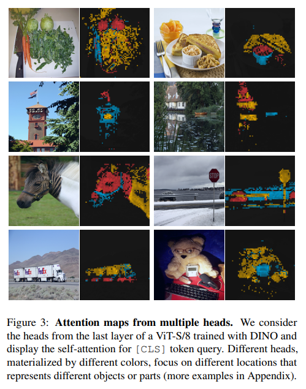

# Emerging Properties in Self-Supervised Vision Transformers (DINO)
`Proceedings of the International Conference on Computer Vision '21 (ICCV 2021)`

> AN IMAGE IS WORTH 16X16 WORDS: TRANSFORMERS FOR IMAGE RECOGNITION AT SCALE (Google Brain, ICLR 2021)
We show that this reliance on CNNs is not necessary and a pure transformer applied directly to sequences of image patches can perform very well on image classification tasks. When pre-trained on large amounts of data and transferred to multiple mid-sized or small image recognition benchmarks (ImageNet, CIFAR-100, VTAB, etc.), Vision Transformer (ViT) attains excellent results compared to state-of-the-art convolutional networks while requiring substantially fewer computational resources to train.

## Abstract
- In this paper, we question if **self-supervised learning** provides new properties to **Vision Transformer (ViT)** that stand out compared to convolutional networks (convnets).
- Beyond the fact that adapting self-supervised methods to this architecture works particularly well, we make the following observations:
    1. **self-supervised ViT features contain explicit information about the semantic segmentation of an image**, which does not emerge as clearly with supervised ViTs, nor with convnets.
    2. **these features are also excellent k-NN classifiers**, reaching 78.3% top-1 on ImageNet with a small ViT.

- Our study also underlines the importance of **momentum encoder**, **multi-crop training**, and the use of **small patches with ViTs**. We implement our findings into a simple self-supervised method, called **DINO**, which we interpret as a form of self-distillation with no labels. ( code: https://github.com/facebookresearch/dino )

## Introduction
In this work, we study the impact of self-supervised pretraining on ViT features. Of particular interest, we have identified several interesting properties that do not emerge with supervised ViTs, nor with convnets:
- Self-supervised ViT features explicitly contain the **scene layout** and, in particular, **object boundaries**, as shown in Figure 1. This information is directly accessible in the self-attention modules of the last block.
- Self-supervised ViT features perform particularly well with a **basic nearest neighbors classifier (k-NN) without any finetuning, linear classifier nor data augmentation**, achieving 78.3% top-1 accuracy on ImageNet.

The resulting framework, DINO, simplifies self-supervised training by directly predicting the output of a teacher network—**built with a momentum encoder**—by using a standard cross-entropy loss. Of particular importance, our framework is flexible and works on both convnets and ViTs without the need to modify the architecture, nor adapt internal normalizations.

 Interestingly, our method can work with only a **centering** and **sharpening** of the teacher output to avoid collapse, while other popular components such as ~~**predictor**~~, ~~**advanced normalization**~~ or ~~**contrastive loss**~~ add little benefits in terms of stability or performance. Of particular importance, our framework is flexible and works on both convnets and ViTs without the need to modify the architecture, nor adapt internal normalizations.

##  Approach

Figure 2: **Self-distillation with no labels.** We illustrate DINO in the case of one single pair of views $(x1, x2)$ for simplicity:
- The model passes two different random transformations of an input image to the student and teacher networks. Both networks have the same architecture but different parameters.
- The output of the teacher network is centered with a mean computed over the batch. Each networks outputs a $K$ dimensional feature that is normalized with a temperature softmax over the feature dimension. 
- Their similarity is then measured with a cross-entropy loss. We apply a stop-gradient (sg) operator on the teacher to propagate gradients only through the student. 
- The teacher parameters are updated with an exponential moving average (ema) of the student parameters.

#### 3.1. SSL with Knowledge Distillation
The probability $P$ is obtained by normalizing the output of the network g with a softmax function. More precisely,

First, we construct different distorted views, or crops, of an image with multicrop strategy. More precisely, from a given image, we generate a set $V$ of different views. This set contains two global views, $x^{g}_{1}$ and $x^{g}_{2}$ and several local views of smaller resolution. All crops are passed through the student while only the global views are passed through the teacher, therefore encouraging “local-to-global” correspondences. We minimize the loss:

**Teacher network**
- freezing the teacher network over an epoch works surprisingly well in our framework, while copying the student weight for the teacher fails to converge
- using an exponential moving average (EMA) on the student weights, i.e., a **momentum encoder**, is particularly well suited for our framework.

**Network architecture**
- The neural network $g$ is composed of a backbone $f($ViT or ResNet$)$, and of a projection head h: $g = h ◦ f$.
- The projection head consists of a 3-layer multi-layer perceptron (MLP) with hidden dimension 2048 followed by $l_{2}$ normalization and a weight normalized fully connected layer with $K$ dimensions

**Avoiding collapse**
- The center $c$ is updated with an exponential moving average, which allows the approach to work
well across different batch sizes:

where $m > 0$ is a rate parameter and $B$ is the batch size.
- Output sharpening is obtained by using a low value for the temperature t in the teacher softmax normalization.

#### 3.2. Implementation and evaluation protocols
**Vision TransformerVision Transformer**
- The ViT architecture takes as input a grid of non-overlapping contiguous image patches of resolution $N \times N$. In this paper we typically use $N = 16 (“/16”)$ or $N = 8 (“/8”)$. The patches are then passed through a linear layer to form a set of embeddings.
- We add an extra learnable token to the sequence. The role of this token is to aggregate information from the entire sequence and we attach the projection head h at its output.

**Implementation details**
- We pretrain the models on the ImageNet dataset without labels.
- We train with the adam optimizer and a batch size of 1024, distributed over 16 GPUs when using ViT-S/16.
- We follow the data augmentations of BYOL (color jittering, Gaussian blur and solarization) and multi-crop with a bicubic interpolation to adapt the position embeddings to the scales.
> BYOL : Bootstrap your own latent: A new approach to self-supervised Learning, 2020, Google Deepmind

## Main Results

**Comparing with SSL frameworks on ImageNet**

**Video instance segmentation**

**Probing the self-attention map.**

## Conclusion
本篇論文提出了一種基於無監督學習方法DINO： self-distillation with no labels。其中模型ViT-B/8在ImageNet上的top-1 acc（evaluated by linear probing）80.1 %，而且 DINO 訓練的 ViT 模型表現得非常好可解釋性。這開拓了無監督式學習方法的後續研究發展，像是MoCo v3(Momentum Contrast)及MAE(Masked Autoencoders)。