# Domain Adaption 2021
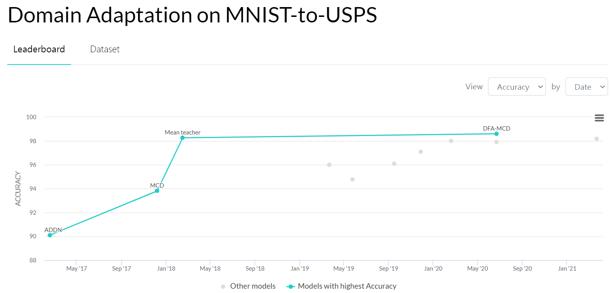
## Agenda 
- Maximum Classifier Discrepancy for Unsupervised Domain Adaptation (IEEE 2018, Saito et al.)
- Discriminative Feature Alignment: Improving Transferability of Unsupervised Domain Adaptation by Gaussian-guided Latent Alignment (Pattern Recognition, 2021, Wang et al.)
- Larger Norm More Transferable: An Adaptive Feature Norm Approach for Unsupervised Domain Adaptation (ICCV, 2019, Xu et al.)

## Maximum Classifier Discrepancy for Unsupervised Domain Adaptation (MCD)

#### Two problems exist with previous methods:
- The domain classifier only tries to distinguish the features as a source or target and thus does not consider task-specific decision boundaries between classes. **Therefore, a trained generator can generate ambiguous features near class boundaries.**
- These methods aim to completely match the feature distributions between different domains. **Which is difficult because of each domain’s characteristics.**

#### To solve these problems:
- We introduce a new approach that attempts to align distributions of source and target by utilizing the task-specific decision boundaries.
- We propose to maximize the discrepancy between two classifiers’ outputs to detect target samples that are far from the support of the source.
- A feature generator learns to generate target features near the support to minimize the discrepancy.
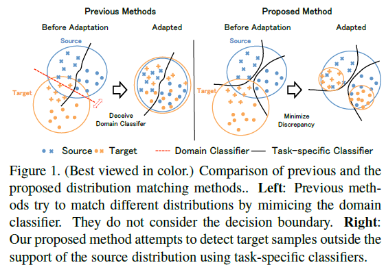

#### Overall Idea
In order to effectively detect target samples outside the support of the source, we propose to train discriminators ($F1$ and $F2$) to maximize the discrepancy given target features.
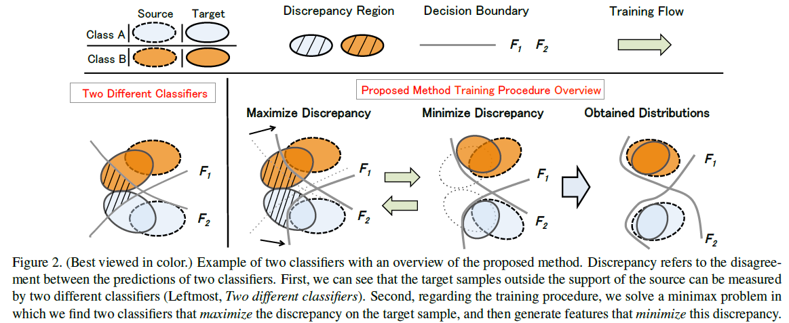

#### Training Steps
**step A : Minimize softmax cross entropy.**
We train both classifiers and generator to classify the source samples correctly.

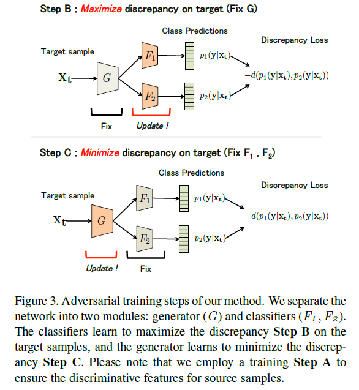

#### Conclusion
- We propose to utilize task-specific classifiers as discriminators that try to detect target samples that are far from the support of the source.
- A feature generator learns to generate target features near the support to fool the classifiers.
- Since the generator uses feedback from task-specific classifiers, it will avoid generating target features near class boundaries.

## Discriminative Feature Alignment: Improving Transferability of Unsupervised Domain Adaptation by Gaussian-guided Latent Alignment (DFA)

#### Abstract
- Previous work has attempted to directly align latent features by the classifier-induced discrepancies.
- We introduce a Gaussian guided latent alignment approach to align the latent feature distributions of the two domains under the guidance of the prior distribution.
- We also propose a novel unpaired $L1$-distance by taking advantage of the formulation of the encoder-decoder.
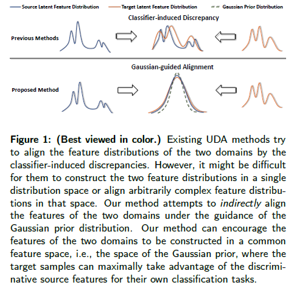

#### Method
As illustrated in Figure 2, the decoder D is specifically used for the proposed distribution alignment loss to align the target latent distribution with the prior distribution.
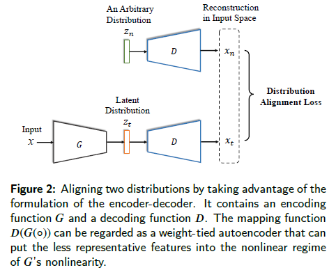

#### Framework of Discriminative Feature Alignment

- As the first step of our model, we define the Gaussian prior distribution $q(z_{n}) \sim  N(0, 1) $ where we will construct the two feature spaces on. 

- We regularize $G$ and $F$ by softmax cross-entropy loss on the labeled source samples, and enforce the distribution over the source samples $p(z_{s})$ to be close to the Gaussian prior $q(z_{s})$ via the $KL$-divergence penalty on $G$.

- Meanwhile, the latent feature distribution of the target domain p.zt / should be similarly close to the Gaussian prior. (using $L1$-distance)
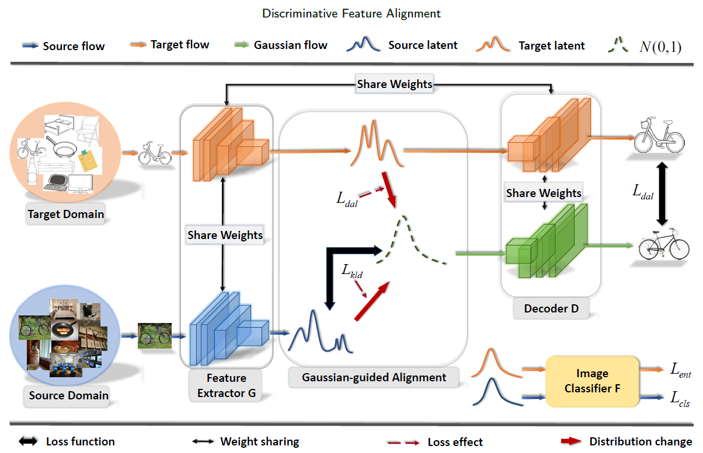

#### Loss Functions
- Softmax Cross-entropy Loss
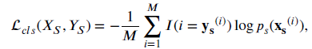
- Kullback-Leibler Divergence
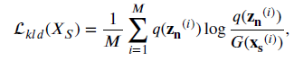
- Distribution Alignment Loss
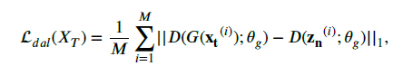
- Entropy Loss
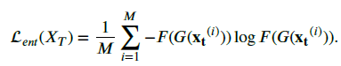
- **Full Objective**
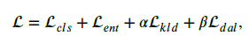

#### DFA-MCD (adversirial)
The proposed DFA-MCD is developed based on MCD. Our objective $L_{kld}$ is integrated into the first and the second training steps of MCD; and the proposed $L_{dal}$ is combined with the objective function of its last training step.

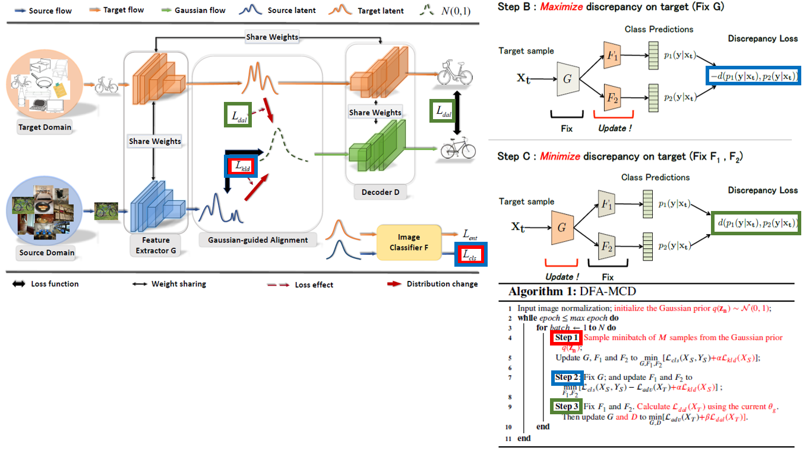

#### DFA-SAFN (non-adversarial)
Our DFA-SAFN is developed based on SAFN. We implement a ResNet-50-based decoder to generate $D_{z_{t}}$ and $D_{z_{n}}$ for the proposed DAL. We integrate all of our objective functions into the final loss of SAFN.

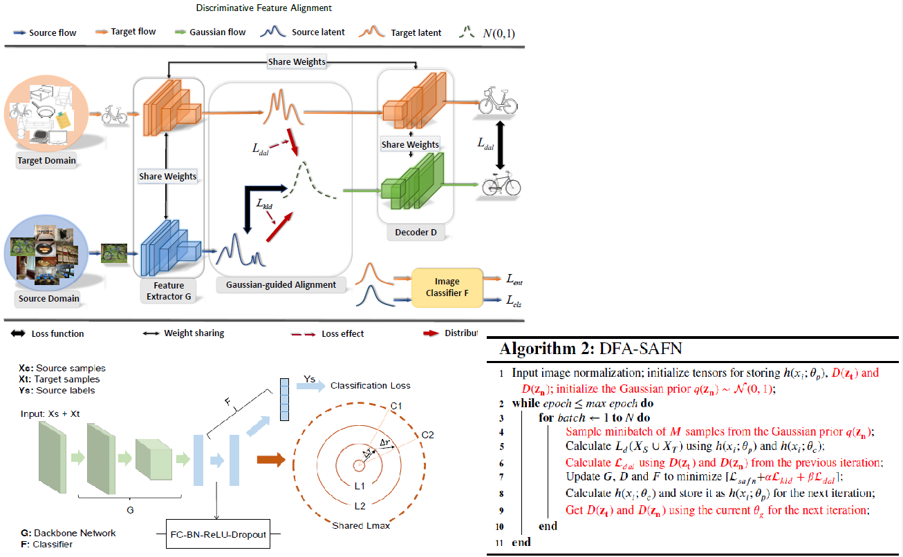

## Larger Norm More Transferable: An Adaptive Feature Norm Approach for Unsupervised Domain Adaptation

#### Abstract 
- In this paper, we empirically reveal that the erratic discrimination of the target domain mainly stems from its much smaller feature norms with respect to that of the source domain.

- We demonstrate that progressively adapting the feature norms of the two domains to a large range of values can result in significant transfer gains, implying that those task-specific features with larger norms are more transferable.

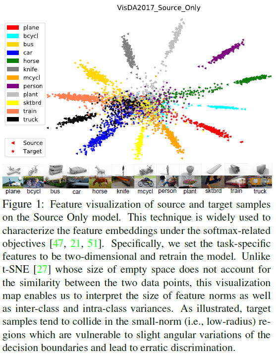
#### Two hypothetical interpretations from the current observation:
1) **Misaligned-Feature-Norm Hypothesis**: The domain shift between the source and target domains relies on their misaligned feature-norm expectations. Matching the mean feature norms of the two domains to an arbitrary shared scalar is supposed to yield similar transfer gains. 

2) **Smaller-Feature-Norm Hypothesis**: The domain shift substantially relies on the excessively less-informative features with smaller norms for the target task. Despite nonrigorous alignment, adapting the target features far away from the small-norm regions can lead to safe transfer.

## Framework
As indicated in Fig. 2, our framework consists of a backbone network $G$ and a classifier $F$.
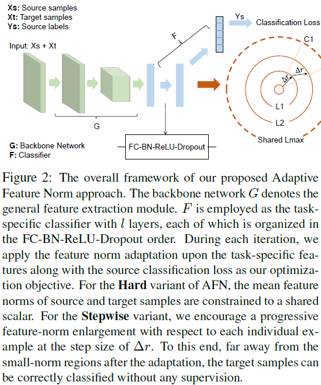

## Hard Adaptive Feature Norm
Based on our Misaligned-Feature-Norm Hypothesis, we propose the Maximum Mean Feature Norm Discrepancy (MMFND) to characterize the mean-feature-norm distance between the two distributions and verify whether bridging this statistical domain gap can result in appreciable transfer gains.

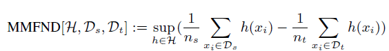

## Stepwise Adaptive Feature Norm
To break the aforementioned bottleneck, we introduce an improved variant called Stepwise Adaptive Feature Norm (SAFN) in order to encourage the model to learn taskspecific features with larger norms in a progressive manner.
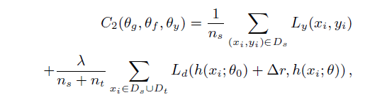

It is noteworthy that SAFN does not rigorously bridge the mean-feature-norm discrepancy, yet one can alternatively place a terminal R to restrict the endless enlargement, which is indicated by:
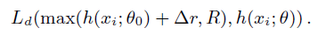
As the Smaller-Feature-Norm hypothesis suggests, once we properly adapt the target samples towards the large-norm regions, the rigorous alignment becomes superfluous.