##　DocTr: Document Image Transformer for Geometric Unwarping and Illumination Correction

＞institution: CAS Key Laboratory of Technology in GIPAS
author: Hao Feng
conference: ACM MM 2021
github: https://link.zhihu.com/?target=https%3A//github.com/fh2019ustc/DocTr

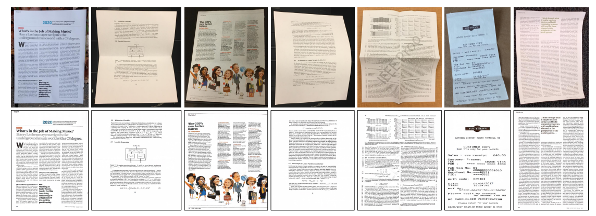
> Figure 1: Qualitative rectified results of our Document Image Transformer (DocTr). The top row shows the distorted document images. The second row shows the rectified results after geometric unwarping and illumination correction.

### ABSTRACT
- DocTr consists of a **geometric unwarping transformer** and an **illumination correction transformer**. 
- By setting a set of **learned query embedding**, the geometric unwarping transformer captures the global context of the document image by self-attention mechanism and decodes the pixel-wise displacement solution to correct the geometric distortion. 
- After geometric unwarping, our illumination correction transformer further **removes the shading artifacts** to improve the visual quality and OCR accuracy.

### APPROACH
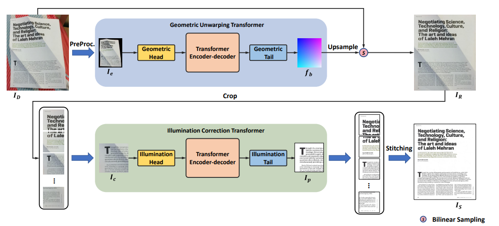
> Figure 2: An overview of Document Image Transformer (DocTr). It consists of two main components: a geometric unwarping transformer and an illumination correction transformer.
#### Geometric Unwarping Transformer
- As shown in Figure 2, given an image $𝑰_{𝐷} ∈ R^{𝐻×𝑊 ×3}$ , we first downsample it and get the image $𝑰_{𝑑}∈ R^{𝐻+{0}×𝑊_{0}×𝐶_{0}}$ , where $𝐻_{0} = 𝑊_{0} = 288$ in our method and $𝐶_{0} = 3$ is the number of RGB channels.
- Then, $𝑰_{𝑑}$ is fed into the preprocessing module to get the background-excluded image $𝑰_{𝑒}$ which is injected into geometric unwarping transformer to predict a backward mapping field $𝒇_{𝑏}$.
- With $𝒇_{𝐵}$, the rectified document image $𝑰_{𝑅} ∈ R^{𝐻×𝑊 ×3}$ can be obtained by warping operation.

**Preprocessing**
- a **light semantic segmentation network** is utilized to predict the confidence map of the foreground document, which is further binarized with a threshold $\tau$ to obtain the binary document region mask $𝑴_{𝑰_{d}}$.

**Transformer Encoder**

> Figure 3: Architecture of the transformer encoder-decoder.
- features are then extracted from $𝑰_{\theta}$ using a convolutional module $𝐺_{\theta}$ that consists of 6 residual blocks.

- $G_{\theta}$ downsamples the feature maps at $\frac{1}{2}$ resolution every two blocks and output features $𝑓_{g}$.

- we flatten $𝒇_{𝑔}$ into a sequence of 2D features, i.e., $𝒇_{𝑠} ∈ R^{𝑁_{𝑔}×𝑐_{𝑔}}$ , where $𝑁_{𝑔} = \frac{𝐻_{0}}{8} × \frac{𝑊_{0}}{8}$ is the number of patches.

- to maintain the position information in the process, we add learnable 2D position embedding $𝑬_{𝑝} ∈ R^{𝑁_{𝑔}×𝑐_{𝑔}}$ following, which is consistent to different input images.

- As shown in Fig 4, we train a learnable module to perform upsampling on the decoded features and obtain high-resolution predictions.

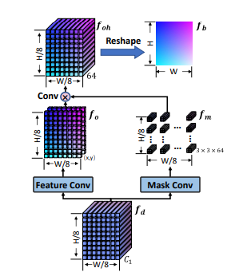
> Figure 4: Illustration of the tail network for unwarping.
**Loss Function**
- The training loss for our geometric unwarping transformer is defined as the $𝐿_{1}$ distance between the predicted backward mapping $𝒇_{𝑏}$ and ground truth $𝒇_{𝑔𝑡}$ as follows,
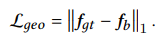

#### Illumination Correction Transformer
- As shown in Figure 2, given the unwarped image 𝑰𝑅 ∈ R 𝐻×𝑊 ×3 , we first crop 𝑰𝑅 into patches with a overlap of 12.5% (each patch at 128×128 resolution).

**Transformer Encoder-Decoder**
- Like Transformer in Geometric Unwarping, reshape the patch feature $𝒇_{𝑖|}$ into a sequence of flattened 𝑃 × 𝑃 mini-patches.
- $f_{𝑠𝑝} ∈ R^{𝑁_{𝑖}×𝑐^{′}_{𝑖}}$ , where $𝑁_{𝑖} = \frac{𝐻_{𝑝}×𝑊_{𝑝}}{𝑝^{2}}$ is the number of mini-patches on the input image patch, $𝑐^{′}_{𝑖} = 𝑐_{𝑖} × 𝑃^{2}$ is the number of channels of transformer input. 
- Note that in our method, $𝑐_{𝑖}$ is set to 16, and $𝑃$ is set to 4.

**Loss Function**
We optimize the illumination correction transformer by minimizing the $𝐿_{1}$ distance and the VGG loss between the estimated patch image $𝐼_{𝑝}$ and ground truth image $𝐼_{𝑔𝑡}$ as follows,
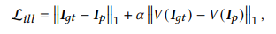
where $\alpha$ is the weight of the VGG loss and $𝑉 (·)$ denotes the VGG Network.

### DATASET
- We train the geometric unwarping transformer on Doc3D dataset, following DewrapNet.
- our illumination correction transformer is optimized using the DRIC dataset.
- We evaluate the performance of our DocTr on Doc3D, DRIC, and DocUNet benchmark

###  EXPERIMENTS
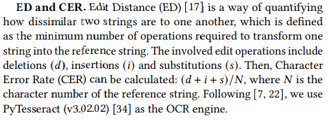
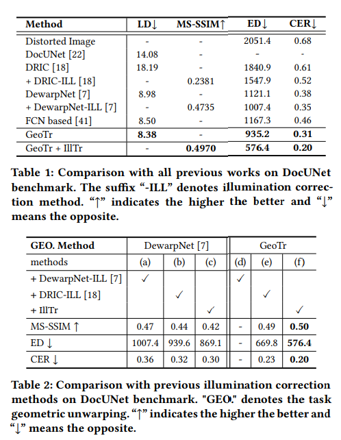

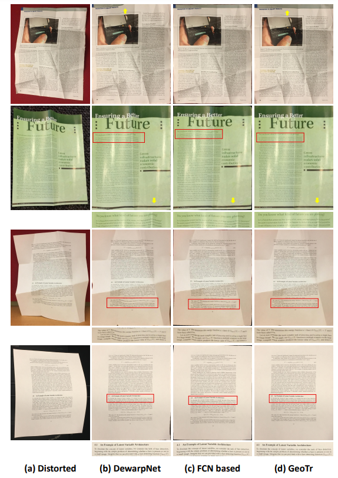
> Figure 5: Qualitative comparison with state-of-the-art methods. Column 1: original distorted images, column 2: results of DewarpNet [7], column 3: results of [41], column 4: ours. The comparison of rectified boundaries and text lines are highlighted by yellow arrows and cropped text, respectively.

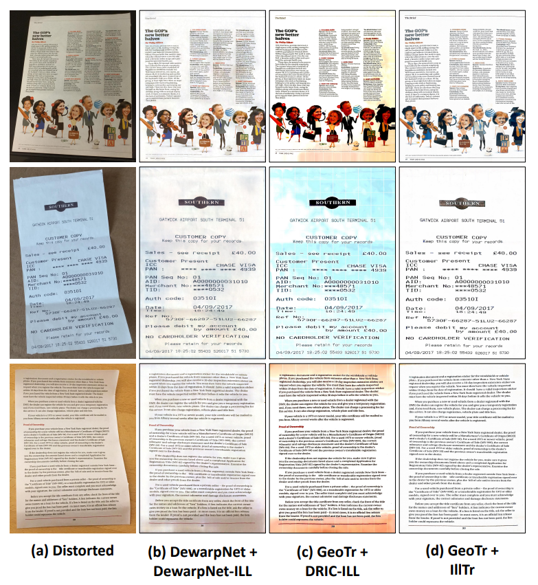
> Figure 6: Qualitative comparison with illumination correction methods DewarpNet-ILL [7] and DRIC-ILL [18] on unwarped results of DewarpNet [7] and GeoTr, respectively

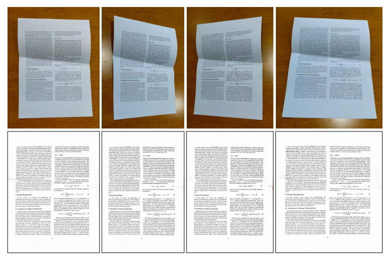
> Figure 7: Robustness of DocTr in terms of viewpoint. The top row shows the distorted document images taken from different viewpoints. The second row shows the corresponding rectified document images by DocTr.

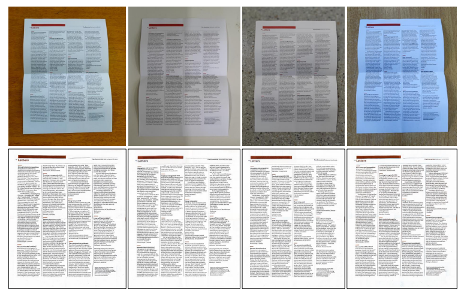
> Figure 8: Robustness of DocTr in terms of illumination variation and background environment. The top row shows the distorted document images captured in different scenes. The second row shows the rectified document images by DocTr.