## Document Dewarping with Control Points

> conference: ICDAR2021
author: Guo-Wang Xie, Cheng-Lin Liu
institution: Chinese Academy of Science (CAS) Center
github: https://github.com/gwxie/document-dewarping-with-control-points

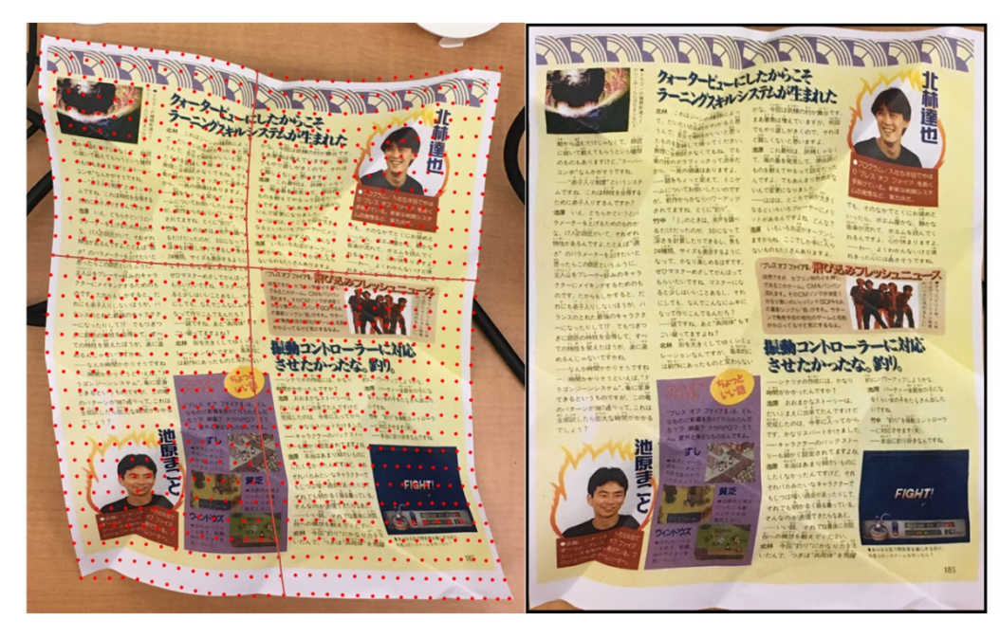

### Introduction
- A widely-used approach is to exploit the **Encoder-Decoder architecture** as a generic feature extractor to predict some pixel-wise information, such as forward mapping and dewarping image or backward mapping. <!-- - Although the Encoder-Decoder architecture has achieved satisfying performance, further research is needed for more flexible and lightweight approaches. -->
- As shown in Fig. 1(d), we take advantage of the **Encoder architecture** for extracting semantic information from image automatically, which is used to predict control points and reference points in Fig. 1(e).
- Furthermore, our approach can be **edited** multiple times to improves its practicability when the correction effect is not satisfied, which alleviates the disadvantages of weak operability in end-to-end methods.

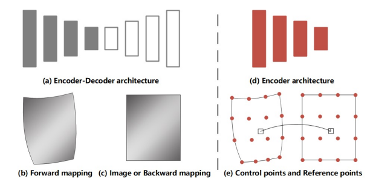
> Fig. 1. Dewarping architecture. (a) the Encoder-Decoder architecture is used as a generic feature extractor to predict the expression of the pixel-wise such as (b) forward mapping and (c) image or backward mapping in recent rectifying systems. Our proposed sparse points is based on rectification which only exploits (d) Encoder architecture to predict (e) control points and reference points so as to achieves similar effects as (a) but in a more flexible and practical way.

### Approach
**Definition**
- To facilitate explanation, we define the following concepts:
    **Vertex** represents the coordinates of a point in document image. In this paper, we can move the vertices by changing the coordinates. 
    **Control Points** consist of a set of vertices. As shown in Fig. 2 (c), control points are distributed on the distorted image to describe the geometric deformation of the document. 
    **Reference Points** consists of the same number of vertices as the control points. As shown in Fig. 2 (d), the reference point describes the regular shape. Document Dewarping could be realized using unwarping grid by matching the control points and the reference points.

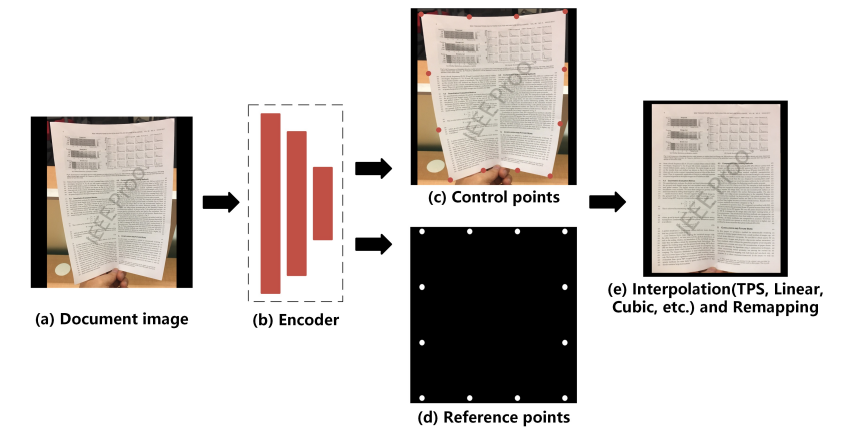
> Fig. 2. Dewarping pipeline. (a) input deformed document image. (b) Encoder architecture for extracting semantic information which will be exploited to predict (c) control points and (d) reference points. Then, we convert sparse mappings to dense mapping and get the rectified image by (e) interpolation method and remapping respectively. Only 12 control points are used in this pipeline.

**Dewarping Process**
- First, an image of a deformed document is fed into network to obtain two output branches: **control points** and **reference points**.
- Second, we construct the **rectified grid** by moving the control points to the position of the reference points and converting it to pixelwise location mapping.
- we employ **interpolation method** (TPS, Linear, Cubic, etc.) between control points and reference points. 

**Network Architecture**
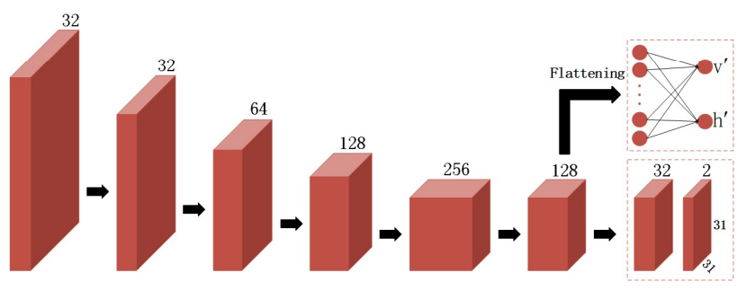
> Fig. 3. Network architecture. An encoder extracts image features and sends them to two branches. The upper branch is a fully connected neural network which predicts the interval between reference points. The lower branch is a two-layer convolutional network to predict control points.

- We flatten the features of the last layer and feed them into the fully connected network to predict the **intervals** $v', h'$ between reference points. Simultaneously, we use two-layer convolutional network to **predict control points** $R^{31×31×2}$ , which apply Batch Normalization and PReLU after the first convolution

**Training Loss Functions**
- We train our models in a supervised manner by using **synthetic** reference points and control points as the ground-truth.

- The Smooth L1 loss is used for position regression on control points, which is less sensitive to outliers. It is defined as:
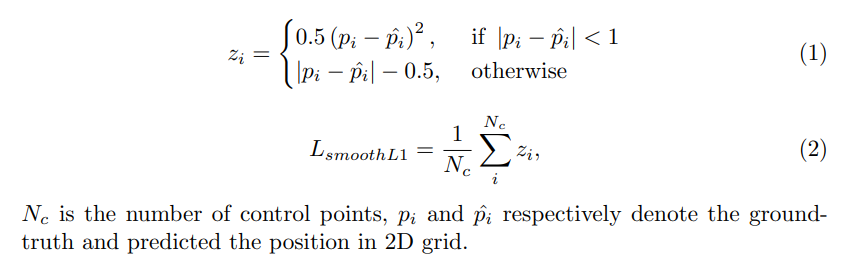
> Smooth L1 loss
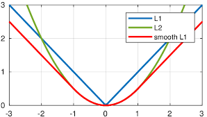

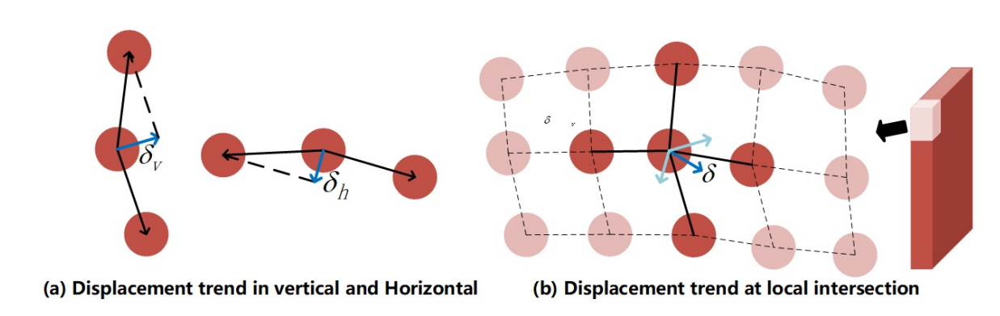
> Fig. 4. Differential Coordinates. We use differential coordinates as an alternative representation of vertex coordinates. $δ_{v}$ and $δ_{h}$ respectively represent the **displacement trend** of the center point in the **horizontal** and **vertical**. $δ$ represents the **local positional correlation** between the intersection and its connection points

- To make a more fault-tolerant model to better describe the shape, we use differential coordinates as an alternative representation for the center coordinates.
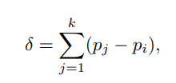
$k$ is the number of elements, $p_{i}$ is the intersection.

- We formulate $L_{c}$ function as follows:
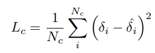
The predictions of control points are not independent of each other by using correlation constraints between vertices.

- We use L1 loss to perform interval regression on reference points, which is defined as:
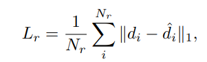
where $N_{r} = 2$, $d$ represents the interval between two points in the horizontal or vertical directions.

- The final loss is defined as a linear combination of different losses:
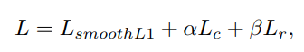
where $α$ and $β$ are weights associated to $L_{c}$ and $L_{r}$.

**Interactivity**
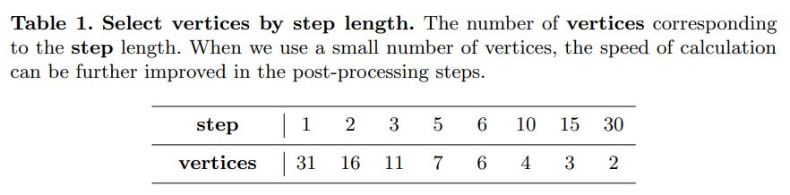

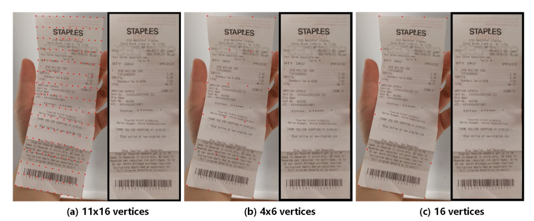
> Fig. 6. **Sparse vertices.** We can choose the number of vertices according to step length in Table. 1. For simple deformations, a small number of control points can be used to achieve similar results.

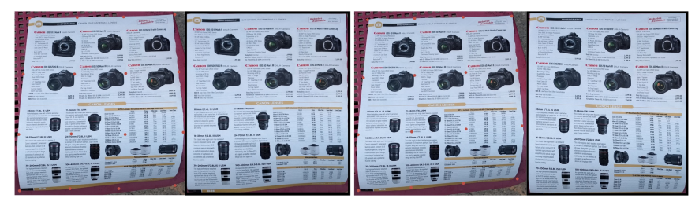
> Fig. 7. Move the vertices. The first group is the predicted initial position (4 × 4 vertices). The second group is the adjusted position. By **adjusting the coordinates** of the sub-optimal vertices, we can get a better rectified image.

### Experiments
**Datasets**
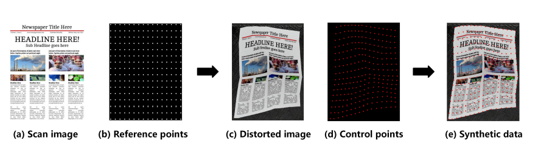
> Fig. 8. **Synthesize distorted document image.** We uniformly sample a set of (b) reference points on (a) scanned document image, and then perform geometric deformation on them to get (c) distorted image and (d) control points. (e) Synthetic data consists of distorted image, reference points and control points.

**Results**
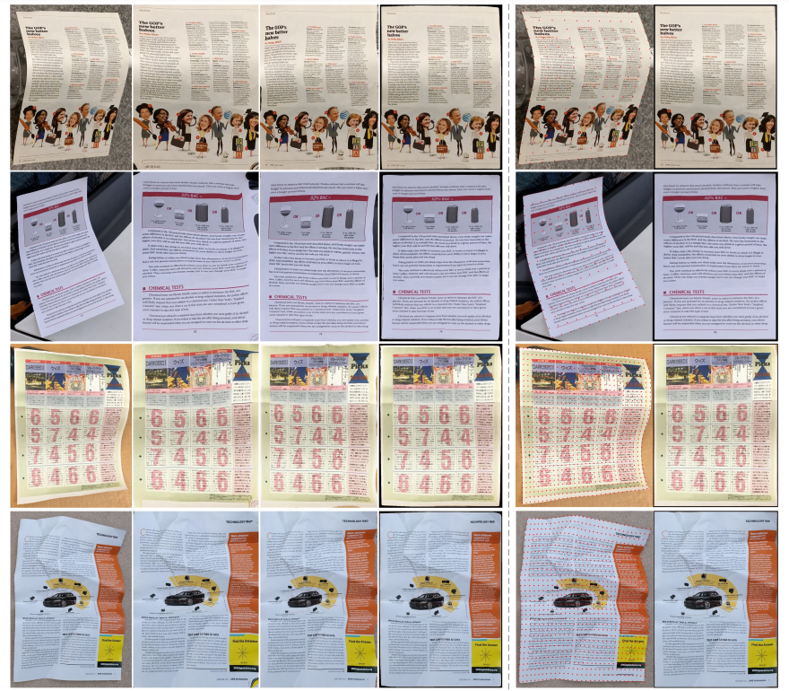
> Fig. 9. Results on the Ma et al. Docunet benchmark dataset. Col 1 : Original distorted images, Col 2 : Results of Ma et al. Docunet, Col 3 : Results of Das and Ma et al. Dewarpnet, Col 4 : Results of Xie et al., Col 5 : Position of control points, Col 6 : Results of our method. In the first two Row, our method uses 11 × 16 vertices to rectify distortion. The last three Row use 31 × 31 vertices.

- MS-SSIM evaluates the global similarity between the rectified image and scanned image in multi-scale. LD computes the local metric by using SIFT flow between the rectified image and the ground truth image.
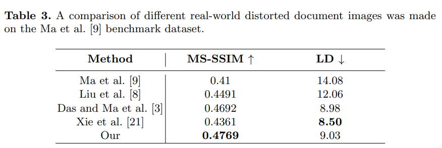

- ablation 
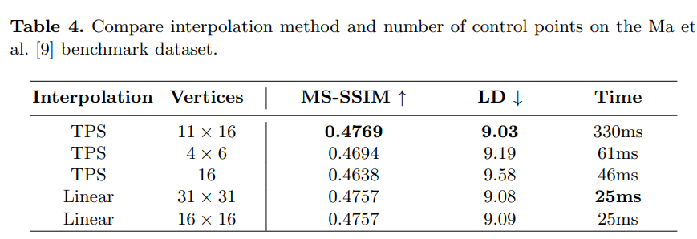