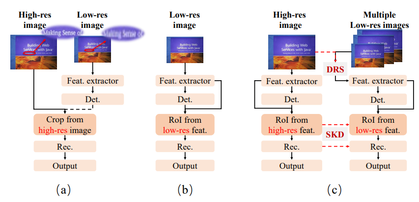
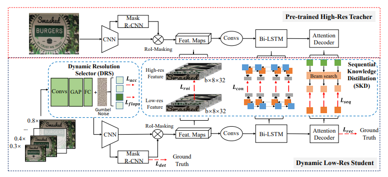
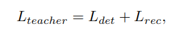
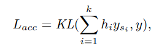
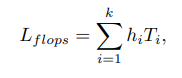
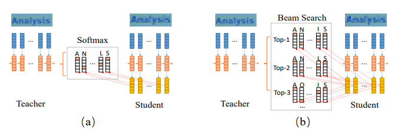
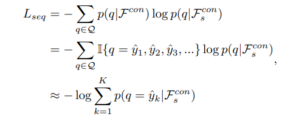
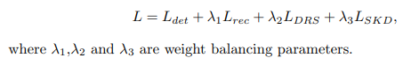
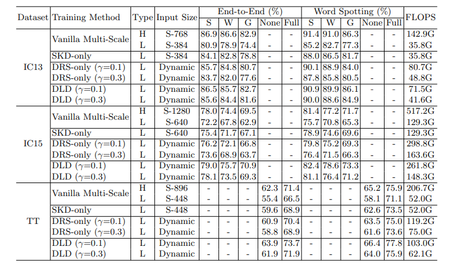
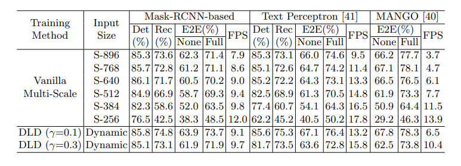

## Dynamic Low-Resolution Distillation for Cost-Efficient End-to-End Text Spotting

> author: Ying Chen
institution: 浙江大学
company: Hikvision Research Institute
github: https://github.com/hikopensource/DAVAR-Lab-OCR/

> Fig. 1. 
(a) is the offline two-staged text spotter, which can use different resolutions for two tasks while cannot be globally optimized. 
(b) is the ordinary end-to-end text spotter, where the recognizer can only receive the low-res RoI features map when using the low-res input. 
(c) is our proposed DLD framework, where the low-res network can dynamically select small but feasible resolutions and reconstruct the high-res features.

### Abstract
We propose a novel cost-efficient **Dynamic Low-resolution Distillation (DLD)** text spotting framework, which aims to infer images in different small but recognizable resolutions and achieve a better balance between **accuracy** and **efficiency**.

Concretely, we adopt a **resolution selector** to dynamically decide the input resolutions for different images, which is constraint by both inference accuracy and computational cost.

Another **sequential knowledge distillation** strategy is conducted on the text recognition branch, making the low-res input obtains comparable performance to a high-res image.

### Methodology

> Fig. 2. Illustration of the proposed DLD framework. It contains a fixed pre-trained high-res teacher and a dynamic low-res student that aims to obtain comparable performance. The DRS dynamically selects a small resolution for the student with minimal performance reduction. The SKD process helps the student capture the inter-sequence information and be able to recognize text in low-resolution.

##### Overview
- It follows the setting of **resolution distillation**, where the teacher and student use **the same network architecture** but were input with images in different resolutions.
- The high-res teacher network is well pre-trained and then fixed in the following training.
- It mainly attributes to two parts:
    - a **Dynamic Resolution Selector (DRS)** to choose the appropriate resolution for different input images
    - a **Sequential Knowledge Distillation (SKD)** strategy to capture the semantic sequence information and improve the recognizability of the low-res instances.

#####  Baseline Text Spotting Model
- We adopt a **Mask-RCNN-based** two-staged end-to-end text spotting framework as the base model.
- For the input image $I∈R^{H×W×3}$ , the multiscale features are extracted through the backbone of ResNet-50 and a feature pyramid network (FPN).
<!-- - For the text recognition task, the recognition features are firstly cropped from the global feature map via the RoI-Masking operation and then uniformly resized into a fixed size $8×32$. -->
- We firstly train a strong high-resolution teacher and then fix it in following distillation training.

where the detection part contains the losses from bounding boxes regression, classification, and instance segmentation.

##### Dynamic Resolution Selector
- Here, we predefine a group of candidate down-sampled scales for student network, e.g., images can be selected in the range $[0.8×, 0.3×]$ of teacher’s resolution.

- The target of DRS is to find a **suitable scale** in the group with minimal performance reduction compared to the teacher.

- The selection criteria are that decreasing the resolution should be **rewarded** while performance decline would be **penalized**.

- Given a high-res image $I$ and $k$ candidate down-sampled scale factors ${s_{1}, s_{2}, ..., s_{k}}$, the DRS first predicts the probability vector $p=[p_{1}, p_{2}, ..., p_{k}]$ by the network and then transforms p into binary decisions $h=[h_{1}, h_{2}, ..., h_{k}]∈\{0, 1\}^{k}$ indicating which scale factor to select.

- We use y and ${y_{s_{1}} , y_{s_{2}} , ..., y_{s_{k}} }$ to denote the predicted probability distribution of teacher and students, respectively.

where $KL(·)$ is the KL divergence for the recognition results.

- To prevent the DRS module from converging to the maximum scale and encourage it to choose a smaller image as much as possible, we directly penalize it with its forward computation cost as follows:

where $T_{i}$ is the forward FLOPS under input $I_{s_{i}}$.

##### Sequential Knowledge Distillation
> For example, although some characters are easily confused in low-res, such as ‘i’ and ‘l’ in Figure 3, people can still recognize them in a word. This inspires us to dig out further the model’s deeper potential, making DRS choose the smaller scale as much as possible.
- We only explore the optimization problem of the text recognition task since it is more likely to be the bottleneck of the overall performance of the current end-to-end text spotting framework.

> Fig. 3. The comparison of (a) logit-based Knowledge Distillation and (b) sequencelevel Knowledge Distillation in sequence decoding.
- In these two stages of the network, we adopt L2 loss as:

where H, W, and C denote the feature map’s height, width, and channel. N is the length of the hidden state.
- The student is trained based on the output from the **top-k beam** search results of the teacher network. 
- To ensure the optimization speed, we only choose the results with the **top-3** scores.

##### Optimization
- The proposed DLD framework is optimized to recognize images in both high accuracy and efficiency with end-to-end training.

- The student is trained based on the output from the top-k beam search results of the teacher network. It helps the student retain the context information in a sequence as much as possible.

### Experiments
##### Implementation Details
For the teacher network, we firstly pre-train it on SynthText-800K and then fine-tune with a mixture dataset which includes 7k images filtered from ICDARMLT2017 and all training images in IC13, IC15, and TT.
In the following KD training stage, the teacher will be fixed, and the student network can be initialized using the teacher’s weights.
##### Results on Text Spotting Benchmarks
> Table 1. Results on three text spotting benchmarks. ‘S’, ‘W’ and ‘G’ separately mean recognition with strong, weak and generic lexicon [23]. ‘Full’ indicates lexicons of all images are combined, and ‘None’ means lexicon-free [8]. ‘H’ and ‘L’ in column ‘Type’ indicates whether the inference is carried out with high- or low-resolution input. FLOPS is the average floating point operations.

##### Studies on Different End-to-End Text Spotters
> Table 8. The ablations experiments on scale changes in Vanilla Multi-Scale and the compared result when adopting DLD on different text spotting frameworks. ‘Det’ is the Hmean metric of text detection task. ‘Rec’ is the Accuracy metric of text recognition task. ‘E2E’ stands for ‘End-to-End’. ‘Full’ indicates lexicons of all images are combined and ‘None’ means lexicon-free. FPS is the average frames per second.

