## Entropy Minimization vs. Diversity Maximization for Domain Adaptation

#### Abstract

- ***Problem***: Existing works reveal that entropy minimization only may result into collapsed **trivial solutions**.
- ***Solution***: It proposes **diversity maximization**, which can be finely controlled with the use of deep embedded validation in an unsupervised manner.

#### Minimal-Mntropy Diversity Maximization
- As shown in Figure 1, domain adaptation requires some **regularization techniques** for pushing the network towards correct class prediction of unlabeled target samples.
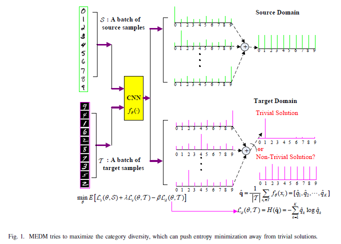

- Where $L_{d}$ is define as follow:
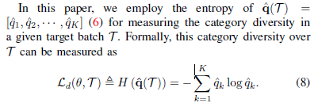

- The objective of the proposed ***MEDM*** is:
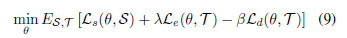

#### Entropy-Minimization vs. Diversity-Maximization
<!-- ###### Entropy-Minimization -->
As shown in (9), our proposed ***MEDM*** may encourage to make prediction evenly across the batch, which, however, does not necessarily produce the **evenly-distributed** categories.

###### Step 1.
It may encourage to make prediction towards a **single class** with entropy minimization, since there are simply no other constraints to be enforced.
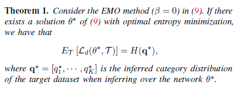
>Proof.
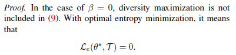
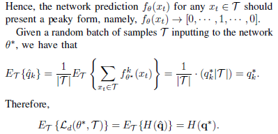

###### Step 2.
<!-- ###### Diversity-Maximization -->
With the use of diversity maximization, it may encourage to make prediction evenly across the batch, since the maximum value of $L_{d}(\theta^{*};\Tau)$ could be achieved $q^{*} = [1/K, ... , 1/K]$.
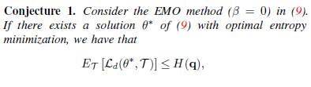
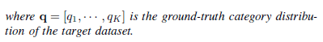

###### Step 3.
We believe that the perfect domain-adaptation classifier under the framework of (9) may output predictions with low entropies.
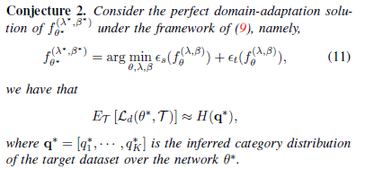 

#### Model Selection via Deep Embedded Validation
For UDA, the model selection should be decided without access to the labels in the target dataset. Fortunately, the recentlyproposed **deep embedded validation**  has been proved very efficient for model selection.
> Practically, we use $L_{e} \le 2$ employed in experiments.

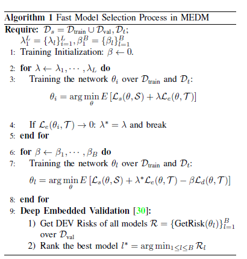

> **Deep Embedded Validation (DEV) Risk**
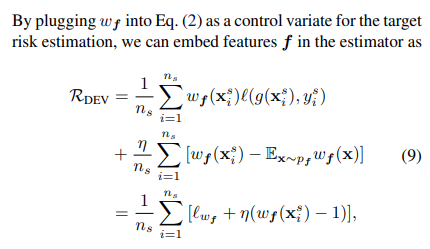
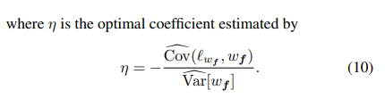

#### EXPERIMENTS
Throughout the experiments, we employ deep neural network architecture detailed as follows. It has a pre-trained ResNet- 50/101, followed by two fully-connected layers, FC-1 of size 20481024 and FC-2 of size 1024K. For model selection, we assume that $\lambda, \beta \in {0.0, 0.1, 0.2, 0.3, 0.4, 0.5, 0.6, 0.7, 0.8, 0.9, 1.0}$

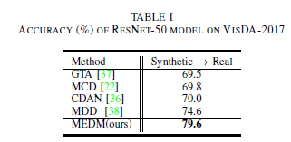
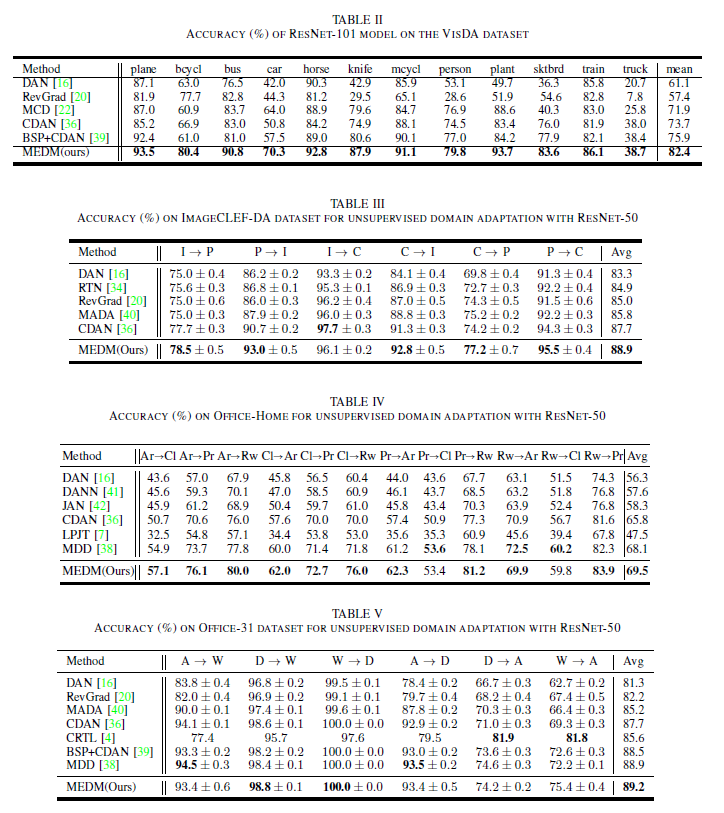

###### Ablation Study
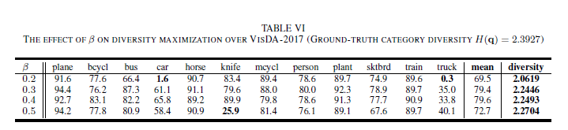
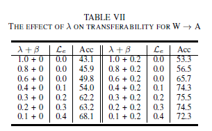

#### REFERENCE
1. [Entropy Minimization vs. Diversity Maximization for Domain Adaptation](http://proceedings.mlr.press/v97/you19a/you19a.pdf)
2. [Deep Embedded Validation 非监督领域自适应的模型选择方法](https://zhuanlan.zhihu.com/p/79869300)