## Language Model-Based Emotion Prediction Methods for Emotional Speech Synthesis Systems
> institution: clova AI Japan
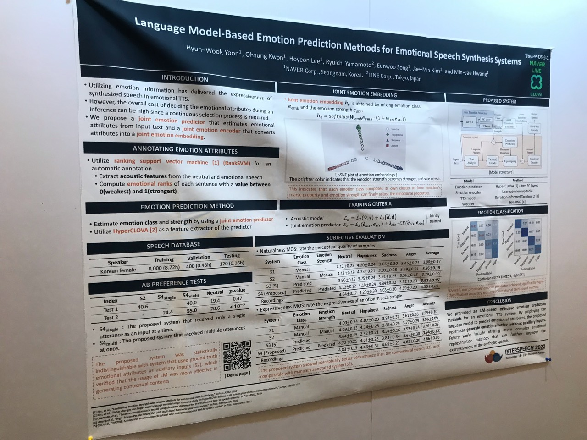

#### Abstract
This paper proposes an effective emotional text-to-speech (TTS) system with a pre-trained language model (LM)-based emotion prediction method.
1. **GPT-3**: predict both an emotion class and its strength in representing emotions’ **coarse** and **fine** properties, respectively.
2. **emotional embedding space** and used as conditional features of the TTS model for generating output speech signals
3. produce emotional speech only from text **without any auxiliary inputs**.
4. **paragraph-level generation of emotional speech**:　GPT-3 enables to capture emotional context among the consecutive sentences.

#### Method
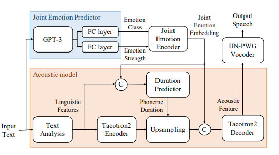
> Figure 1: Block diagram of the proposed system; © denotes the concatenation process between input tensors.

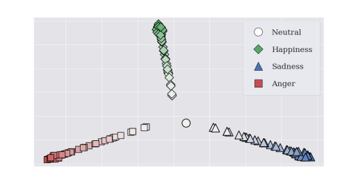
> Figure 2: t-SNE plot of joint emotion embeddings generated from randomly sampled emotion strengths with various emotions. The brighter color indicates that the emotion strength becomes stronger, and vice versa.

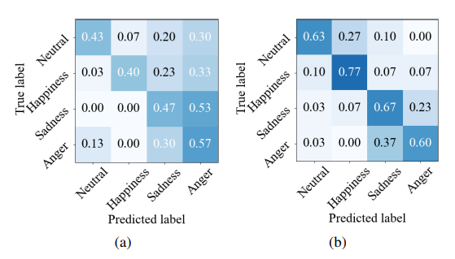
> Figure 3: Classification accuracy of emotion predictors: (a) conventional CNN-based and (b) proposed LM-based methods

## TTS-by-TTS 2: Data-Selective Augmentation for Neural Speech Synthesis Using Ranking Support Vector Machine with Variational Autoencoder
> institution: clova AI Japan
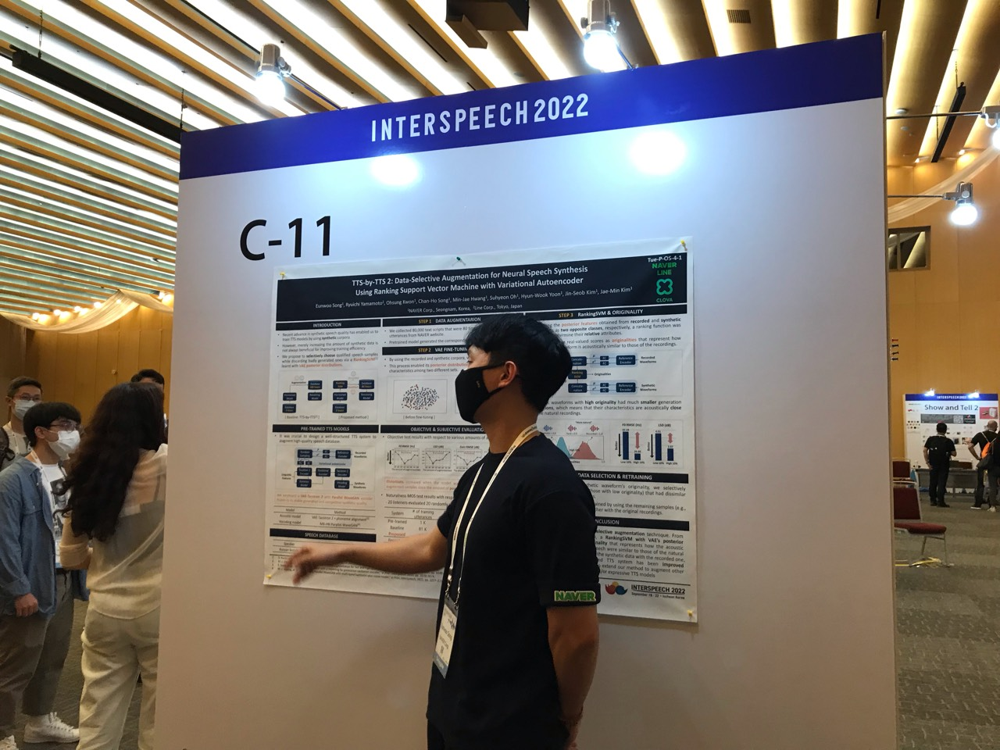

#### Abstract
Our aim in this study is to selectively choose synthetic data that are beneficial to the training process.
1. **variational autoencoder** (VAE): learning latent features: the recorded & synthetic corpora. 
2. train a **ranking support vector machine** (RankSVM): ranking relative attributes among binary classes. 
3. get a **ranking** features by RankSVM: determine how the synthesized speech is acoustically similar to the recorded data.
4. **selected** from large-scale synthetic corpora: by using these data for retraining the TTS model

#### Method
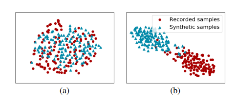
> Figure 2: Distribution of the VAE’s posterior mean vector extracted from recorded (red dot) and synthetic (blue triangle) samples: (a) before and (b) after applying the VAE fine-tuning process.

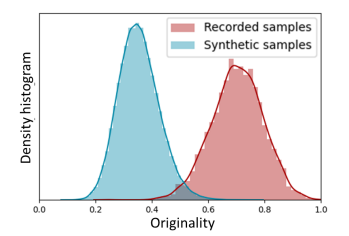
> Figure 3: Density histograms of originality determined using RankSVM from the recorded (red boxes) and synthetic (blue boxes) waveforms, respectively.

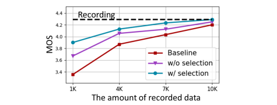
> Figure 5: The MOS test results with respect to various amounts of recorded data: baseline model trained with recorded data alone (red square) and augmented models trained without (purple triangle) and with (blue dot) the proposed data selection method.

## Probing phoneme, language and speaker information in unsupervised speech representations
> institution: Meta, France

#### Abstract
1. Unsupervised models of representations based on Contrastive Predictive Coding (CPC) are primarily used in spoken language modelling.
2. We focus on three categories: phone class, gender and language, and compare monolingual and bilingual models.

#### Method
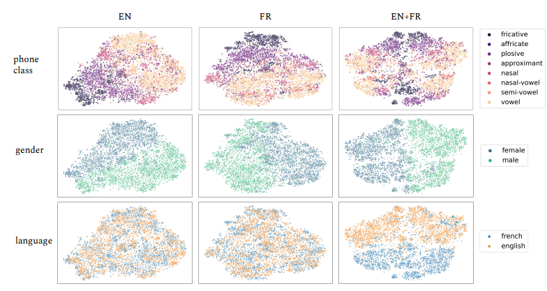
> Figure 1: T-SNE visualisation of English and French phone embeddings at the CPC level, for monolingual (EN and FR) and bilingual (EN+FR) models. Embeddings are colored based on their phone class label, gender label and language label.
fricative; affricate; plosive; approximant; nasal; nasal vowel; semi-vowel; vowel: 
擦音;塞擦音；爆破音；近似值；鼻;鼻元音;半元音；元音

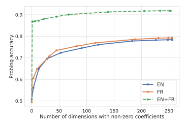
> Figure 2: Probing Accuracy on Language Logistic Regression models wrt. number of active coefficients

### Deep Speech Synthesis from Articulatory Representations
> institution: Berkeley
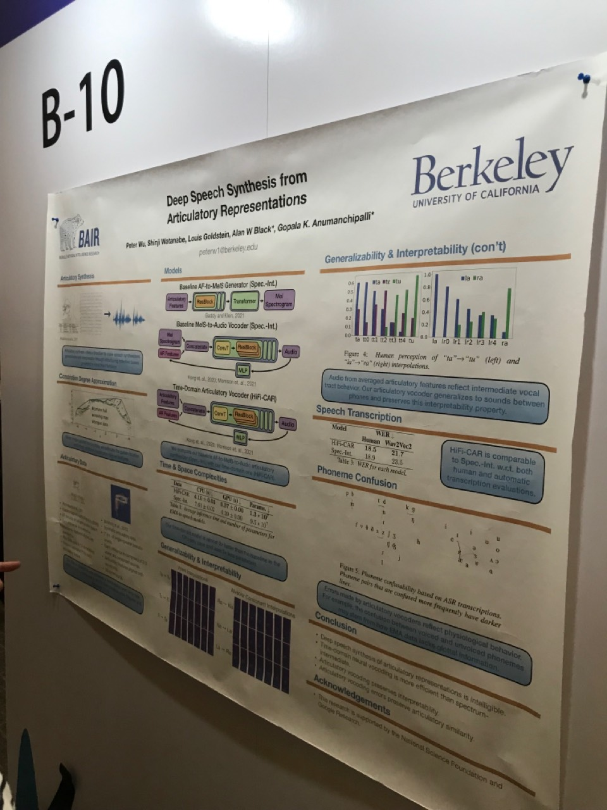

#### Abstract
- This task provides a promising direction for speech synthesis research, as the articulatory space is compact, smooth, and interpretable.
- we propose a time-domain articulatory synthesis methodology and demonstrate its efficacy with both electromagnetic articulography (EMA) and synthetic articulatory feature inputs.

#### Method
**Electromagnetic Articulography (EMA)**
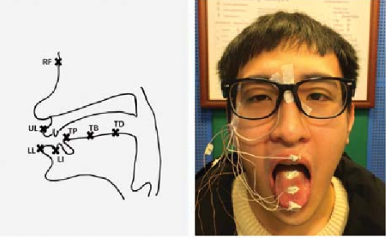

**Spectrum-Intermediate Baseline**
- We map articulatory representations to spectrums using a six-layer Transformer prepended with three residual convolution blocks.

**HiFi-CAR Model**
- we feed our articulatory input features directly into HiFi-GAN.
- removing the need for an articulatory-to-spectrum architecture noticeably improves computational efficiency

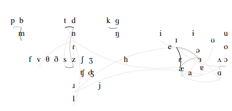
> Figure 5: Phoneme confusability based on ASR transcriptions. Phoneme pairs that are confused more frequently have darker lines. Details in Section 8.

To study the generalizability of our time-domain model, we perform interpolation experiments, prompting our model to synthesize unseen articulatory representations between pairs of sounds.
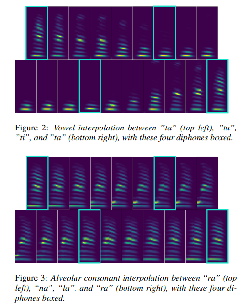

## Spoofed speech from the perspective of a forensic phonetician
> institution: Lancaster Universityphonetician.
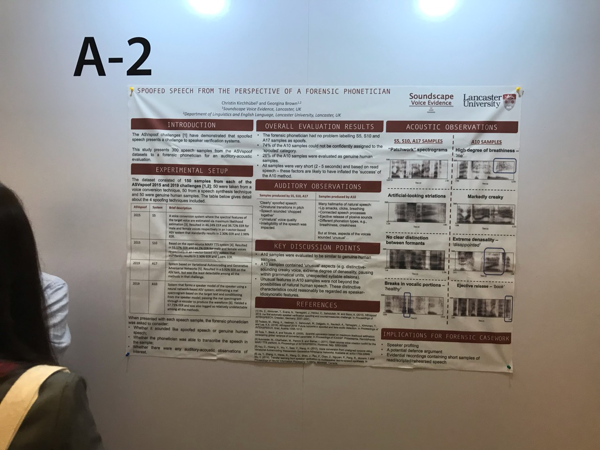

#### Abstract
1. This work looks deeper into these samples from the perspective of an experienced forensic　（法醫學） phonetician.
2. The main contribution of this paper is a descriptive account of different spoofed speech samples, based on the auditory-acoustic evaluation of a forensic phonetician.
3. This is to spark an awareness of the current possibilities of spoofing methods that perhaps have so far been ‘off the radar’ for many forensic phoneticians.

#### Method
The phonetician was asked to offer insights on each of the 300 samples with respect to the following: 
- whether the speech sample sounded like a spoofed sample or a genuine human sample; 
- whether the phonetician was able to transcribe the speech contained in the sample; 
- whether there were any auditory or acoustic observations of interest (in the form of qualitative notes).

**observation**
‘patchwork’ appearance as the result of a concatenative speech synthesis approach applied in the S10 method.
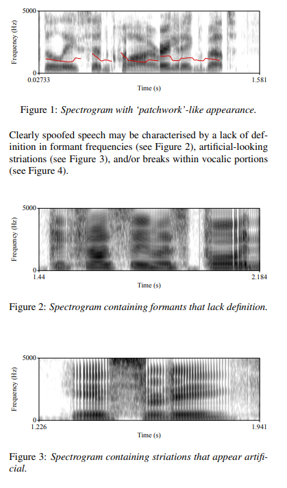
Clearly spoofed speech may be characterised by a lack of definition in formant frequencies (see Figure 2), artificial-looking striations (see Figure 3), and/or breaks within vocalic portions (see Figure 4)
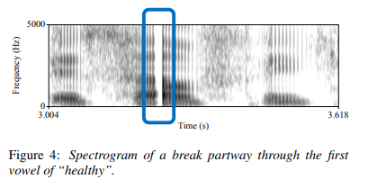
Figure 5 is an example spectrogram of the spoofed male speech “exactly by the rule book” with the highlighted section showing the ejective-release of the velar plosive
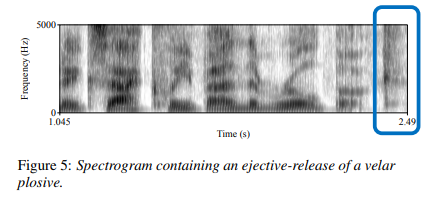
Figure 6 is an example spectrogram of the spoofed female speech “better for me” with the highlighted section displaying breathiness in the final vowel.
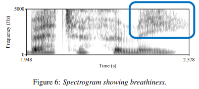
Figure 7 shows the spectrogram of the spoofed male speech “more regularly in the new year”; but it is difficult to conclude whether this is because the sample is spoofed or whether it is because the speaker has a distinctive voice.

Figure 8 shows the spectrogram of the spoofed male speech “disappointed”; The degree of denasality is very unusual, but it is difficult to conclude whether this is because the sample is spoofed or whether it is a speaker-idiosyncratic marker.
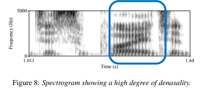
