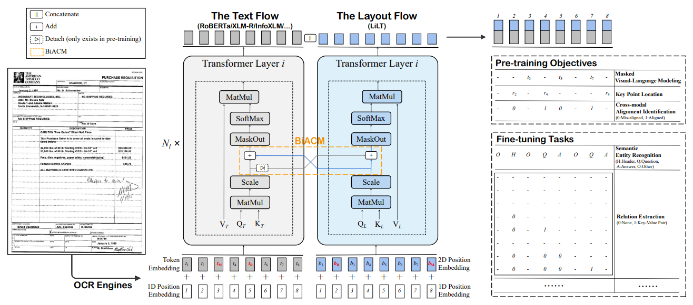
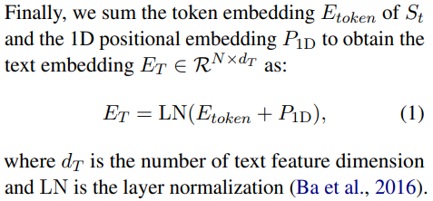
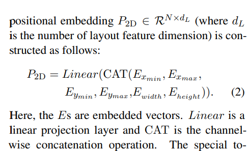
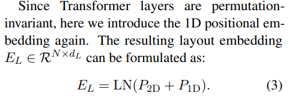
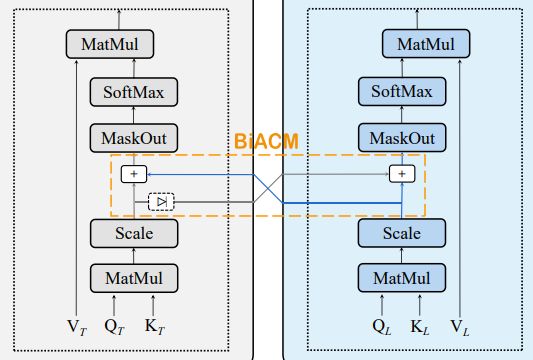

# LiLT A Simple yet Effective Language-Independent Layout Transformer for Structured Document Understanding

>author: Jiapeng Wang
insitution: INTSIG-SCUT 上海合合信息
conference: ACL 2022
github: https://github.com/jpwang/lilt

# Abstract
- Most existing related models can only deal with the document data of **specific language(s)**
- **LiLT** can be pretrained on the structured documents of a single language and then directly fine-tuned on other languages

# Introduction
- When the layout structure remains unchanged, the substitution of language does not make obvious unnaturalness.

> Figure 1: The substitution of language does not appear obviously unnatural when the layout structure remains unchanged, as shown in a (a) form/(b) receipt. The detailed content has been re-synthesized to avoid the sensitive information leak. Best viewed in zoomed-in.

- Based on this inspiration, in this paper, we propose a simple yet effective Language-independent Layout Transformer (LiLT) for structured document understanding.

- We propose BiACM to provide languageindependent cross-modality interaction, along with an effective asynchronous optimization strategy for textual and non-textual flows in pre-training. 

- Moreover, we present two new pre-training objectives, namely KPL and CAI.

# LiLT

> Figure 2: The overall illustration of our framework. Text and layout information are separately embedded and fed into the corresponding flow. BiACM is proposed to accomplish the cross-modality interaction. At the model output, text and layout features are concatenated for the self-supervised pre-training or the downstream fine-tuning. $N_{l}$ is the number of Transformer layers. The red $*_{M}/*_{R}$ indicates the randomly masked/replaced item for pre-training. $t$, $b$ and $r$ represent $token$, $box$ and $region$, respectively.

### Model Architecture
- The whole framework can be regarded as a parallel dual-stream Transformer.

- The layout flow shares a similar structure as text flow, except for the $reduced hidden size$ and $intermediate size$ to achieve computational efficiency.

### Text Embedding
- All text strings in the OCR results are first tokenized and concatenated as a sequence $S_{t}$ by sorting the corresponding text bounding boxes from the top-left to bottom-right.

### Layout Embedding
- we normalize and discretize all box coordinates to integers in the range [0, 1000], and use four embedding layers to generate x-axis, y-axis, height, and width features separately.

###  BiACM

# Pre-training Tasks

### Masked Visual-Language Modeling
- We mask 15% text tokens, among which 80% are replaced by the special token [MASK], 10% are replaced by random tokens sampled from

### Key Point Location
- KPL equally divides the entire layout into several regions (we set 7×7=49 regions by default) and randomly masks some of the input bounding boxes. The model is required to predict which regions the key points (top-left corner, bottom-right corner, and center point) of each box belong to using separate heads.

- We mask 15% boxes, among which 80% are replaced by (0,0,0,0,0,0), 10% are replaced by random boxes sampled from the same batch, and 10% remain the same. Crossentropy loss is adopted.

### Cross-modal Alignment Identification
- We collect those encoded features of token-box pairs that are masked and further replaced (misaligned) or kept unchanged (aligned) by MVLM and KPL, and build an additional head upon them to identify whether each pair is aligned.