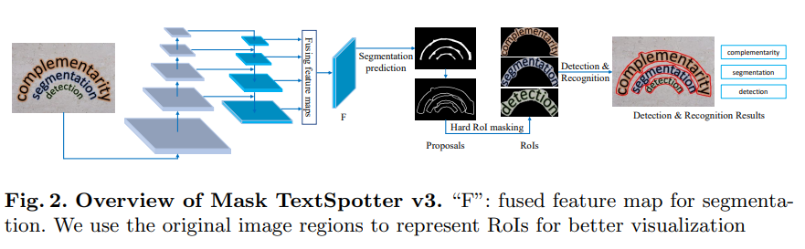
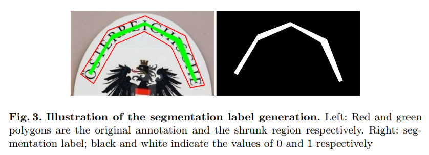
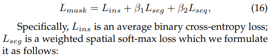
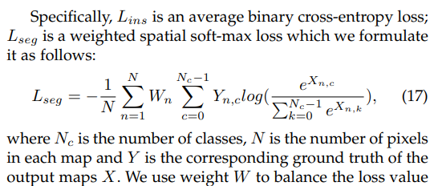
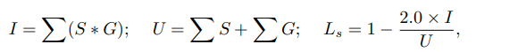
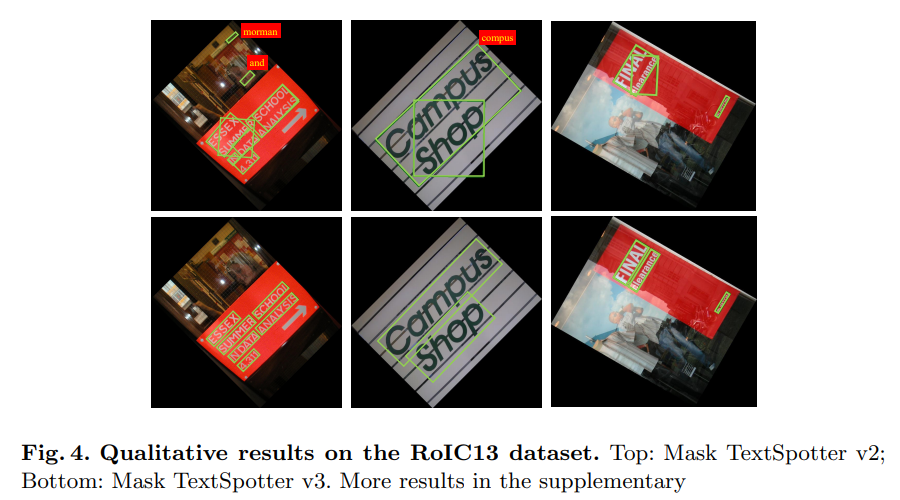
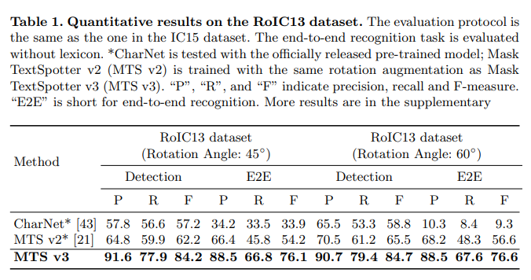
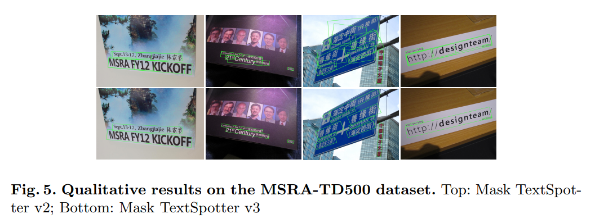
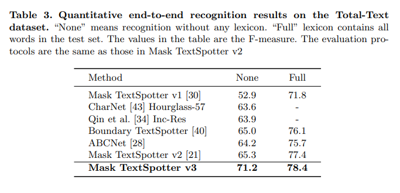

## Mask TextSpotter v3: Segmentation Proposal Network for Robust Scene Text Spotting

> **ECCV 2020**
Huazhong University of Science and Technology (Xiang Bai), China & Facebook AI, USA 
github: https://github.com/MhLiao/MaskTextSpotterV3

> **Mask TextSpotter V1 是第一篇可以完全 end-to-end 的 ocr 論文**
雖然在V1之前有兩篇 text spotter 方面的論文，但是訓練起來不能完全的 end-to-end，通常是分開訓練 detection 和 recognition 後再聯合訓練，或者是先訓練 detection 後再加入 recognition 一起訓練。
**Mask-TextSpotter V2 基於空間 attention 的方式進行識別**
與 V1 相比， V2 的主要改進是在識別部分，在 V1 中識別是對單個字符的識別。V2 中提出了SAM（Spatial Attention Module），採用了基於空間 attention 的方式進行識別。
**Mask-TextSpotter V3 採用 Segmentation Proposal Network (SPN) 更加精確的得到文本行特徵**
前兩版的都是基於mask-rcnn的，它們對於密集的傾斜文本和長文本效果不好，主要是因為 1.預先設定的 anchor box 無法滿足長寬比很大的文本行；2.當文本密集時，一個矩形框中會包含多個文本行。

### Abstract
- **RPN** relies heavily on **manually designed anchors** and its proposals are represented with **axis-aligned rectangles**. 

- The former presents difficulties in handling text instances of **extreme aspect ratios or irregular shapes**, and the latter often **includes multiple neighboring instances into a single proposal**, in cases of densely oriented text.

- To tackle these problems, we propose Mask TextSpotter v3, an end-to-end trainable scene text spotter that adopts a **Segmentation Proposal Network (SPN)** instead of an RPN.

### Methodology
Mask TextSpotter v3 consists of:
- a **ResNet-50** backbone, a **Segmentation Proposal Network** (SPN) for proposal generation, 
- a **text instance segmentation module** for accurate detection, 
- a **Fast R-CNN** module for refining proposals,
- a **character segmentation module** and a **spatial attentional module** for recognition.

###### Segmentation proposal network
- our proposed SPN adopts a **U-Net** structure to make it robust to scales.
- SPN generates proposals from segmentation masks, predicted from a fused feature map $F$ that concatenates feature maps of various receptive fields.
- $F$ is of size $\dfrac{H}{4} × \dfrac{W}{4}$ , where H and W are the height and width of the input image respectively. 
- The predicted text segmentation map $S$ is of size $1× H ×W$, whose values are in the range of $[0, 1]$.

###### Segmentation label generation
<!-- - Inspired by Wang et al. and DB, we adopt the Vatti clipping algorithm to shrink the text regions by clipping $d$ pixels. -->
- Inspired by Wang et al. and DB, we adopt the **offset polygon** to shrink the text regions by clipping $d$ pixels.
- The offset pixels d can be determined as $d = A(1 − r^{2} )/L$, where $A$ and $L$ are the area and perimeter of the polygon that represents the text region, and $r$ is the shrink ratio, which we empirically set to $0.4$.

###### Proposal generation
- Given a text segmentation map, $S$, whose values are in the range of $[0, 1]$, we first binarize $S$ into a binary map $B$:
    
    Here, $i$ and $j$ are the indices of the segmentation or binary map and $t$ is set to $0.5$.

- We dilate them by un-clipping $d$ pixels, where $d$ is calculated as $d = A × r/ L$. Here, $A$ and $L$ are the area and perimeter of the predicted shrunk text regions. $r$ is set to $3.0$ according to the value of the shrink ratio $r$.

###### Hard RoI masking
- Qin et al. proposed RoI masking which multiplies the mask probability map and the RoI feature, where the **mask probability map** is generated by a Mask R-CNN detection module. 
- **Hard RoI masking** multiplies binary polygon masks with the RoI features to suppress background noise or neighboring text instances.
- The **polygon masks** $M$ can be easily generated by filling the polygon proposal region with 1 while setting the values outside the polygon to 0.
- Assuming that $R_{0}$ is the RoI feature and $M$ is the polygon mask, the **masked RoI feature** $R$ can be calculated as $R = R_{0} ∗ M$, where $∗$ indicates element-wise multiplication. 

<!-- #### Detection and recognition -->

###### Optimization
- The loss function $L$ is defined as below:
    
    $L_{s}$ indicates the **SPN loss**.
    $L_{rcnn}$ is defined in **Fast R-CNN**.
    $L_{mask}$ is defined in **Mask TextSpotter v2**, consisting of a text instance segmentation loss, a character segmentation loss, and a spatial attentional decoder loss.
> $L_{mask}$ in Mask TextSpotter v2:

sequence recognition loss $L_{seq}$ in 

- We adopt dice loss for SPN. Assuming that $S$ and $G$ are the segmentation map and the target map, the segmentation loss $L_{s}$ can be calculated as:
    
    where $I$ and $U$ indicate the intersection and union of the two maps, and ∗ represents element-wise multiplication.
> dice loss:

### Experiments
It is first **pre-trained with SynthText** and then fine-tuned with a mixture of SynthText, the ICDAR 2013 dataset, the ICDAR 2015 dataset, the SCUT dataset, and the Total-Text dataset (2 : 2 : 2 : 1 : 1) for 250k iterations.

##### Rotation robustness
We test for rotation robustness by conducting experiments on the RoIC13 dataset.

#####  Aspect ratio robustness
Aspect ratio robustness is verified by our experimental results on the MSRATD500 dataset, which contains many text lines of extreme aspect ratios.

##### Shape robustness
Robustness to shape variations is evaluated with end-to-end recognition performance on the Total-Text dataset, which contains text instances of various shapes, including horizontal, oriented, and curved shapes.

##### Small text instance robustness
The challenges in the IC15 dataset mainly lie in the low-resolution and small text instances.

##### Limitations
Although Mask TextSpotter v3 is far more robust to rotated text variations than the existing state-of-the-art scene text spotters, it still suffers minor performance disturbance with some extreme rotation angles, e.g. 90◦ , as shown in Fig. 4.3.