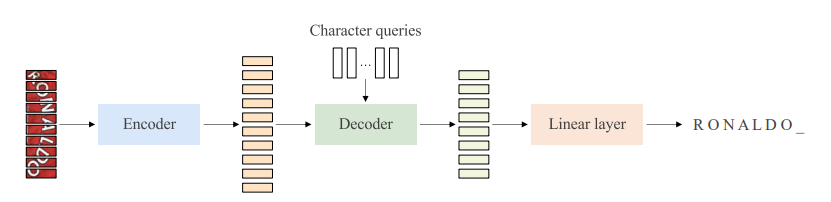

## MaskOCR: Text Recognition with Masked Encoder-Decoder Pretraining

### Abstract
Our text recognition architecture is an encoder-decoder transformer:
- the encoder extracts the **patch-level representations**
- the decoder recognizes the text from the representations

Our approach pretrains both the encoder and the decoder in a **sequential manner**:
1. We pretrain the **encoder** in a **self-supervised** manner over a large set of unlabeled real text images. We adopt the **masked image modeling approach**, which shows the effectiveness for general images, expecting that the representations take on **semantics**. 
2. We pretrain the **decoder** over a large set of **synthesized** text images in a supervised manner and enhance the language modeling capability of the decoder by **randomly masking** some text image patches **occupied by characters** input to the encoder and accordingly the representations input to the decoder.

### Approach

**Encoder-Decoder Transformer for Text Recognition**

> Figure 1: Encode-decoder transformer for text recognition. The encoder extracts a sequence of patch representations, and the decoder maps the patch representations to a sequence of representations, followed by a linear layer to recognize the sequence of characters.
- **Encoder**: 
We use the ViT, consisting of a sequence of multi-head self-attention and FFN units, as the encoder and learn the patch-level representations, $F = [f_{1},f_{2}, . . . ,f_{M}]$, for the text image.

- **Decoder**: 
    We form the text recognition decoder by following the decoder style of the DETR that is original designed for object detection.
    
    The decoder transforms the N input embeddings, $C = [c_{1}, c_{2}, . . . , c_{N}]$, called character queries, into output embeddings, which are then independently mapped into characters through a linear classifier.

- **Loss**
We denote the character predictions by $Y = [y^{1} y^{2} . . . y^{N} ]$. Assuming N is larger than the number of characters in the text image. We consider the ground truth as $Y^{∗} = [y^{ ∗}_{ 1}, y^{ ∗}_{ 2}, . . ., y^{ ∗}_{ N} ]$ padded with an end of sentence symbol [EOS]. The loss function is formulated as follows,

where $CE(·, ·)$ is the cross-entropy loss.

**Masked Encoder Pretraining**

> Figure 2: Encoder pretraining architecture. We adopt a masked image modeling approach, CAE [6] to pretrain the encoder for text image representation learning. Slightly different from the CAE, we use the image patches (RGB) as the prediction targets. In this example, six image patches (top) are visible patches, and the other four (bottom) to be predicted are masked patches.

The encoder pretraining process is given as follows:
- The text image is divided into a set of **visible image patches** and a set of **masked image patches**.
- The visible image bands are sent to the encodoer, generating the **representations of visible patches**. 
- Then, the representations of visible patches are fed into a latent contextual regressor with **mask queries**, predicting the representations for masked patches $Z_{m}$ which is expected to be close to the representations $Z^{∗}_{ m}$ of masked patches directly computed from the encoder. 
- Last, the representations of masked patches go into the image decoder, **predicting** the targets $T_{m}$.

The loss function for encoder pretraining is a combination of representation alignment loss and prediction loss, and given as follows,

Here, both losses $l_{t}(·, ·)$ and $l_{z}(·, ·)$ are the MSE loss. λ is the tradeoff parameter, and set to be 0.05 in our implementation.

**Masked Decoder Pretraining**

> Figure 3: Decoder pretraining architecture. The whole pipeline is similar with the one in Figure 1. The difference is that the input to the encoder are the visible patches. The visible patches are formed by masking the image patches that correspond to the target characters (the patch number may be greater than the character number). The input representations to the decoder are a combination of encoded representations and zero representations added to the positions (gray boxes) where the masked patches are. The prediction targets are the characters that are masked.

We pretrain the decoder on **synthesized** text images using the supervision loss. Considering the style of synthesized text images might be different from the real text images, we keep the encoder (learned from encoder pretraining) not updated and **only optimize the decoder**, so that this pretraining stage does not influence the representation quality.

In addition to removing duplicate predictions, the decoder is capable of modeling the language for better text recognition. To further enhance the capability of language modeling, we adopt the idea of masked language modeling and introduce a **masked decoder pretraining scheme**.

Then, we insert the zero representations $F_{m}$ to the positions corresponding to the masked patches, and feed the combined representations $F = [F_{v}, F_{m}]$ with the corresponding positional embeddings added into the decoder, predicting the text: $\hat{Y} = [\hat{y}_{1}, \hat{y}_{2}, . . ., \hat{y}_{N} ]$.

The loss function is similar to BERT and is merely about masked characters,

where $L$ is the number of masked characters, and $\{n_{1}, n_{2}, . . . , n_{L}\}$ are the positions of the masked characters.

### Experiments
**Chinese text line images.** The pretraining set consists of 100 million unlabeled text line images collected from practical scenarios for encoder pretraining, and 100 million synthetic text line images for decoder pretraining. The real images are collected from document and street view, and the text in them are almost in Chinese. We collect text corpus from Chinese corpus 2 , and generate 100 million images with 64 commonly used fonts using Text Render 3 . Specifically, for each synthetic sample, the text transcription as well as the character bounding boxes are given.

**English text word images.** We collect about 4.2 million unlabeled English word images from COCO-Text [47] and Book32 [19] for encoder pretraining. To be specific, we obtain about 0.5 million cropped images from COCO-Text with the official annotations. Besides, about 3.7 million cropped images are collected from Book32 with the predicted bounding boxes yielded by DB4 [28]. In addition, we also synthesize 100 million English word images for decoder pretraining. Similarly, we collect corpus from WikiText103 [35] and generate synthetic images with Text Render and 10 commonly used English fonts.
