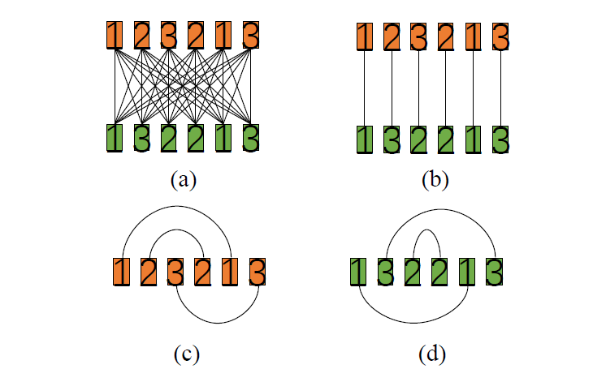
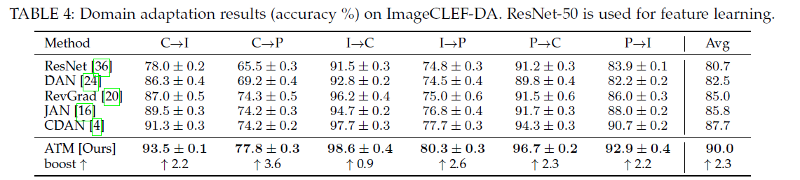

# Maximum Density Divergence for Domain Adaptation (PAMI, 2020)

## Abstract
In this paper, we propose a new domain adaptation method named **Adversarial Tight Match** (ATM) which enjoys the benefits of both adversarial training and metric learning.
Codes and datasets used in this paper are available at github.com/lijin118/ATM.
1. We propose a novel distance loss, named **Maximum Density Divergence** (MDD), to quantify the distribution divergence. MDD minimizes the inter-domain divergence (“match” in ATM) and maximizes the intra-class density (“tight” in ATM). 
2. To address the equilibrium challenge issue in adversarial domain adaptation, we consider leveraging the proposed MDD into **adversarial domain adaptation** framework. 
3. We tailor the proposed MDD as a practical learning loss and report our ATM. Both empirical evaluation and theoretical analysis are reported to verify the **effectiveness** of the proposed method.

Fig. 1: Illustration of domain adaptation and adversarial domain adaptation networks (ADAN). In domain adaptation tasks, the source domain and the target domain have different data distributions. The goal is to learn a new feature representation where the two domains can be well aligned. ADAN leverages the idea of adversarial learning and it assumes that the two domains are aligned as long as the domain discriminator is confused. **However, recent advances reveal that such an assumption may be not solid.** In this paper, we propose a new method to challenge this issue.

**Fig. 2**: The illustration of our proposed distance loss MDD (Maximum Density Divergence). MDD has two motivations: **minimizing the inter-domain divergence** and **maximizing the intra-class density**.

<!--
In summary, the main contributions of this paper can be outlined as: 
- We present a novel loss MDD for unsupervised domain adaptation. MDD jointly minimizes the inter-domain divergence and maximizes the intra-domain density. It can be seamlessly incorporated into deep domain adaptation networks and optimized by stochastic gradient descent. 
- We argue that the equilibrium challenge issue in adversarial domain adaptation can be alleviated by optimizing an additional loss which quantifies the distribution gaps. In this paper, we deploy the proposed MDD loss. The loss can also be used as a regularization term in adversarial domain adaptation networks to improve the performance. 
- We propose a novel method named Adversarial Tight Match (ATM) for unsupervised domain adaptation. The proposed ATM leverages the MDD in adversarial domain adaptation networks. Experiments on four benchmarks verify that our method can significantly outperform several previous state-of-the-arts. The result on SVHN!MNIST, for instance, is improved from 89.2% to 96.1%
--> 

## THE PROPOSED METHOD:
In this section, we first introduce our novel MDD. Then, <!--we prove it is a lower bound of symmetric KL-divergence. At last, --> we present a practical variant of the MDD loss and show how to incorporate it into adversarial domain adaptation framework and propose our new method ATM. A global glance at the proposed ATM is illustrated in Fig. 3.

**Fig. 3**: The idea illustration of the proposed adversarial tight match (ATM) for domain adaptation. Our method simultaneously optimizes the MDD loss and the adversarial loss. As a result, it can not only confuse the domain discriminator but also guarantee that the two data distributions are well aligned. The feature learner $F$ is a deep neural network, e.g., LeNet for the digits recognition and ResNet-50 for the object recognition in this paper. The predictor is a softmax classifier which has two purposes: generating the classification condition $p$ and predicting the pseudo labels $y_{t}$ for target samples.

#### **Maximum Density Divergence**

Fig. 4: Idea illustration for Eq. (4). Better viewed in color. We use orange for source domain and green for target domain. The number in each box denotes the class information. A line means that the distance between the two samples will be considered into the loss. For clarity, we use 5 samples per domain in a batch for this example. To calculate the first term in Eq. (3), we need to calculate it in the way shown in (a). In this paper, we simplify it as shown in (b), i.e, the first term in Eq. (4). The second and the third terms are calculated as shown in (c) and (d), respectively.

In practice, we calculate the MDD loss by the following equation:

where $n_{b}$ is the half of the batch size, $m_{s}$ and $m_{t}$ can be dynamically calculated in each batch.

#### **Cross-Domain Adversarial Tight Match**

Fig. 5: An illustration of the implementation of the proposed method. In this paper, we mainly use ResNet-50 as the feature representation network (exceptions are stated in the context, e.g., LeNet is used for digits recognition to avoid over-fitting). The domain discriminator is implemented by three FC layers.

The implementations of $F$(feature learner) and $D$(domain discriminator) are shown in Fig. 5. Formally, we can formulate the adversarial domain adaptation networks as follows:

The first term in Eq. (6) is a supervised cross-entropy loss on the source domain, in which  is an indicator, $\sigma$ is the softmax and $C$ is the possible categories. The second term is a conditional loss which is very similar to conditional GAN.

As a result, the overall objective function of our method ATM can be written as:

## EXPERIMENTS
#### Recognition on Digits

- MNIST, USPS and Street View House Numbers (SVHN), are three widely used handwritten digits dataset. 
- We mainly deploy ResNet-50 as the backbone network of F except for digits recognition where we follow the same settings in CyCADA.
- The domain discriminator D is implemented by FC-ReLU-FC-ReLU-FC-Sigmoid.

#### Recognition on Office-31

- Samples from the DSLR (D) domain is relatively easier to classify and samples in Amazon (A) domain is more challenging. (W for Webcam)
- It consists of 31 office objects, e.g., monitor, keyboard and printer, from 3 different domains. 
- In the header, average 1 is the overall average and average 2 is the average over 4 challenging evaluations except for W$\rightarrow$D and D$\rightarrow$W. ResNet-50 is used for feature learning.

#### Results on ImageCLEF-DA and Office-Home
- The objects in Office-31 dataset are all from the office scenario. The resources of objects in ImageCLEF-DA dataset are more diverse, e.g., animals, vehicle and people.

- Office-Home is a relatively large-scale domain adaptation benchmarks for classification tasks reported in recent years. Compared with Office-31, Office-Home has more categories.

#### Model Analysis
###### Training Stability
- The adversarial networks are generally known as hard to train. It can be seen that our method is able to converge within 20 epochs on SVHN$\rightarrow$MNIST.

###### Parameter Sensitivity
- It can be seen that our ATM achieves the best result with $\alpha$ = 0.01.
- As we can observe, the adversarial loss has a log operation on the output of the domain discriminator. However, the MDD loss is the sum of mean squared $l_{2}$ distance. 
- As a result, it is not hard to speculate that the absolute value of the MDD loss could be much larger than the adversarial loss.

###### The Effectiveness of MDD
- In addition, to verify the effectiveness on handling the equilibrium issue, we report the classification loss and overall loss of both CDAN and our method in Fig. 8.

Fig. 8: The classification loss (a) and overall loss (b) comparison between CDAN (black line) and our method (orange line). The evaluation A$\rightarrow$D is used as an example.

## CONCLUSION
- In this paper, we propose a novel method Adversarial Tight Match (ATM) for unsupervised domain adaptation.

- We propose a novel loss Maximum Density Divergence (MDD) which manages to align the two domains by simultaneously minimizing the inter-domain divergence and maximizing the intra-class density.

- Extensive experiments on four benchmarks verify that our ATM can outperform previous state-of-the-arts with significant advantages.