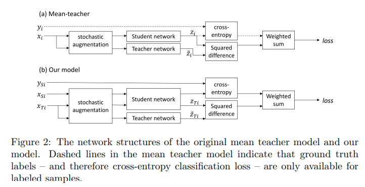

# Mean teachers are better role models: Weight-averaged consistency targets improve semi-supervised deep learning results

Main Reference: Mean teachers are better role models: Weight-averaged consistency targets improve semi-supervised deep learning results []

## Abstract 
This paper explores the use of self-ensembling for visual domain adaptation problems. Our technique is derived from the mean teacher variant [29] of temporal ensembling [14], a technique that achieved state of the art results in the area of semi-supervised learning.

## Introduction
- We have developed the approach proposed by Tarvainen et al. [29] to work in a domain adaptation scenario. (mean teacher semi-supervised learning model)
- To this end, we developed confidence thresholding and class balancing that allowed us to achieve state of the art results in a variety of benchmarks, with some of our results coming close to those achieved by traditional supervised learning.
- Our approach is sufficiently flexble to be applicable to a variety of network architectures, both randomly initialized and pre-trained.

## Methodolegy
The structure of the mean teacher model:
- The student network is trained using gradient descent, while the weights of the teacher network are an exponential moving average of those of the student. 
- During training each input sample $x_{i}$ is passed through both the student and teacher networks, generating predicted class probability vectors $z_{i}$ (student) and $\tilde{z_{i}}$ (teacher). Different dropout, noise and image translation parameters are used for the student and teacher pathways.

The training loss is the sum of a supervised and an unsupervised component:
- The supervised loss is cross-entropy loss computed using $z_{i}$ (student prediction). It is masked to 0 for unlabeled samples for which no ground truth is available. 
- The unsupervised component is the self-ensembling loss. It penalises the difference in class predictions between student ($z_{i}$) and teacher ($\tilde{z_{i}}$) networks for the same input sample. It is computed using the mean squared difference between the class probability predictions $z_{i}$ and $\tilde{z_{i}}$.

Laine et al. and Tarvainen et al. found that it was necessary to apply a time-dependent weighting to the unsupervised loss during training in order to prevent the network from getting stuck in a degenerate solution that gives poor classification performance. They used a function that follows a Gaussian curve from 0 to 1 during the first 80 epochs.

### **Adapting to domain adaptation**

Our variant of the mean teacher model – shown in Figure. 2b – has separate source (XSi) and target (XT i) paths. 
- Batch normalization uses different normalization statistics for each domain during training. 
- Our approach must train using both simultaneously
- We also do not maintain separate exponential moving averages of the means and variances for each dataset for use at test time.

### **Confidence thresholding** :
For each unlabeled sample xT i the teacher network produces the predicted class probabilty vector $\tilde{z}_{T_{ij}}$ – where j is the class index drawn from the set of classes $C$ – from which we compute the confidence $\tilde{f_{T_{i}}} = \max j∈C  \tilde{z}_{T_{ij}}$; the predicted probability of the predicted class of the sample.

### **Data augmentation** :

### **Class balance loss** :

## Experiments

Our implementation was developed using PyTorch ([3]) and is publically available at http://github.com/Britefury/self-ensemble-visual-domain-adapt.

