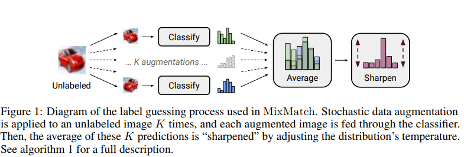
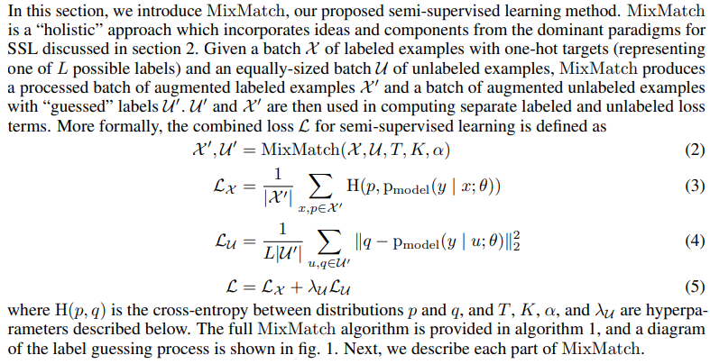
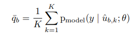
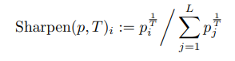
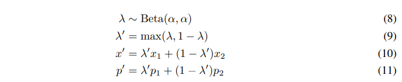
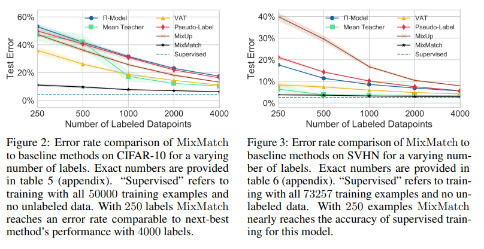
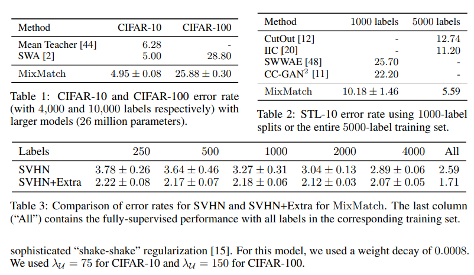

# MixMatch: A Holistic Approach to Semi-Supervised Learning
> Google Research, in the 33rd Conference on Neural Information Processing Systems (NeurIPS 2019)

## Abstract
- In this work, we unify the current dominant approaches for semi-supervised learning to produce a new algorithm, MixMatch, that **guesses <!--low-entropy--> labels for data-augmented unlabeled examples** and **mixes labeled and unlabeled data using MixUp**. 
- MixMatch **obtains state-of-the-art results by a large margin across many datasets and labeled data amounts**. For example, on CIFAR-10 with 250 labels, we reduce error rate by a factor of 4 (from 38% to 11%) and by a factor of 2 on STL-10.
<!-- - We also demonstrate how MixMatch can help achieve a dramatically better accuracy-privacy trade-off for **differential privacy**.
- Finally, we perform an ablation study to tease apart **which components of MixMatch are most important** for its success. -->

## Introduction
In short, MixMatch introduces a unified loss term for unlabeled data that seamlessly reduces entropy while **maintaining consistency** and **remaining compatible** with traditional regularization techniques.

## MixMatch 

#### 1. Data Augmentation
For each $x_b{}$ in the batch of labeled data $X$ , we generate a transformed version $x_{b} = Augment(xb)$.
For each $u_{b}$ in the batch of unlabeled data $U$, we generate $K$ augmentations $u_{b,k} = Augment(u_{b}), k ∈ (1, . . . , K)$.

#### 2. Label Guessing
For each unlabeled example in $U$, MixMatch produces a “guess” for the example’s label using the model’s predictions.
To do so, we compute the average of the model’s predicted class distributions across all the $K$ augmentations of $u_{b}$ by:

**Sharpening**
bution. In practice, for the sharpening function, we use the common approach of adjusting the “temperature” of this categorical distribution, which is defined as the operation:

#### 3. MixUp
MixUp We use MixUp for semi-supervised learning, and unlike past work for SSL we mix both labeled examples and unlabeled examples with label guesses.

where $α$ is a hyperpar.

Given that labeled and unlabeled examples are concatenated in the same batch, we need to preserve the order of the batch to compute individual loss components appropriately. priately. This is achieved by eq. (9) which ensures that $x'$ is closer to $x_{1}$ than $x_{2}$.

#### Experiments
**Implementation details**
Unless otherwise noted, in all experiments we use the “Wide ResNet-28” model from [35]. Our implementation of the model and training procedure closely matches that of [35] (including using 5000 examples to select the hyperparameters),

**Semi-Supervised Learning**

