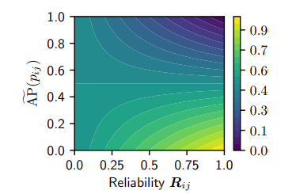

## R2D2: Repeatable and Reliable Detector and Descriptor

>author: Jerome Revaud Philippe Weinzaepfel César De Souza Martin Humenberger
constiution: NAVER LABS Europe
conference: NeurIPS 2019
github: https://github.com/naver/r2d2
reference: https://proceedings.neurips.cc/paper/2019/file/3198dfd0aef271d22f7bcddd6f12f5cb-Paper.pdf
### Abstract 

- We argue that **repeatable regions** are not necessarily discriminative and can therefore lead to select suboptimal keypoints.
- we claim that **descriptors** should be learned only in regions for which matching can be performed with high confidence.
- We thus propose to jointly learn **keypoint detection** and **description** together with a predictor of the local descriptor discriminativeness.

### Introduction
- Every corner or blob is **repeatable** but matching cannot be performed due to the repetitiveness of the pattern. 

- In natural images, common textures such as the tree leafage, skyscraper windows or sea waves can be **salient** but hard to match because of their repetitiveness and unstable nature.

- Our method estimates a confidence map for each of these two aspects and selects only keypoints which are both **repeatable** and **reliable**.

> 
Figure 1: Toy examples to illustrate the key difference between repeatability (2nd column) and reliability (3rd column) for a given image. Repeatable regions in the first image are only located near the black triangle, however, all patches containing it are equally reliable. In contrast, all squares in the checkerboard pattern are salient hence repeatable, but are not discriminative due to self-similarity.
### Joint learning reliable and repeatable detectors and descriptors

>
Figure 2: Overview of our network for jointly learning repeatable and reliable matches.

- The proposed approach, referred to as **R2D2**, aims to predict a set of sparse locations of an input image I that are **repeatable** and **reliable** for the purpose of local feature matching. 

- In contrast to classical approaches, we make an explicit **distinction between repeatability and reliability**. As shown in Figure 1, they are in fact two complementary aspects that must be predicted separately.

- The 128-dimensional output tensor serves as input to: 
    - a $l_{2}$-normalization layer to obtain the per-pixel patch **descriptors** $X$
    - an element-wise square operation followed by an additional 1 × 1 convolutional layer and a softmax to obtain the **repeatability** map $S$.
    - an identical second branch to obtain the **reliability** map $R$.

#### 3.1 Learning repeatability
- Using **supervision** essentially boils down in this case to imitating an existing detector rather than discovering potentially better keypoints. 
- We thus treat the repeatability as a **self-supervised** task and train the network such that the positions of local maxima in S are covariant to natural image transformations like viewpoint or illumination changes.
- Therefore we reformulate this idea locally:

<!-- ,
 -->

>
Figure 4: Sample repeatability heatmaps obtained when training the repeatability loss $L_{rep}$ from Eq. (3) with different patch size N. Red and green colors denote low and high values, respectively.

#### 3.2 Learning reliabilit
- The goal is to let the network learn to choose between making **descriptors** as discriminative as possible or, conversely, sparing its efforts on uniformative regions like the sky or the ground.
- For reliable patches (i.e. $AP$ > $κ$), the loss incites to maximize the $AP$. 
- Conversely, when $AP < κ$, the loss encourages the reliability to be low.

<!--  -->

>
Figure 3: Visualization of our proposed loss $L_{AP,R}$.

#### Inference and training details
Training data.
(a) distractors from a retrieval dataset (i.e., random web images), from which we build synthetic image pairs by applying **random transformations** (homography and color jittering), 
(b) images from the Aachen dataset, using the same strategy to build **synthetic** pairs, and 
(c) pairs of nearby views from the Aachen dataset where we obtain a pseudo ground-truth using **optical flow**.

### Experiments

>
Figure 6: For one given input image (1st row), we show the repeatability (2nd row) and reliability heatmaps (3rd row) extracted at a single scale, and overlaid onto the original image. The reliability heatmap’s color scale is enhanced for the sake of visualization. Top-scoring keypoints are shown as green crosses in the first image. They tend to avoid uniform and repetitive patterns (sky, ground, ...).

>
Table 2: Comparison with QuadNet [49] and a handcrafted difference of gaussian (DoG) in terms of detector repeatability on the Oxford dataset, with a varying number of keypoints K.

>
Figure 8: Sample results using reciprocal nearest matching. Correct and incorrect correspondences are shown as green dots and red crosses, respectively.

>
Table 3: Comparison to the state of the art on the Aachen Day-Night dataset [45] for the visual localization task. The last row is performed with an increased number of channels.