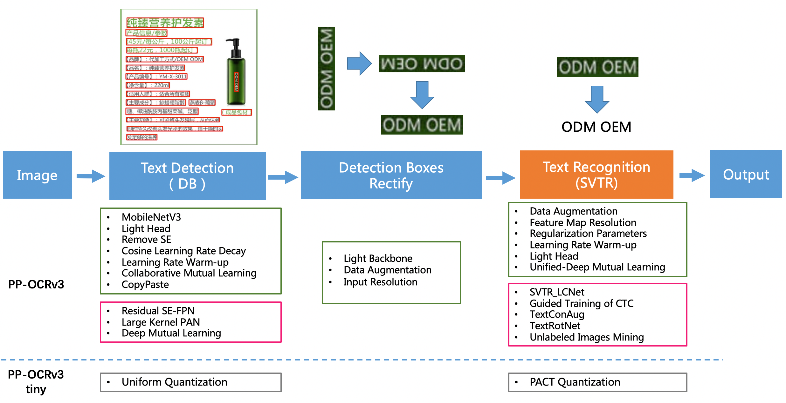
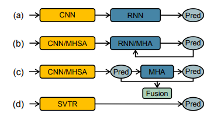
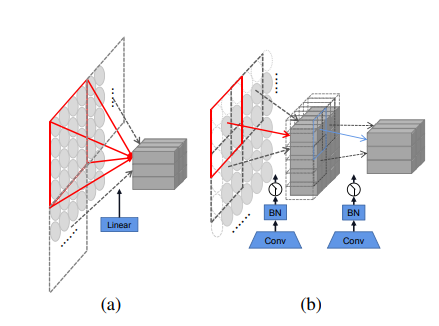
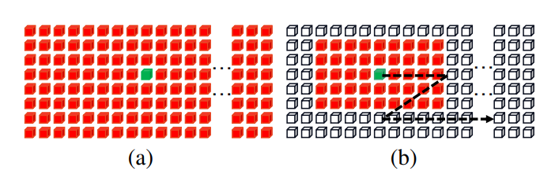
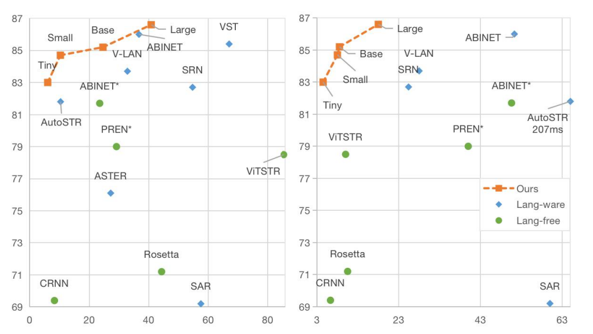

## SVTR: Scene Text Recognition with a Single Visual Model
constiution: Baidu Inc., Fudan University, China
conference: IJCAI 2022
github: https://github.com/PaddlePaddle/PaddleOCR
reference: https://arxiv.org/pdf/2205.00159v2.pdf

> **PP-OCRv3**
Introduction: PP-OCRv3, proposed by PaddleOCR team, is further upgraded on the basis of PP-OCRv2. The overall framework of PP-OCRv3 is same as that of PP-OCRv2. The base model of recognition network is replaced from CRNN to SVTR, which is recorded in IJCAI 2022. 

There are 9 optimization strategies for text detection and recognition models in PP-OCRv3, which are as follows.
In terms of effect, when the speed is comparable, the accuracy of various scenes is greatly improved:
    - In Chinese scenarios, PP-OCRv3 outperforms PP-OCRv2 by more than 5%.
    - In English scenarios, PP-OCRv3 outperforms PP-OCRv2 by more than 11%.
    - In multi-language scenarios, models for more than 80 languages are optimized, the average accuracy is increased by more than 5%.

### Abstract
- In this study, we propose a Single Visual model for Scene Text recognition within the **patch-wise** image tokenization framework, which dispenses with the **~~sequential modeling~~** entirely.
- The method, termed SVTR, firstly decomposes an image text into small patches named **character components**.
- **Global and local mixing** blocks are devised to perceive the inter-character and intra-character patterns, leading to a multi-grained character component perception. Thus, characters are recognized by a simple linear prediction.

>
Figure 1: 
(a) CNN-RNN based models. 
(b) Encoder-Decoder models. MHSA and MHA denote multi-head self-attention and multihead attention, respectively. 
(c) Vision-Language models. (e.g. SRN, ABINet)
(d) Our SVTR, which recognizes scene text with a single visual model and enjoys efficient, accurate and cross-lingual versatile.

### Method
#### Overall Architecture

> Figure 2: Overall architecture of the proposed SVTR. It is a three-stage height progressively decreased network. In each stage, a series of mixing blocks are carried out and followed by a merging or combining operation. At last, the recognition is conducted by a linear prediction.

#### Progressive Overlapping Patch Embedding

> Figure 3: (a) The linear projection in ViT [Dosovitskiy et al., 2021]. (b) Our progressive overlapping patch embedding.
- There exists two common one-step projections for this purpose, i.e., a 4×4 disjoint linear projection (see Figure 3(a)) and a 7 × 7 convolution with stride 4.
- Alternatively, we implement the patch embedding by using two consecutive 3 × 3 convolutions with stride 2 and batch normalization, as shown in Figure 3(b).
- The scheme, despite increasing the computational cost a little, adds the feature dimension progressively which is in favor of feature fusion.

#### Mixing Block

> Figure 4: Illustration of (a) global mixing and (b) local mixing.
- Since two characters may differ slightly, text recognition heavily relies on features at character component level.

- We argue that text recognition requires two kinds of features:
    1. The first is local component patterns such as the **stroke-like** feature. It encodes the morphology feature and correlation between different parts of a character. 
    2. The second is intercharacter dependence such as the correlation between different **characters** or **between text and non-text** components. 
- Therefore, we devise two mixing blocks to perceive the correlation by **using self-attention with different reception fields**.

####  Merging
- It is computational expensive to maintain a constant spatial resolution across stages, which also leads to redundant representation.
- we employ a $3 × 3$ convolution with stride $2$ in the height dimension and $1$ in the width dimension, followed by a layer norm, generating an embedding of size $\frac{h}{2} × w × d_{i}$.
- The merging operation halve the height while keep a constant width. It not only **reduce the computational cost**, but also build a **text-customized hierarchical structure**.

#### Combining and Prediction
- It pools the height dimension to $1$ at first, followed by a fully-connected layer, non-linear activation and dropout.
- By doing this, **character components are further compressed to a feature sequence**, where each element is represented by a feature of length $D_{3}$.
- Compared to the merging operation, the combining operation **can avoid applying convolution** to an embedding whose size is very small in one dimension, e.g., with $2$ in height.

#### Experiments

**The Effectiveness of Patch Embedding**

> Figure 5: Accuracy-parameter (M) and Accuracy-speed (ms) plots of different models on IC15.

**Comparison with State-of-the-Art**

> Table 4: Results on six English and one Chinese benchmarks tested against existing methods, where CRNN and Rosetta are from the reproduction of CombBest [Baek et al., 2019]. Lan means language and * means the language-free version of the corresponding method. The speed is the inference time on one NVIDIA 1080Ti GPU averaged over 3000 English image text.