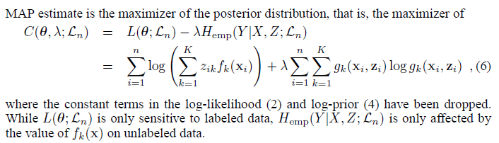

# Semi-supervised Learning by Entropy Minimization

## Abstract

We consider the semi-supervised learning problem, where a decision rule is to be learned from labeled and unlabeled data.

In this framework, we motivate minimum entropy regularization, which enables to incorporate unlabeled data in the standard supervised learning.

## Derivation of the Criterion

#### Likelihood
if $x_{i}$ is labeled $w_{k}$, then $z_{ik} = 1$ and $z_{il} = 0$ for  $l \neq k$; if $x_{i}$ is unlabeled, then $z_{il} = 1$ for $l = 1, . . . ,K$.
Assuming independent examples, the conditional log-likelihood of $(Z|X)$ on the observed sample is then:

#### When Are Unlabeled Examples Informative?
Learning theory is mostly developed at the two extremes of the statistical paradigm: 
1. In parametric statistics where examples are known to be generated from a known class of distribution.
2. In the distribution-free Structural Risk Minimization (SRM) or Probably Approximately Correct (PAC) frameworks.

ref: https://datascience.stackexchange.com/a/66884

>Semi-supervised learning, in the terminology used here, does not fit the distribution-free frameworks: no positive statement can be made without distributional assumptions, as for some distributions P(X, Y ) unlabeled data are non-informative while supervised learning is an easy task. In this regard, generalizing from labeled and unlabeled data may differ from transductive inference.

>In parametric statistics, theory has shown the benefit of unlabeled examples, either for specific distributions. ... These studies conclude that the (asymptotic) information content of unlabeled examples decreases as classes overlap. Thus, the assumption that classes are well separated is sensible if we expect to take advantage of unlabeled examples.

#### Entropy Regularization

Here, maximum entropy refers to the construction principle which enables to derive distributions from constraints, not to the content of priors regarding entropy.

#### Related Work

Self-Training

Minimum entropy methods

Input-Dependent Regularization
