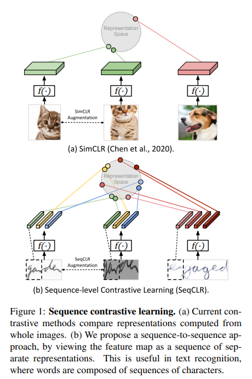
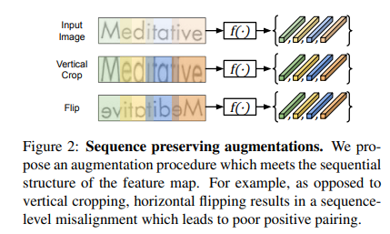
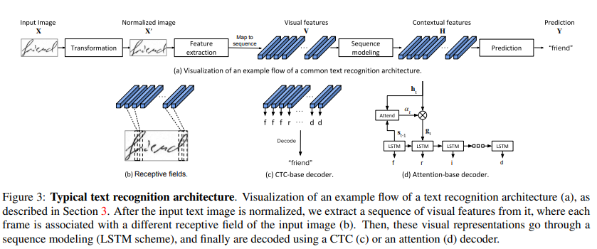
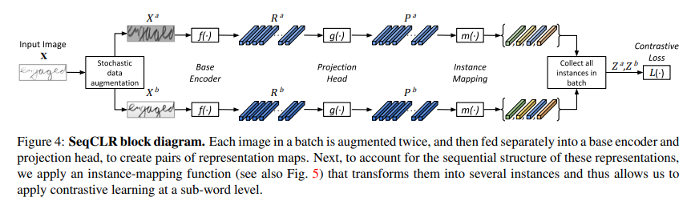
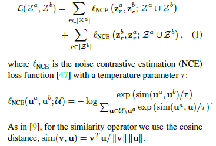
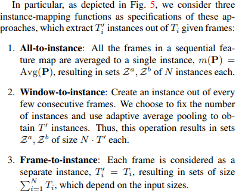

# Sequence-to-Sequence Contrastive Learning for Text Recognition

## Abstract
We propose a framework for sequence-to-sequence contrastive learning (SeqCLR) of visual representations, which we apply to text recognition. 

To account for the sequenceto-sequence structure, each feature map is divided into different instances over which the **contrastive loss** is computed.

To yield effective visual representations for text recognition, we further suggest **novel augmentation heuristics**, different encoder architectures and custom projection heads.

To summarize, the key contributions of our work are:
- A **contrastive learning** approach for visual sequenceto-sequence recognition.
- Viewing each feature map as a sequence of individual instances, leading to contrastive learning in a **sub-word level**, such that each image yields several positive pairs and multiple negative examples.(Figure 2)
- Defining **sequence preserving augmentation procedures**, and **custom projection heads**.

## Text Recognition Background

## Sequence-to-Sequence Contrastive Learning

As depicted in Fig. 4, we suggest a framework consisting of the following five building-blocks:
- A stochastic data augmentation module that is designed to ensure a sequence-level alignment. This operation transforms any given image $X_{i}$ in a batch of $N$ images, into two augmented images $X^{a}_{i}$ , $X^{b}_{i}$ ∈ $R^{ C×H×Wi}$.
- A base encoder $f(·)$ consisting of several blocks of the recognizer scheme (Fig. 3(a)). For each pair of augmented images, this component extracts a pair of sequential representations, $R^{a}_{i} , R^{b}_{i} ∈ R^{F ×T_{i}}$
- An optional projection head $g(·)$, that transforms the representations using a small auxiliary network.
- A novel instance-mapping function $m(·)$ is utilized before the contrastive loss to yield $T^{′}_{i}$ instances out of $T_{i}$ projected frames, as illustrated in Fig. 5. Next, we collect all the instances in the batch into two aligned sets $Z_{a} , Z_{b}$.
- A contrastive loss aims to pull closer together representations of corresponding indices of $Z_{a} , Z_{b}$.

We now detail each of these components:
**Data augmentation**
**Base encoder**
**Projection head**
**Instance-mapping**
we propose to view every few consecutive frames in the feature map as an atomic input element for the contrastive loss.

# ScrabbleGAN: Semi-Supervised Varying Length Handwritten Text Generation

## Abstract
We present ScrabbleGAN, a semi-supervised approach to synthesize handwritten text images that are versatile both in style and lexicon. ScrabbleGAN relies on a novel generative model which can generate images of words with an arbitrary length.

We show how to operate our approach in a semi-supervised manner, enjoying the aforementioned benefits such as performance boost over state of the art supervised HTR.

Furthermore, our generator can manipulate the resulting text style. This allows us to change, for instance, whether the text is cursive, or how thin is the pen stroke.

## Introduction
#### Our contributions
First, we present a novel fully convolutional handwritten text generation architecture, which allows for arbitrarily long outputs. This is in contrast to the vast majority of text related solutions which rely on recurrent neural networks (RNN). Our approach is able to generate arbitrarily long words (e.g., see Figure 1) or even complete sentences altogether. Another benefit of this architecture is that it learns character embeddings without the need for character level annotation. Our method’s name was chosen as an analogy between the generation process to the way words are created during the game of Scrabble, i.e. by concatenating some letter-tokens together into a word.

Second, we show how to train this generator in a semisupervised regime, allowing adaptation to unlabeled data in general, and specifically to the test time images. To the best of our knowledge, this is the first use of unlabeled data to train a handwritten text synthesis framework.

Finally, we provide empirical evidence that the training lexicon matters no less than the richness of styles for HTR training. This fact emphasizes the advantage of our method over ones that only warp and manipulate the training images.

## PreviousWork

**Handwriting text generation**

**Data augmentation using generative models.**

**Classic augmentation**

## Method

