# Sequence-to-Sequence Domain Adaptation

## Agenda
- Sequence-to-Sequence Domain Adaptation Network for Robust Text Image Recognition (Proceedings of the IEEE/CVF Conference on Computer Vision and Pattern Recognition 2019)
- Robust Text Image Recognition via Adversarial Sequence-to-Sequence Domain Adaptation (2021 IEEE Transactions on Image Processing)

## Sequence-to-Sequence Domain Adaptation Network for Robust Text Image Recognition

### Abstract :
- In this paper, we develop a Sequence-to- Sequence Domain Adaptation Network (SSDAN) for robust text image recognition, which could exploit unsupervised sequence data by an attention-based sequence encoder- decoder network.

- In the SSDAN, a gated attention similarity (GAS) unit is introduced to adaptively focus on aligning the distribution of the source and target sequence data in an attended character-level feature space rather than a global coarse alignment.

As shown in Figure 2, the proposed SSDAN is an attention-based sequence encoder-decoder network, which encodes a text image into a sequence of attended character-level features that are then recomposed through a GRU decoder with an attention mechanism. In the proposed SSDAN, a GAS unit is further introduced to adaptively guide model finding the character-level domaininvariant features between the source and target domain.

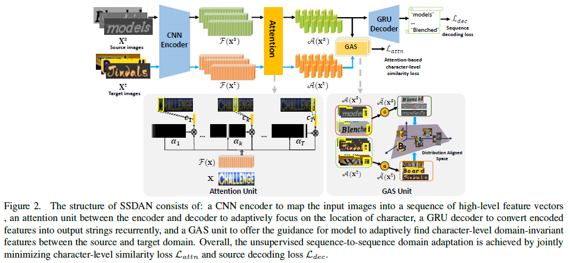

### We summarize our contributions as follows:
- We propose a novel Sequence-to-sequence Domain Adaptation Network dubbed SSDAN for robust text image recognition, which could be generalized to different scenes, such as natural scene text, handwritten text and mathematical expression recognition. 
- We introduce a novel GAS unit in SSDAN to bridge the sequence-like text image recognition and domain adaptation, which could adaptively transfer finegrained character-level knowledge instead of performing domain adaptation by global features.
- The proposed SSDAN is capable of using unsupervised sequence data to reduce domain shift effectively.

### Method:
**Attentive Text Recognition:**

As shown in Figure 2, the attentive text recognition pipeline consists of:
- a CNN encoder that learns high-level visual representations from an input image. 
- an attention model between the encoder and the decoder driving the focus of attention of the model towards a specific part of the sequence of encoded features. 
- a GRU decoder that generates a sequence of symbols as output, one at every time step.

**Gated Attention Similarity Unit**

We introduced Gated Attention Similarity (GAS) Unit, based on an attention encoder-decoder mechanism, to convert a variablelength input text image into a sequence of character features.

By decomposing the text strings into a set of characters, the source and target domain will statistically share the same label space in character-level, and thus the influence of the misalignment problem can be alleviated.

We notice that if the attention context vector fails to focus on the region of effective character, the adaptation on the attention context vector will not help.

we introduce a gate mechanism to select effective attention context vectors to perform domain adaptation. An intuition is that if the current attention context vector $c_{k}$ is distinguishable, the probability that $c_{k}$ belongs to one specific character $y_{k}$ will be relatively higher than others.

A gated attention similarity loss $L_{attn}$ is accordingly introduced to measure the distance on the valid attended character-level feature set of source and target domain as:
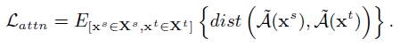

CORAL is to align the second-order statistics-correlation of the source and target data , which is defined as

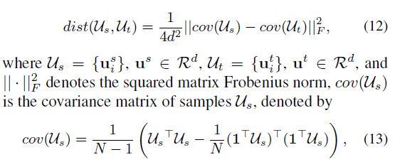

**Overall Objective Function**

we can use the negative log likelihood of sequential probability as the decoding loss Ldec to measure the differences between the predicted and the source labeled character sequences:

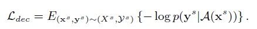

the attention similarity loss Lattn in Eq. 11 is combined with the discriminative decoder loss Ldec in source domain. The overall objective function of the attentional domain adaptation model is defined as:

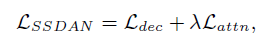

## Robust Text Image Recognition via Adversarial Sequence-to-Sequence Domain Adaptation

### Abstract:
we found that these methods might struggle when dealing sequence-like text images. An important reason is that conventional domain adaptation methods strive to align images as a whole, while text images consist of variable-length fine-grained character information.

To address this issue, we propose a novel Adversarial Sequence-to-Sequence Domain Adaptation (ASSDA) method to learn “where to adapt” and “how to align” the sequential image.

Our key idea is to mine the local regions that contain characters, and focus on aligning them across domains in an adversarial manner.

We summarize our contributions as follows:
- We introduce an Adversarial Sequence-to-sequence Domain Adaptation dubbed ASSDA for robust text image recognition, which bridges the sequence-like text image recognition and domain adaptation.
- We design two domain adaptation modules to alleviate the domain shift at both the global-level and local-level, where they collaboratively contribute to guiding model find the domain-invariant representations.
- We introduce a spatial normalization network to the domain adaption process, which makes the model robust and could be generalized to more complex scenes.

The paper surpasses its conference version SSDAN [16] with three major extensions:
- To address the insufficient knowledge transferring problem in the SSDAN, we redesign the alignment module to consider the inevitable cross-domain shifts at different levels, rather than only local-level domain shifts.
- Regarding that various perspective distortions and geometric noises in real scenes, the extended ASSDA incorporates a spatial normalization network to the domain adaption process. It makes our model could be generalized to broader scenes in a unified framework.
- We explore the application of ASSDA in more complex tasks, including irregular text recognition, and more complex cross-domain adaptation tasks.

## Proposed Method
We introduce two domain adaptation components: global-level alignment and local-level alignment, which are used to align the feature representation distribution on not only global-level but also local-level. **After training, the alignment module is no longer needed.**

#### Global-level Alignment
Aligning global image level representations generally helps to reduce the shift caused by the global image difference such as image style, illumination, etc. We wish to learn a global representation that is invariant for both appearances (background, illumination, etc. ), and geometry characteristics (translation, rotation, and affine transformation, etc. ).

To tackle this problem, we introduce a spatial normalization network N, which transforms a raw input image $x$ into a geometry-normalized image $\hat{x}$. Motivated by ASTER, we apply a learnable Thin-Plate Spline (TPS) transformation network as $N$ to normalize the irregular text image.

The loss of the global-level domain discriminator $D_{g}$ as $L_{g}$ is denoted as follows,
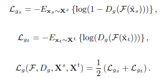

#### Local-level Alignment
However, such(Global-level Alignment) a setting has three limitations.
- First the model ignores the alignment of fine-grained local character features, making certain domainsensitive local features weaken the generalization ability of the adaptive model. 
- Second, single adaptation (one domain classifier) is difficult to cancel the data bias between the source domain and the target domain, because the sequential text images are complex combinations of local characters. 
- Third, due to that the target sequence domain is unsupervised, the whole ground truth strings of target domain may suffer the inconsistency with the source domain.

We desire to find those regions that cover fine-grained character region, and then align the character-level feature in both the source and target domain.

We notice that if the attention context vector fails to focus on the region of effective character, the adaptation on the attention context vector will not help. To overcome this problem, we introduce a gate mechanism to select effective attention context vectors to perform domain adaptation, as illustrated in Fig. 4.
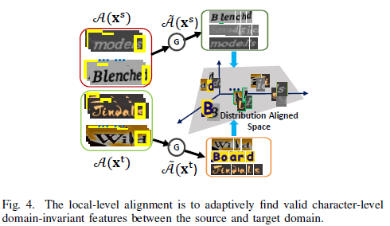

We further introduce an adaption gate function $\sigma (c_{k})$ to judge if a context vector ck is attending to a valid character,
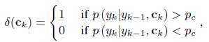

Furthermore, a gate function set $G$ is adaptively changed according to the specific input image $x$, which is expressed as:

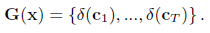

Through the gate function, we can update attention context vector set by adaptation gate function set $G(x)$,

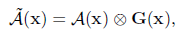

local-level adaptation loss can now be written as: 
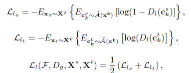

#### Overall Objective

We use the negative log likelihood of sequential probability as the decoding loss $L_{dec}$ to measure the differences between the predicted and the source labeled character sequences:

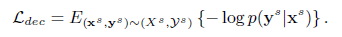

The global-level adaptation loss $L_{g}$ and the local-level adaptation loss $L_{l}$ are combined with the discriminative decoder loss Ldec in source domain.

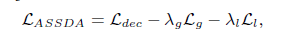