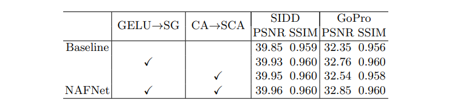

# Simple Baselines for Image Restoration

> conference: ECCV2022
 authors: Liangyu Chen, Xiaojie Chu, Xiangyu Zhang, Jian Sun, MEGVII Technology (曠視科技)
 github: https://github.com/megvii-research/NAFNet 
 reference: https://arxiv.org/abs/2204.0467

## Image Restoration
>Image Restoration is a family of inverse problems for obtaining a high quality image from a corrupted input image. Corruption may occur due to the image-capture process (e.g., noise, lens blur), post-processing (e.g., JPEG compression), or photography in non-ideal conditions (e.g., haze, motion blur). 
Examples of Image Restoration:

## Abstract
- Although there have been significant advances in the field of image restoration recently, the **system complexity** of the SOTA methods is increasing as well, which may hinder the convenient analysis and comparison of methods.
- In this paper, we propose a **simple baseline** that exceeds the SOTA methods and is computationally efficient.
- We derive a Nonlinear Activation Free Network, namely **NAFNet**, from the baseline.

>
Fig. 1: PSNR vs. computational cost on Image Deblurring (left) and Image Denoising (right) tasks.
(Peak signal-to-noise ratio, PSNR)
(Giga Multiply Add Caculation per Second, MACs)

##  Build A Simple Baseline
### Architecture
- Inter-block Complexity are multi-stage networks, i.e. the latter stage refine the results of the previous stage, and each stage is a U-shaped architecture.
- To reduce the inter-block complexity, we adopt the classic single-stage U-shaped architecture with skip-connections, as shown in Figure 2c, following **Restformer** and **Uformer**.

>
Fig. 2: Comparison of architectures of image restoration models. Dashes to distinguish features of different sizes. 
(a) The multi-stage architecture[4,35] stacks UNet architecture serially. 
(b) The multi-scale fusion architecture[24,6] fusions the features in different scales. 
(c) UNet architecture, which is adopted by some SOTA methods[37,34]. We use it as our architecture.

#### Layer Normalization
- Although abandoned **~~Batch Normalization~~** as the small batch size may bring the unstable statistics, re-introduce the Instance Normalization and avoids the small batch size issue.
- However, **Hinet** shows that adding instance normalization does not always bring performance gains and requires manual tuning.
- Based on these facts we conjecture **Layer Normalization** may be crucial to SOTA restorers, thus we add Layer Normalization to the plain block described above.

#### Activation
- The activation function in the plain block, **~~Rectified Linear Unit (ReLU)~~**, is extensively used in computer vision. However, there is a tendency to replace ReLU with GELU in SOTA methods [22,37,30,21,11].
- We replace ReLU with **GELU** in the plain block, because it keeps the performance of image denoising while bringing non-trivial gain on **image deblurring**.

#### Attention
- Inspired by **Restormer**, we realize the vanilla channel attention meets the requirements: computational efficiency and brings global information to the feature map.
- In addition, the effectiveness of channel attention has been verified in the image restoration task, thus we add the **channel attention** to the plain block.

>
Fig. 3: Intra-block structure comparison. ⊗:matrix multiplication, ⊙/⊕:elementwise multiplication/addition. dconv: Depthwise convolution. Nonlinear activation functions are represented by yellow boxes. 

### Nonlinear Activation Free Network (NAFNet)
- The baseline described above is simple and competitive, but is it possible to further improve performance while ensuring simplicity?

>
Fig. 4: Illustration of (a) Channel Attention[15] (CA), (b) Simplified Channel Attention (SCA), and (c) Simple Gate (SG). ⊙/∗: element-wise/channel-wise multiplication.
#### Simple Gate Unit
- Based on these, we propose a simple GLU variant: directly divide the feature map into two parts in the channel dimension and multiply them, as we shown in Figure 4c, noted as SimpleGate.
- The results demonstrate that GELU could be replaced by our proposed SimpleGate.

>GAUSSIAN ERROR LINEAR UNITS (GELUS):

#### Simplified Channel Attention
- Channel Attention: it squeezes the spatial information into channels first and then a multilayer perceptual applies to it to calculate the channel attention, which will be used to weight the feature map.
- This inspires us to consider channel attention as a special case of GLU, which can be simplified like GLU in the previous subsection.
>

## Experiments
The ablation studys are conducted on image denoising (SIDD) and deblurring (GoPro) tasks. We limit our computational budget to 16 GMACs (when input size is 256 × 256) in experiments if not specified, following.
> Using metrics:
(Peak signal-to-noise ratio, PSNR)
(Structural SIMilarity, SSIM)
(Giga Multiply AddCaculation per Second, MACs)

>
Table 1: Build a simple baseline from PlainNet. The effectiveness of Layer Normalization (LN), GELU, and Channel Attention (CA) have been verified. ∗ indicates that the training is unstable due to the large learning rate (lr)

>
Table 2: NAFNet is derived from the simplification of baseline, i.e. replacing GELU to SimpleGate (SG), and replacing Channel Attention (CA) to Simplified Channel Attention (SCA)

### RGB Image Denoising
>
Fig. 5: Qualitative comparison of image denoising methods on SIDD.

>
Table 5: Image Denoising Results on SIDD.

### Image Deblurring
>
Table 6: Image Deblurring Results on GoPro[25].

>
Fig. 6: Qualitative comparison of image deblurring methods on GoPro[25].

### Raw Image Denoising
>
Fig. 7: Qualitatively compare the noise reduction effects of PMRID[33] and our porposed NAFNet. Zoom in to see details.

>
Table 7: Raw image denoising results on 4Scenes[33]