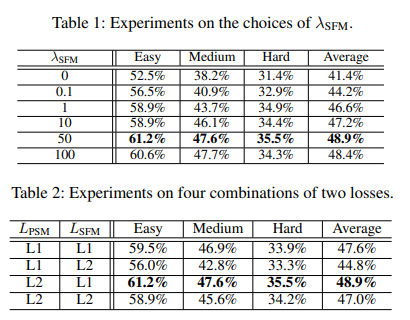

# Text Gestalt: Stroke-Aware Scene Text Image Super-Resolution
> author: Jingye Chen, Haiyang Yu, Jianqi Ma, Bin Li, Xiangyang Xue
institution: Fudan University, The Hong Kong Polytechnic University
conference: AAAI 2022
github: https://github.com/FudanVI/FudanOCR/tree/main/text-gestalt

> Gestalt Psychology (格式塔學派):
    又叫做完形心理學（德語：Gestalttheorie）是心理學重要流派之一。由馬科斯·韋特墨（1880－1943）、沃爾夫岡·苛勒（1887－1967）和科特·考夫卡（1886－1941）三位德國心理學家在研究似動現象的基礎上創立。格式塔是德文Gestalt的譯音，意即「模式、形狀、形式」等，意思是指「動態的整體（dynamic wholes）」。有以下理論原則：
    - 心理功能完整性原則: 人腦的運作原理是整體
    - 心理物理學同型性原則: 知覺經驗和大腦活動之間有確定的聯繫
    舉例: 圖形A可以被知覺為三角形，儘管在事實上並未畫三角形。
    

## Abstract
they usually treat text images as general images while ignoring the fact that the visual quality of **strokes** (the atomic unit of text) plays an essential role for text recognition.

<!-- According to **Gestalt Psychology**, humans are capable of composing parts of details into the most similar objects guided by prior knowledge. Likewise, when humans observe a low-resolution text image, they will inherently use partial stroke-level details to recover the appearance of holistic characters. -->

Inspired by Gestalt Psychology, we put forward a Stroke-Aware Scene Text Image Super-Resolution method containing a **Stroke-Focused Module (SFM)** to concentrate on stroke-level internal structures of characters in text images.

Specifically, we attempt to design rules for **decomposing English characters and digits** at strokelevel, then pre-train a text recognizer to provide **stroke-level attention maps** as positional clues with the purpose of controlling the consistency between the generated super-resolution image and high-resolution ground truth.

Furthermore, since the proposed SFM is only used to provide stroke-level guidance when training, it will not bring any ~~time overhead~~ during the test phase.

>
Figure 1: For incomplete or blurred images, detailed information (e.g., spots or strokes) play a significant role during recovery. Our method can generate recognizable English and Chinese text images with the guidance of stroke details.

## Methodology
>
Figure 2: The overall architecture of our method. It contains two modules, including a Pixel-wise Supervision Module (PSM) to recover the color and contour of text images and a Stroke-Focused Module (SFM) to highlight the details of stroke regions.

#### Pixel-wise Supervision Module
- The existing super-resolution backbones usually follow this design: 
    1. Employ a series of **stacked CNN layers** to build up a backbone for extracting features, whose height and width are the same as the original images while **containing more channels**; 
    2. Utilize a **pixel shuffle module** containing multiple CNN layers to reshape the generated maps. Consequently, a super-resolution image is generated with a **larger size**.
- We follow (TSRN, Wang et al. 2020) to append a **STN** (Jaderberg et al. 2015) before the backbone to alleviate this problem.
- We denote the $HR$ images as $I_{HR}$ and the generated $SR$ images as $I_{SR}$. The loss is calculated as follows:
    

#### Stroke-Level Decomposition

- According to Unicode Han Database, there are **five basic strokes** of Chinese characters including horizontal, vertical, left-falling, right-falling, and turning.

- We attempt to create stroke encoding for English **characters** and **digits**: 
    1. Break down the characters and digits in more simplified structures. We reduce the total category number for the recognition models to generate better-learned and fine-grained supervision. 
    2. Represent each character as a sequence of these basic strokes (see Figure 3(d)) 
    3. Concatenate the stroke sequences of each character and pad a stop symbol “eos” in the end (see Figure 3(e)).

#### Stroke-Focused Module
- To exploit more fine-grained attention maps, we pre-train a **Transformer-based recognizer** on two synthetic datasets, including Synth90k and SynthText with stroke-level labels following (Chen, Li, and Xue 2021b).
- More specifically, given the character-level labels $c_{GT} = \{c_{1}, c_{2}, ..., c_{t}\}$, we decompose each character and concatenate them to construct the stroke-level labels $s_{GT} = \{s_{1}, s_{2}, ..., s_{t'}\}$, where $t$ and $t'$ denote the maximum length of labels at two different levels $(t ≤ t' )$.
<!-- - During pre-training, following (Vaswani et al. 2017; Shi et al. 2018), we use the force teaching strategy to accelerate the training procedure by employing right-shifted stroke-level label $s_{GT′} = \{s_{<start>}, s_{1}, s_{2}, ..., s_{t ′−1}\}$ as input, where $s_{<start>}$ denotes the start symbol. -->
- When reaching convergence, we discard ~~the sequence prediction $y_{pred}$ supervised with cross-entropy loss during training~~, and only leverage the **sequence of stroke-level attention** maps generated from the Multi-Head Self-Attention Module as stroke-level positional clues.
- Specifically, we denote the attention maps of HR images as $A_{HR} = \{ A^{1}_{HR}, A^{2}_{HR}, ..., A^{t'}_{HR} \}$ and $SR$ images as $A_{SR} = \{A^{1}_{SR}, A^{2}_{SR}, ..., A^{t'}_{SR} \}$, then employ an $L1$ loss to constrain these two maps as follows:
    

#### Overall Loss Function
Finally, we construct the overall loss function as follows:

where $λ_{SFM}$ balances the weight of these two loss functions.

## Experiments

#### Choices of Parameters
TextZoom contains 17, 367 LR-HR pairs for training and 4, 373 pairs for testing. In terms of different focal lengths of digital cameras, the test set is divided into three subsets: easy, medium and hard.

#### Experimental Results

> TBSRN: Transformer-Based SuperResolution Network, Chen, J
TSRN: Text Super-Resolution Network, Wang, W

## Discussions

>Figure 4: Examples of the generated images. “None” means no text priors are taken into account, while “Char” and “Stroke” denote the model is trained with character-level guidance and stroke-level guidance. We choose TSRN as the backbone.

>Figure 5: Manually design LR-HR pairs to construct Degraded-IC13. The upper row are four types of blur and the lower row are some examples of LR-HR pairs.

>Figure 6: Examples of the generated Chinese characters.