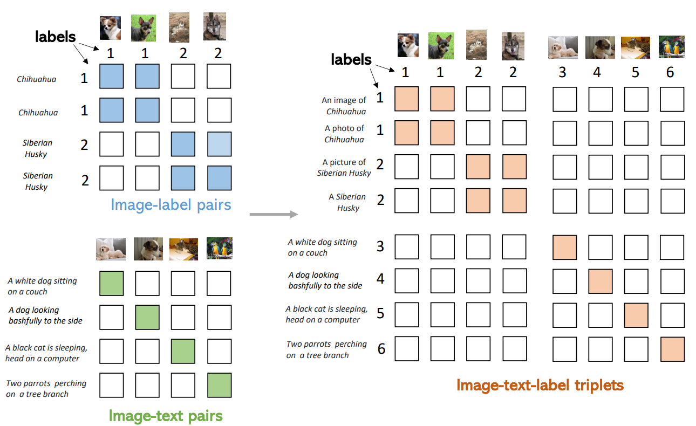

# Unified Contrastive Learning in Image-Text-Label Space

> author: Jianwei Yang, Chunyuan Li, Pengchuan Zhang, Bin Xiao, Ce Liu, Lu Yuan, Jianfeng Gao
institution: Microsoft Research at Redmond, Microsoft Cloud + AI
comments: CVPR 2022
github: <https://github.com/microsoft/UniCL>

**Figure 1.** Unified contrastive learning paradigm in the **imagetext-label space**, which recovers the supervised learning (e.g., Cross-Entropy (CE) or Supervised Contrastive Learning (SupCon) ) on image-label data, and language-image contrastive learning (e.g., CLIP or ALIGN ) on image-text data

## Abstract

- We introduce a new perspective of **image-text-label space**, which can seamlessly unify the commonly used image-label and image-text data.
- We propose a unified contrastive learning method called **UniCL** in the image-text-label space, that can learn from either of the image-label and image-text data, or both.
- Extensive experiments show that our UniCL can leverage both types of data effectively and achieve **superior performance** universally on standard zero-shot, linear probe, fully-finetuning and transfer learning settings.

## Method

### Problem setup

The goal of this work is to learn from the **joint data** $S$, believing that the rich semantics in language **description** $t$ and structured organizations of **labels** $y$ together are beneficial for learning semantic-rich and discriminative visual representations of **images** $x$.

- For **image-label data**, we associate a textual concept to each label, and the images and textual concepts are matched based on the annotated labels (blue tiles).
- For **image-text data**, each pair have unique label index, thus matched only at the diagonal entries (green tiles).
- On the right side, we can simply combine them as **image-text-label triplets**, and the red tiles means positive pairs while the blank tiles are negative pairs.

**Figure 2.** An illustration of covering image-label and image-text data in the **image-text-label space**.

### Unified Image-Text-Label Contrast

We consider a bidirectional learning objective between images and language:

- $L_{i2t}$: The image-to-text contrastive loss to align matched images in a batch with a given text.
- $L_{t2i}$: The text-to-image contrastive loss to align matched texts to a given image.

Using Fig. 2 right side as an example, the $L_{i2t}$ is computed for each row, and $L_{t2i}$ computed for each column.

### Discussions & Properties

**Figure 3.** Illustrative comparisons across different learning paradigms.

- For a batch of size $|B|$, all image features $U$, $U'$ and text features $V$ are in dimension $P$, and $K$ is the number of classes.
- Given a similarity matrix in each method, the labels play the role of defining the positive pairs whose elements are in orange, negatives are in white;
- CLIP has the one-to-one assumption for an image-text pair, which implicitly define the diagonal elements as positives.

### Model Training and Adaptation

- The **TargetM** function ensures that each unique language description in the batch has a unique label index.
- After training, the learned **visual and textual encoder** ${f_{θ}, f_{φ}}$ can be used jointly for open-vocabulary image recognition.
- Alternatively, the **visual backbone** $f_{θ}$ can be used independently, either for feature extraction in linear probe or for full model finetuning in object detection.

> We consider a bidirectional learning objective between images and language:

## Experiments

### Datasets

**Table 1.** Statistics of training datasets used in our experiments. #Img/C. is ratio between the numbers of images and concepts.

- For classification data (top four rows), the number of visual concepts are identical to the number of categories.
- For image-text data (bottom three rows), we use Spacy to extract the noun phrases and then count the number of unique noun entities that appear more than 5 times.

### Training

- We use the same prompt strategy and tokenizer for classification data as proposed in CLIP. (ex: dog -> a photo of a dog)

> These datasets include MNIST, the Facial Expression Recognition 2013 dataset (Goodfellow et al., 2015), STL-10 (Coates et al., 2011), EuroSAT (Helber et al., 2019), the NWPURESISC45 dataset (Cheng et al., 2017), the German Traffic Sign Recognition Benchmark (GTSRB) dataset (Stallkamp et al., 2011), the KITTI dataset (Geiger et al., 2012), PatchCamelyon (Veeling et al., 2018), the UCF101 action recognition dataset (Soomro et al., 2012), Kinetics 700 (Carreira et al., 2019), 2,500 random samples of the CLEVR dataset (Johnson et al., 2017), the Hateful Memes dataset (Kiela et al., 2020), and the ImageNet-1k dataset (Deng et al., 2012).

**Table 1.** Statistics of training datasets used in our experiments. #Img/C. is ratio between the numbers of images and concepts.Table 2. Image classification trained with CE, SupCon [30] and our Unified Contrastive Learning. ResNet-50 [23], ResNet-101 [23] and Swin Transformer Tiny [44] are used as the visual encoders. † means trained with MixUp [75] and CutMix [73] data augmentation as in [59]. The following numbers are from [30]: ResNet-50 trained on CIFAR-10 and CIFAR-100, ResNet-50 and ResNet-101 on ImageNet-1K. Since there is no clear way to use CutMix or MixUp in SupCon, we leave it as “n/a” for Swin-Tiny† model.

**Table 2.** Image classification trained with CE, SupCon [30] and our Unified Contrastive Learning. ResNet-50 [23], ResNet-101 [23] and Swin Transformer Tiny [44] are used as the visual encoders. † means trained with MixUp [75] and CutMix [73] data augmentation as in [59]. The following numbers are from [30]: ResNet-50 trained on CIFAR-10 and CIFAR-100, ResNet-50 and ResNet-101 on ImageNet-1K. Since there is no clear way to use CutMix or MixUp in SupCon, we leave it as “n/a” for Swin-Tiny† model.

**Table 5.** Performance for various training objectives and adding image-text pairs to ImageNet-1K dataset.
